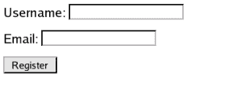

# 基本 SQL 注入和缓解示例

> 原文:[https://www . geesforgeks . org/basic-SQL-注入-缓解-示例/](https://www.geeksforgeeks.org/basic-sql-injection-mitigation-example/)

SQL 注入是一种代码注入技术，用于攻击数据驱动的应用程序，在这种技术中，恶意的 SQL 语句被插入到入口字段中执行(例如，将数据库内容转储给攻击者)。

*   SQL 注入可以通过多种方式导致严重的问题。
*   通过利用 SQL 注入，攻击者可以绕过身份验证，访问、修改和删除数据库中的数据。

一会儿，把自己放在一个攻击者的角色中。你的目标很简单。您希望数据库执行任何意外的 SQL 语句。你只是想让一些东西工作，因为这将揭示一个事实，即应用程序有一个潜在的漏洞。例如，考虑图 1 所示的简单身份验证表单。

```
      
                                     Figure 1
```

**图 1 代码**

```
<form action="/login.php" method="POST">
<p>Username: <input type="text" name="username" /></p>
<p>Password: <input type="text" name="password" /></p>
<p><input type="submit" value="Log In" /></p>
</form>
```

您已经可以对该应用程序可能用来验证访问凭据的 SQL 语句的类型做出非常有根据的猜测。很可能是 SELECT 语句。您还可以猜测数据库表中使用的命名约定，因为它可能与 HTML 表单中使用的简单名称相匹配。因为此表单用于身份验证，所以可能会使用 WHERE 子句

```
$_POST['username'] and $_POST['password'].
```

根据所有这些，您可能会预测到以下情况:

```
<?php $sql = "SELECT count(*) FROM users WHERE 
              username = '{$_POST['username']}'AND 
              password = '...'"; ?>
```

假设这个猜测是正确的，你能做什么来操作这个查询？想象一下发送以下用户名:

```
akash' /*
```

```
SELECT count(*)FROM users WHERE username = 'akash' /*'AND password = '...'";
```

```
In this example, /* is used to begin a multi-line comment,
effectively terminating the query at that point. This has
been tested successfully with MySQL. A standard comment 
in SQL begins with --, and it's trivial to try both.
```

只要 akash 帐户存在，无论密码是什么，该查询都表明身份验证尝试成功。这种特殊的攻击经常被用来窃取帐户。当然，任何用户名都可以使用(管理员是一个受欢迎的目标)。因此，通过发送格式错误的用户名，您可以在没有有效帐户的情况下登录。

**使用准备好的语句缓解(参数化查询)**

保卫 SQL 注入有很多方法。主要防御技术之一是“准备好的语句(参数化查询)”。这种技术迫使开发人员定义所有的 SQL 代码，然后将每个参数传递给查询。这种风格允许数据库区分代码和数据，而不管提供什么用户输入。
准备好的语句确保攻击者无法更改查询的意图，即使 SQL 命令是由攻击者插入的。例如，如果攻击者输入 ABC 或“1”=“1”的用户标识，则参数化查询不会受到攻击，而是会查找与整个字符串 ABC 或“1”=“1”完全匹配的用户名。
工作:

1.  **准备:**创建一个 SQL 语句模板并将其发送到数据库。某些值未指定，称为参数(标记为“？”).
    示例:

    ```
    SELECT count(*)FROM users WHERE username = ? AND password = ?;
    ```

2.  **解析:**数据库对 SQL 语句模板进行解析、编译和查询优化，并存储结果而不执行。
3.  **执行:**稍后，应用程序将值绑定到参数，数据库执行该语句。应用程序可以用不同的值执行该语句任意多次。

**实施:**

```
<?php 
$stmt = $dbConnection->prepare('SELECT count(*)FROM users WHERE username = ? AND password = ?');

$stmt->bind_param('ss', $username,$password);

$stmt->execute();

$result = $stmt->get_result();

echo $result;
?>
```

这只是绕过用户登录页面的一个简单示例，而 SQL Injection 可以让攻击者未经授权访问敏感数据，包括客户数据、个人身份信息(PII)、商业机密、知识产权和其他敏感信息。还有一个 SQL 注入自动化工具 [sqlmap](http://sqlmap.org/) ，用于执行所有类型的 SQL 注入。
所以我们必须应用**安全编码**，这样系统就不会受到威胁。

**参考文献:**

*   [维基百科](https://en.wikipedia.org/wiki/SQL_injection)
*   [OWASP](https://www.owasp.org/index.php/SQL_Injection)

**相关文章:**
[使用准备好的语句(参数化查询)缓解 SQL 注入攻击](https://www.geeksforgeeks.org/mitigation-sql-injection-attack-using-prepared-statements-parameterized-queries/)

本文由**阿卡什·莎兰**供稿。如果你喜欢 GeeksforGeeks 并想投稿，你也可以使用[contribute.geeksforgeeks.org](http://www.contribute.geeksforgeeks.org)写一篇文章或者把你的文章邮寄到 contribute@geeksforgeeks.org。看到你的文章出现在极客博客主页上，帮助其他极客。

如果你发现任何不正确的地方，或者你想分享更多关于上面讨论的话题的信息，请写评论。