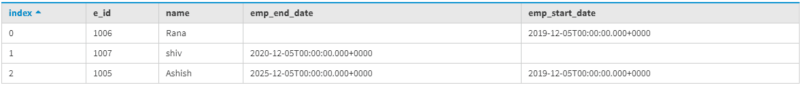
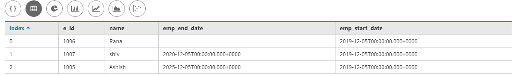
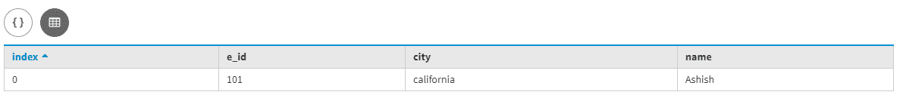
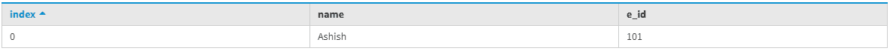

# 卡珊德拉批量声明

> 原文:[https://www.geeksforgeeks.org/batch-statement-in-cassandra/](https://www.geeksforgeeks.org/batch-statement-in-cassandra/)

在本文中，我们将讨论 BATCH 语句、BATCH 语句的优点和误用，以及如何在 [Cassandra](https://www.geeksforgeeks.org/apache-cassandra-nosql-database/) 中的单个和多个分区中使用 BATCH 语句，该分区由 [Cassandra 查询语言(CQL)](https://www.geeksforgeeks.org/additional-functions-in-cql-cassandra-query-language/) 支持。让我们一个一个来讨论。

我们可以在单个和多个分区中使用 BATCH 语句，这确保了两个操作的原子性。

让我们举个例子。
首先，我们创建一个表，即银行 _emp_data，它有 Id、Name、emp_start_date、emp_end_date 字段。让我们看看。

```
CREATE TABLE bank_emp_data(
E_id int,
Name text,
emp_start_date date, 
emp_end_date date,
PRIMARY KEY (E_id, Name)
); 
```

现在，我们要在不使用 BATCH 语句的情况下将数据写入 bank_emp_data 表。让我们看看。

```
INSERT INTO bank_emp_data(E_id, Name, emp_start_date, emp_end_date) 
VALUES (1005, 'Ashish', '2019-12-05', '2025-12-05');

INSERT INTO bank_emp_data(E_id, Name, emp_start_date) 
VALUES (1006, 'Rana', '2019-12-05');

INSERT INTO bank_emp_data(E_id, Name, emp_end_date) 
VALUES (1007, 'shiv', '2020-12-05'); 
```

要查看输出，请使用以下 CQL 查询。

```
Select * 
From bank_emp_data; 
```

**输出:**



现在，要更新 bank_emp_data 表中的现有行，请使用下面给出的 CQL 查询。

```
Update bank_emp_data set emp_start_date = '2019-12-05' 
where E_id = 1007 and Name= 'shiv';  
```

要查看更新的行，请使用以下 CQL 查询。

```
Select * 
from bank_emp_data; 
```

**输出:**


现在，我们在这里使用 BATCH 语句，它也展示了我们如何很好地使用 BATCH 语句。让我们看看。

```
BEGIN BATCH
INSERT INTO bank_emp_data(E_id, Name, emp_start_date, emp_end_date) 
VALUES (1005, 'Ashish', '2019-12-05', '2025-12-05');

INSERT INTO bank_emp_data(E_id, Name, emp_start_date) 
VALUES (1006, 'Rana', '2019-12-05');

INSERT INTO bank_emp_data(E_id, Name, emp_end_date) 
VALUES (1007, 'shiv', '2020-12-05');

Update bank_emp_data set emp_start_date = '2019-12-05' 
where E_id = 1007 and Name= 'shiv'; 
APPLY BATCH; 
```

现在，让我们看看使用 BATCH 语句的 bank_emp_data 的输出。

```
Select * 
from bank_emp_data; 
```



**多分区批处理:**
我们可以使用 batch 语句将数据写入不同的表中。

让我们用一个例子来理解。

**表:** Emp_data

```
create table Emp_data(
E_id int primary key,
Name text,
city text
); 
```

**表:** Emp_data_copy

```
create table Emp_data_copy(
Name text primary key,
E_id int
); 
```

现在，我们使用 BATCH 将数据插入不同的表中。

```
BEGIN BATCH
INSERT INTO Emp_data (E_id, Name, city) 
VALUES (101, 'Ashish', 'california');

INSERT INTO Emp_data_copy (Name, E_id) 
VALUES ('Ashish', 101);
APPLY BATCH; 
```

现在，让我们看看 Emp_data 表的输出。

```
SELECT * 
FROM Emp_data;
```

**输出:**



现在，让我们看看 Emp_data_copy 表的输出。

```
SELECT * 
FROM Emp_data_copy;
```

**输出:**

