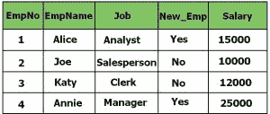
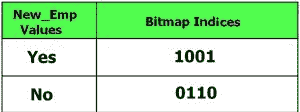
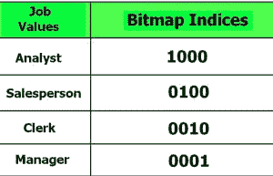
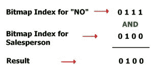

# 数据库管理系统中的位图索引

> 原文:[https://www.geeksforgeeks.org/bitmap-indexing-in-dbms/](https://www.geeksforgeeks.org/bitmap-indexing-in-dbms/)

位图索引是一种特殊类型的数据库索引，使用**位图**。这种技术用于大型数据库，此时列的基数较低，并且这些列在查询中最常用。

**位图索引的需求–**
位图索引的需求将通过下面给出的示例来明确:
例如，假设一家公司持有一个员工表，其中包含 EmpNo、EmpName、Job、New_Emp 和薪资等条目。让我们假设员工在一年中被雇佣一次，因此该表将很少更新，并且在大多数时间保持不变。但是，这些列将经常用于查询，以检索数据，如:公司中女性员工的数量等。在这种情况下，我们需要一种文件组织方法，它应该足够快以给出快速的结果。但是任何传统的文件组织方法都没有那么快，因此我们改用一种更好的存储和检索数据的方法，称为位图索引。

**位图索引是如何完成的–**
在上面的表员工示例中，我们可以看到根据员工是否是公司新员工的事实，列 New_Emp 只有两个值**是**和**否**。同样，让我们假设员工的工作只分为 4 类，即经理、分析师、职员和销售员。这样的列称为低基数列。尽管这些列的唯一值较少，但它们可以经常被查询。

**位:**位是计算中使用的基本信息单位，只能有 0 或 1 两个值中的一个。二进制数字的两个值也可以解释为逻辑值 true/false 或 yes/no。

在位图索引中，这些位用于表示那些低基数列中的唯一值。这种以位的形式存储低基数行的技术称为位图索引。
继续员工示例，下面给出的是员工表:



如果 New_Emp 是要索引的数据，位图索引的内容在标题位图索引下显示为四列(因为我们在上表中有四行)。这里位图索引“是”的值为 1001，因为第 1 行和第 4 行在 New_Emp 列中的值为“是”。



在这种情况下，有两个这样的位图，一个表示“新员工”是，另一个表示“新员工”否。很容易看出，位图索引中的每一位都显示特定行是否指公司的新员工。

以上场景是位图索引的最简单形式。大多数列将有更多不同的值。例如，此处的“作业”列只有 4 个唯一值(如前所述)。位图索引的变化也可以有效地索引这些数据。对于作业列，位图索引如下所示:



现在假设，如果我们想要找出该员工的详细信息，该员工不是公司的新员工，而是销售人员，那么我们将运行查询:

```
 SELECT * 
        FROM STUDENT 
            WHERE New_Emp = "No" and Job = "Salesperson";
```

对于这个查询，数据库管理系统将搜索两个列的位图索引，并对这些位执行逻辑“与”运算，找出实际结果:



这里，结果 0100 表示必须检索第二列作为结果。

**SQL 中的位图索引–**在 SQL 中创建位图索引的语法如下:

```
CREATE BITMAP INDEX Index_Name
         ON Table_Name (Column_Name);
```

对于上面的雇员表示例，New_Emp 列上的位图索引将按如下方式创建:

```
CREATE BITMAP INDEX index_New_Emp
        ON Employee (New_Emp);
```

**优势–**

*   插入删除和更新的效率。
*   更快地检索记录

**缺点–**

*   只适合大桌子
*   位图索引很耗时