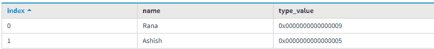
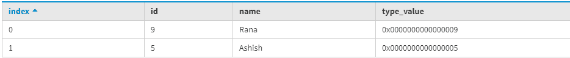

# 卡珊德拉中的斑点转换功能

> 原文:[https://www . geesforgeks . org/blob-conversion-function-in-Cassandra/](https://www.geeksforgeeks.org/blob-conversion-function-in-cassandra/)

在 [Cassandra](https://www.geeksforgeeks.org/introduction-to-apache-cassandra/) 中，Blob 数据类型表示常量十六进制数据类型，数字定义为 0[xX](十六进制)+其中十六进制表示十六进制。存储短字符串或小图像很有用。

在本文中，我们将讨论将本机类型转换为二进制数据(blob)的 Blob 转换函数:

```
typeAsBlob(value)
blobAsType(value) 
```

让我们用一个例子来理解。

为了创建表，function_test1 使用了以下 CQL 查询。

```
CREATE TABLE function_test1 ( 
Name varchar PRIMARY KEY, 
type_value blob
 ); 
```

使用以下 CQL 查询将数据插入表中。

```
INSERT INTO function_test1 (Name, type_value) 
       VALUES ('Ashish', bigintAsBlob(5));
INSERT INTO function_test1 (Name, type_value) 
       VALUES ('Rana', bigintAsBlob(9));  
```

使用以下 CQL 查询读取数据。

```
SELECT * 
FROM function_test1; 
```

**输出:**



现在，要转换 blobAsBigint，首先使用下面的 CQL 查询更新该表。

```
ALTER TABLE function_test1 ADD Id bigint; 
```

现在，再次将数据插入到更新的表中。那么，我们来看看。

```
INSERT INTO function_test1 (Name, Id) 
       VALUES ('Ashish', blobAsBigint(0x0000000000000005));
INSERT INTO function_test1 (Name, Id) 
       VALUES ('Rana', blobAsBigint(0x0000000000000009)); 
```

要查看最终输出，请使用以下 CQL 查询。

```
SELECT * 
FROM function_test1; 
```

**输出:**

