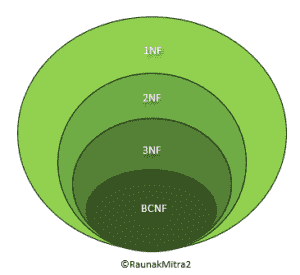

# Boyce-Codd 范式(BCNF)

> 原文:[https://www.geeksforgeeks.org/boyce-codd-normal-form-bcnf/](https://www.geeksforgeeks.org/boyce-codd-normal-form-bcnf/)

应用 [2NF](https://www.geeksforgeeks.org/second-normal-form-2nf/) 和 [3NF](https://www.geeksforgeeks.org/third-normal-form-3nf/) 的一般定义可以识别由违反一个或多个候选关键字的依赖关系引起的额外冗余。然而，尽管有这些额外的约束，依赖性仍然存在，这将导致 3NF 关系中出现冗余。3NF 中的这个弱点导致了一个更强的范式的出现，叫做 Boyce-Codd 范式(Codd，1974)。

虽然，3NF 对于关系数据库来说是足够的范式，但是，这个(3NF)范式可能不会因为 X 而消除 100%的冗余？y 函数依赖，如果 X 不是给定关系的候选键。这可以通过 Boyce-Codd 范式(BCNF)来解决。

**Boyce-Codd 范式(BCNF):**
Boyce-Codd 范式(BCNF)基于[函数依赖关系](https://www.geeksforgeeks.org/functional-dependency-and-attribute-closure/)，该函数依赖关系考虑了关系中的所有候选键；然而，与 3NF 的一般定义相比，BCNF 还有额外的限制。

一个关系是在 BCNF 森林，X 是每个函数依赖的超级键？给定关系中的 y。

换句话说，

> 一个关系在 BCNF，当且仅当，每个行列式都是一个形式(BCNF)候选键。

**注意–**为了测试关系是否在 BCNF，我们确定所有的决定因素，并确保它们是候选键。



范式层次

你在计算理论中遇到了一个类似的层次结构，叫做乔姆斯基范式。现在，仔细研究上面的层次结构。可以推断*在 BCNF 的每一个关系也在 3NF* 中。换句话说，3NF 的关系不需要在 BCNF。仔细考虑一下这个说法。
要确定具有函数依赖关系的给定关系 R 的最高范式，第一步是检查 BCNF 条件是否成立。如果发现 R 在 BCNF，可以安全地推断关系也在 3NF、2NF 和 1NF 中，如层次结构所示。1NF 的约束条件最少——它只需要一个关系 R 就可以在每个元组中有原子值。2NF 有一个稍微更严格的限制。
[阅读这篇文章可以清楚地理解 2NF](https://www.geeksforgeeks.org/second-normal-form-2nf/)
3NF 的约束比前两种范式更严格，但比 BCNF 的约束更少。以这种方式，当我们向下遍历层次结构时，限制会增加。

**例-1:**
求一个关系 R(A，B，C，D，E)的最高范式，FD 集为:

```
{ BC->D, AC->BE, B->E } 
```

**说明:**

*   **Step-1:** 我们可以看到，(AC)+ ={A，C，B，E，D}但是它的子集都不能决定关系的所有属性，所以 AC 会是候选键。a 或 C 不能从关系的任何其他属性派生，因此将只有 1 个候选键{AC}。
*   **步骤-2:** 质数属性是本例中候选键{A，C}的一部分，其他属性在本例中是非质数{B，D，E}的属性。
*   **步骤-3:** 关系 R 是第一范式，因为关系数据库管理系统不允许多值或复合属性。

关系是第二范式，因为 BC->D 是第二范式(BC 不是候选键 AC 的适当子集)，AC->BE 是第二范式(AC 是候选键)，B->E 是第二范式(B 不是候选键 AC 的适当子集)。

这种关系不是第三范式，因为在 BC-> D(BC 既不是超级键，D 也不是质数属性)和 B-> E(B 既不是超级键，E 也不是质数属性)中，为了满足第三范式，FD 的 LHS 应该是超级键，而 RHS 应该是质数属性。所以关系的最高范式是第二范式。

**注意–**在 BCNF 关系中，主属性不能过渡依赖于键。

考虑一些关系 R 的这些函数依赖，

AB ->C
C - > B
AB - > B

假设，已知 R 的唯一候选键是 AB。需要仔细观察才能得出结论，上面的依赖关系是**传递依赖关系**，因为主属性 B 传递依赖于键 AB 到 c。现在，第一个和第三个 FD 在 BCNF，因为它们的左侧都包含候选键(或简称为键)。然而，第二个依赖项不在 BCNF，但由于右侧主属性的存在，它肯定在 3NF 中。所以，R 的最高范式是 3NF，因为三个 FD 都满足 3NF 的必要条件。

**例-2:**
例如考虑关系 R(A，B，C)

```
A -> BC, 
B -> A
```

a 和 B 都是超级键，所以上面的关系是在 BCNF。

**注意–**
BCNF 分解在[依赖保持](https://www.geeksforgeeks.org/data-base-dependency-preserving-decomposition/)的情况下可能总是不可能的，但是，它总是满足[无损连接](https://www.geeksforgeeks.org/database-management-system-lossless-decomposition/)条件。例如，关系 R (V，W，X，Y，Z)，具有函数依赖关系:

```
V, W -> X
Y, Z -> X
  W -> Y 
```

它不能满足依赖保持 BCNF 分解。
**注-:** 冗余有时仍然存在于 BCNF 关系中，因为不可能总是完全消除它们。

参考:
[第 4 和第 5 范式](http://4th and 5th Normal form)和[寻找给定关系的最高范式](https://www.geeksforgeeks.org/how-to-find-the-highest-normal-form-of-a-relation/)。