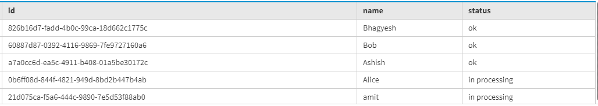
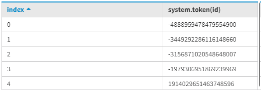
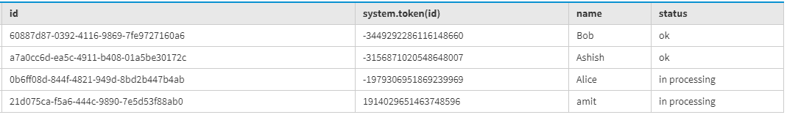

# 卡珊德拉批量阅读

> 原文:[https://www.geeksforgeeks.org/bulk-reading-in-cassandra/](https://www.geeksforgeeks.org/bulk-reading-in-cassandra/)

在本文中，我们将描述如何批量阅读，这也有助于提高性能。在看这篇文章之前，请了解卡珊德拉中的基本[架构。](https://www.geeksforgeeks.org/architecture-of-apache-cassandra/)

我们将为练习创建数据模式，以测试 Cassandra 中的批量读取。

让我们看看。
首先，我们要创建表。

要创建的表模式:

```
keyspace name - cluster1
Table name - user_data_app 
```

<center>

| 列名 | 数据类型 |
| 身份证明（identification） | uuid |
| 名字 | 文本 |
| 状态 | 文本 |

</center>

现在，让我们编写 CQL 查询来创建上面给定的表模式。

```
create table user_data_app
 (
  id uuid primary key,
  name text,
  status text 
 ); 
```

现在，让我们将数据插入表中。下面给出了在表中插入行的 CQL 查询。

```
Insert into user_data_app(id, name, status) 
values(uuid(), 'Ashish', 'ok');

Insert into user_data_app(id, name, status) 
values(uuid(), 'amit', 'in processing');

Insert into user_data_app(id, name, status) 
values(uuid(), 'Bhagyesh', 'ok');

Insert into user_data_app(id, name, status) 
values(uuid(), 'Alice', 'in processing');

Insert into user_data_app(id, name, status) 
values(uuid(), 'Bob', 'ok'); 
```

现在，让我们看看数据成功添加的结果。为了验证结果，使用了下面给出的 CQL 查询。

```
SELECT token(id) 
FROM user_data_app; 
```

**输出:**



现在，我们将找出分区列的标记 id，通过它我们可以执行比较，我们还将使用它来执行批量读取。

```
SELECT token(id) 
FROM user_data_app; 
```

**输出:**



现在，让我们看看下面的 CQL 查询，我们将用于批量阅读。

```
SELECT token(id), id, name, status 
FROM user_data_app 
WHERE 
token(id) >-4888959478479554900 
AND
token(id) <= 1914029651463748596; 
```

**输出:**

