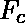
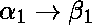
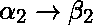
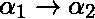

# 数据库管理系统中函数依赖的规范覆盖

> 原文:[https://www . geeksforgeeks . org/canonical-cover-of-functional-dependencies-in-DBMS/](https://www.geeksforgeeks.org/canonical-cover-of-functional-dependencies-in-dbms/)

每当用户更新数据库时，系统必须检查在这个过程中是否有任何功能依赖被违反。如果在新的数据库状态中违反了依赖关系，系统必须回滚。使用大量的[函数依赖](https://www.geeksforgeeks.org/functional-dependency-and-attribute-closure/)会导致不必要的额外计算时间。这就是规范封面发挥作用的地方。
一组函数依赖 F 的规范覆盖是一组简化的函数依赖，其闭包与原始集合 F 相同。

**重要定义:**

**无关属性:**如果我们可以在不改变函数依赖集的闭包的情况下移除一个函数依赖的属性，那么这个属性就被称为无关属性。
**规范覆盖:**一组函数依赖关系 F 的规范覆盖，从而满足以下所有属性:

*   f 在逻辑上意味着中的所有依赖关系。
*   逻辑上隐含 f 中的所有依赖关系。
*   中没有包含无关属性的函数依赖。
*   中函数依赖的每一个左侧都是唯一的。也就是说和之间没有两个依赖关系。

**寻找规范覆盖**

**计算集合 F 的典范覆盖的算法:**

```
repeat
    1\. Use the union rule to replace any dependencies in 
        and  with .
    2\. Find a functional dependency  with an 
       extraneous attribute either in  or in .
    3\. If an extraneous attribute is found, delete it from .
       until F does not change

```

**示例 1:**

考虑以下功能依赖的集合 *F* :

f = {
ABC
BC
AB
ABC

寻找规范封面的步骤:

1.  There are two functional dependencies with the same set of attributes on the left:
    A  BC
    A  B

    这两者结合起来就可以得到
    A  BC。

    现在，修改后的集合 F 变成:

    f = {
    ABC
    BC
    ABC

2.  There is an extraneous attribute in AB  C because even after removing AB  C from the set F, we get the same closures. This is because B  C is already a part of F.

    现在，修改后的集合 F 变成:

    F= {
    A 公元前
    B  C

3.  C is an extraneous attribute in A  BC, also A  B is logically implied by A  B and B  C (by transitivity).

    F= {
    A  B
    B  C

4.  经过这一步，F 不再变化。所以，
    因此需要的规范封面是，
    = {
    AB
    BC

**示例 2:**

考虑另一组函数依赖:

f = {
ABC
CDE
BD
EA

1.  F 中每个函数依赖的左侧都是唯一的。
2.  任何函数依赖的左侧或右侧的属性都不是无关的(通过对每个函数依赖应用无关属性的定义来检查)。
3.  因此，规范覆盖等于 f

**注:**一组 F 个函数依赖可以有多个典范覆盖。

**如何检查一组 F . d . F 是否正规地覆盖了另一组 F . d . G？**

考虑以下两组功能依赖关系:

f = {
ab
abc
dAC
de

G = {
A 公元前
D  AB

现在，我们需要找出这些 f.d .中的一个是否规范地覆盖了另一组 f.d .这意味着，我们需要找出 F 是否规范地覆盖了 G，G 是否规范地覆盖了 F，或者两者都没有规范地覆盖另一个。

为了找到答案，我们遵循以下步骤:

*   Create a singleton right hand side. This means, the attributes to the right side of the f.d. arrow should all be singleton.
    The functional dependency D  AC gets broken down into two functional dependencies, D  A and D  C.

    f = {
    AB
    ABC
    DA
    DC
    DE

*   Remove all extraneous attributes.

    考虑任何函数依赖 XY  Z，如果 X 本身可以决定 Z，那么属性 Y 是无关的，可以去掉。正如我们所看到的，无关属性的出现只有在 LHS 有多个属性的功能依赖中才有可能。

    所以，考虑函数依赖 AB  C.
    现在，我们必须找到 A 和 B 的闭包，以确定其中是否有任何一个是无关的。

    ![[A]^{+}](img/4b8548729a7ee2e59bd009717dd4eae7.png "Rendered by QuickLaTeX.com") =AB
    ![[B]^{+}](img/f4bac0a9ffcfd17f112a8e395d1bffda.png "Rendered by QuickLaTeX.com") =B

    我们可以看到，B 可以从 a 中确定，这意味着我们可以从函数依赖 AB  C 中移除 B。

    f = {
    AB
    AC
    DA
    DC
    DE

*   Remove all redundant functional dependencies.

    逐一检查所有的 f.d .，看看通过移除一个 f.d. X  Y，我们是否仍然可以通过其他一些 f.d .从 X 中找出 Y。更正式的说法是在不使用 f.d 的情况下找到![[X]^{+}](img/aeaba0713016a566bb47214f088dd115.png "Rendered by QuickLaTeX.com")。我们正在测试并检查 Y 是否是闭包的一部分。如果是的话，那么 f.d .是多余的。

    在这里，当检查 f.d. D  C 时，我们观察到即使在隐藏它之后，D 的闭包也包含 C，这是因为我们可以通过其他两个 f . D . DA 和 A  C 的组合从 D 中获得 C，所以， C 是多余的。

    f = {
    AB
    AC
    DA
    DE

现在，对 g 做同样的事情。

*   Create a singleton right hand side. This means, the attributes to the right side of the f.d. arrow should all be singleton.

    g = {
    AB
    AC
    DA
    DB

*   移除所有无关属性。
    由于所有 f.d .的 RHS 只包含 1 个属性，所以不可能有无关属性。

*   Remove all redundant functional dependencies.

    通过遍历所有的 f.d .并在所有情况下检查 LHS 的关闭，我们观察到 f.d. D  B 是多余的，因为它可以通过两个其他 f . D . DA 和 A  B 的组合来获得

    g = {
    AB
    AC
    DA

    现在，由于 G 的所有 f.d .已经包含在 F 中，我们得出结论 F 包含 G

    本文由 **Anannya Uberoi** 供稿。如果你喜欢 GeeksforGeeks 并想投稿，你也可以使用[contribute.geeksforgeeks.org](http://www.contribute.geeksforgeeks.org)写一篇文章或者把你的文章邮寄到 contribute@geeksforgeeks.org。看到你的文章出现在极客博客主页上，帮助其他极客。

    如果你发现任何不正确的地方，或者你想分享更多关于上面讨论的话题的信息，请写评论。