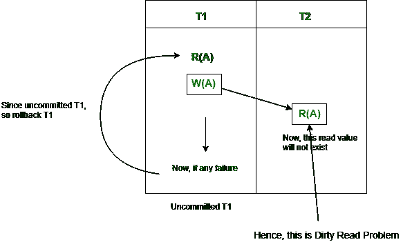
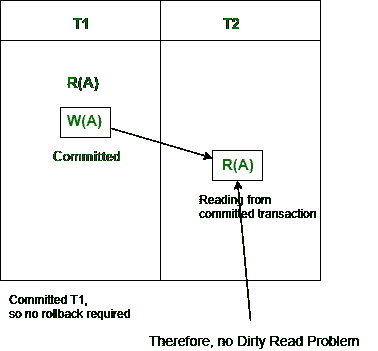
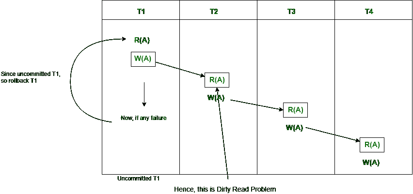
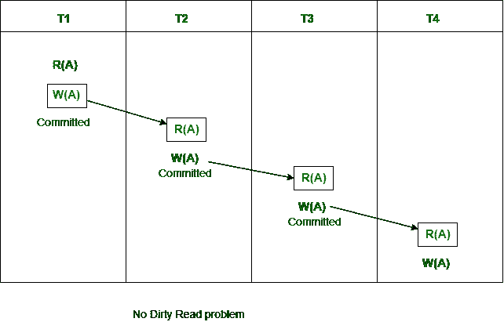

# 数据库管理系统中的无级联

> 原文:[https://www.geeksforgeeks.org/cascadeless-in-dbms/](https://www.geeksforgeeks.org/cascadeless-in-dbms/)

基于可恢复性的进度计划一般有 [3 种，如下所示:](https://www.geeksforgeeks.org/dbms-types-of-recoverability-of-schedules-and-easiest-way-to-test-schedule-set-2/)

1.  **[可恢复时间表:](https://www.geeksforgeeks.org/recoverability-in-dbms/)**
    事务必须按顺序提交。可能会出现脏读问题和更新丢失问题。
2.  **[无级联计划:](https://www.geeksforgeeks.org/dbms-concurrency-control-types-of-schedules/)**
    不允许脏读，意味着不允许读取未提交事务写入的数据。可能会出现更新丢失问题。
3.  **[严格调度:](https://www.geeksforgeeks.org/dbms-types-of-recoverability-of-schedules-and-easiest-way-to-test-schedule-set-2/)**
    既不允许脏读也不允许丢失更新问题，意味着不允许读写未提交事务写入的数据。

**[脏读问题](https://www.geeksforgeeks.org/dbms-dirty-read-in-sql/) :**
当一个事务从另一个事务中未提交的写操作中读取数据时，则称为*脏读*。如果该写入事务失败，则该写入数据可能会再次更新。因此，这导致了*脏读问题*。

换句话说，

> 读取未提交事务写入的数据称为脏读。

它被称为脏读，因为未提交的事务总是有可能在以后回滚。因此，未提交的事务可能会使其他事务读取甚至不存在的值。这导致数据库的不一致性。

例如，假设事务 1 更新一行并使其保持未提交状态，同时，事务 2 读取更新的行。如果事务 1 回滚更改，事务 2 将读取被认为从未存在过的数据。

请注意，不存在脏读问题，即一个事务正在从另一个提交的事务中读取。因此，不需要回滚。

**级联回滚:**
如果在一个计划中，一个事务的失败导致其他几个相关事务回滚或中止，那么这样的计划称为级联回滚或级联中止或级联计划。这只会导致 CPU 时间的浪费。
这些级联回滚的发生是因为**脏读问题**。

例如，事务 T1 写入事务 T2 读取的未提交的 x。事务 T2 写入事务 T3 读取的未提交的 x。
假设此时 T1 失败。
T1 必须回退，因为 T2 依赖 T1，所以 T2 必须回退，因为 T3 依赖 T2，所以 T3 必须回退。

因为 T1 回滚，所有 T2、T3 和 T4 也应该回滚(级联脏读问题)。

这种单个事务失败导致一系列事务回滚的现象称为**级联回滚**。

**无级联时间表:**
该时间表避免了所有可能的*脏读问题*。

在无级联调度中，如果一个事务要对一个值执行读操作，它必须等到对该值执行写操作的事务提交。这意味着不能有**脏读**。因为脏读问题会导致*级联回滚*，效率低下。

无级联调度避免级联中止/回滚(ACA)。事务只在将要读取提交的所有事务的更改之后读取值的计划称为无级联计划。避免单个事务中止导致一系列事务回滚。防止级联中止的策略是禁止一个事务从同一计划中的另一个事务中读取未提交的更改。

换句话说，如果某个事务 Tj 想要读取由某个其他事务 Ti 更新或写入的值，那么 Tj 的提交必须在 Ti 提交之后读取它。

请注意，无级联计划仅允许提交的读取操作。但是，它允许未提交的写操作。

还要注意，无级联计划总是[可恢复的](https://www.geeksforgeeks.org/dbms-types-of-recoverability-of-schedules-and-easiest-way-to-test-schedule-set-2/)，但是所有可恢复的事务可能不是无级联计划。