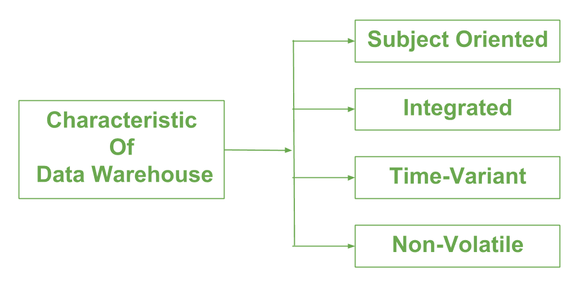

# 数据仓库的特点和功能

> 原文:[https://www . geesforgeks . org/数据仓库的特性和功能/](https://www.geeksforgeeks.org/characteristics-and-functions-of-data-warehouse/)

先决条件–[数据仓库](https://www.geeksforgeeks.org/data-warehousing/)
当用户有一种共享的方式来解释作为特定主题引入的趋势时，可以控制数据仓库。以下是数据仓库的主要**特征**:

1.  **面向主题–**
    数据仓库总是面向主题的，因为它传递的是关于主题的信息，而不是组织当前的运营。它可以在特定的主题上实现。这意味着数据仓库过程被提议用更明确的特定主题来处理。这些主题可以是销售、分销、营销等。

    数据仓库从不只强调当前的运营。相反，它侧重于演示和分析数据，以做出各种决策。它还通过消除决策不需要的数据，围绕特定主题提供了一个简单而精确的演示。
2.  **综合–**
    它与以可靠格式制作的主题方向相同。集成意味着创建一个共享实体来扩展来自不同数据库的所有相似数据。数据还需要以共享和一般授权的方式驻留在各种数据仓库中。

    数据仓库是通过集成来自各种数据源的数据而构建的，例如大型机和关系数据库。此外，它必须有可靠的命名约定、格式和代码。数据仓库的集成有利于数据的有效分析。命名约定、列缩放、编码结构等的可靠性。应该可以确认。数据仓库集成处理各种主题相关的仓库。

*   **时间变量–**
    在本例中，数据通过不同的时间间隔进行维护，如每周、每月或每年等。它在大型数据集之间建立各种时间限制，并保存在联机事务处理中。数据仓库的时限比操作系统的时限更广。驻留在数据仓库中的数据在特定的时间间隔内是可预测的，并且从历史的角度提供信息。它明确或隐含地包含时间元素。时间差异的另一个特征是，一旦数据被存储在数据仓库中，它就不能被修改、变更或更新。*   **Non-Volatile –**
    As the name defines the data resided in data warehouse is permanent. It also means that data is not erased or deleted when new data is inserted. It includes the mammoth quantity of data that is inserted into modification between the selected quantity on logical business. It evaluates the analysis within the technologies of warehouse.

    In this, data is read-only and refreshed at particular intervals. This is beneficial in analysing historical data and in comprehension the functionality. It does not need transaction process, recapture and concurrency control mechanism. Functionalities such as delete, update, and insert that are done in an operational application are lost in data warehouse environment. Two types of data operations done in the data warehouse are:
    *   数据加载
    *   数据存取

    **数据仓库的功能:**
    它作为一个数据集合工作，这里由各种社区组织，这些社区承受恢复数据功能的功能。它已经存储了关于具有高事务级别的表的事实，这些表被观察到，以便定义数据仓库技术和主要功能，下面将提到这些技术和功能:

    1.  数据整合
    2.  数据清理
    3.  数据集成