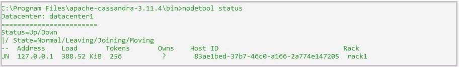
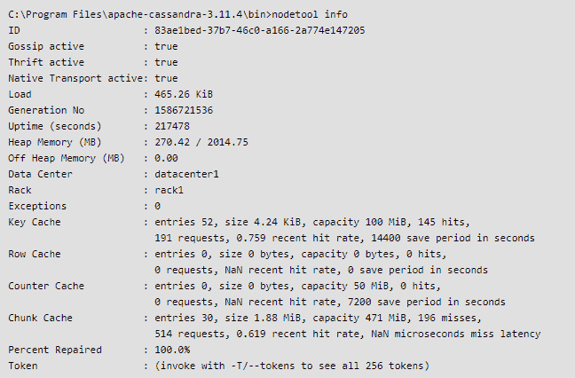
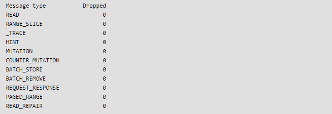

# 在卡珊德拉检查集群运行状况

> 原文:[https://www . geesforgeks . org/checking-the-cluster-health-in-Cassandra/](https://www.geeksforgeeks.org/checking-the-cluster-health-in-cassandra/)

在本文中，我们将讨论在 [Cassandra](https://www.geeksforgeeks.org/apache-cassandra-nosql-database/) 中使用 nodetool 检查集群运行状况。Nodetool 是监控工具之一，有助于监控集群和执行日常维护任务。

我们将讨论通常用于检查集群运行状况的三个 nodetool 命令。

1.  节点工具状态
2.  节点工具信息
3.  nodetool tpstats

**1。节点工具状态:**
在 Cassandra 中，节点工具状态命令真的很有帮助。此命令使您能够检查群集节点的运行状况。nodetool status 命令对于提供关于节点间数据分布的信息也很有用。例如:

```
nodetool status 127.0.0.1   
```

**输出:**



nodetool status 命令提供了与节点相关的有价值的信息，如下所示。

*   **状态:**
    它会让你知道一个节点的状态，比如节点是开着还是关着。
*   **状态:**
    它会让你知道一个节点的状态，比如节点处于正常/离开/加入/移动等。
    例如，“UN”代表节点处于“UP”和“Normal”状态。
*   **地址:**
    它会让你知道一个节点的地址。例如，如果您连接到本地主机 127.0.0.1，那么您的地址将是 127.0..0.1.
*   **加载:**
    它会让你知道一个节点的数据加载情况。
*   **令牌:**
    它会让你知道令牌号。
*   **主机 id :**
    它会让你知道主机 id。

**2。nodetool info :**
在 Cassandra 中，运行 nodetool info 命令来获取节点信息，例如流言的状态(活动或不活动)、磁盘负载、启动时间(生成)、正常运行时间、密钥、行、计数器和块缓存信息、修复百分比、令牌信息(可选)和堆内存使用情况。

这里有一个例子:

```
nodetool info 
```

**输出:**



**3。nodetool tpstats :**
在 Cassandra 中，nodetool tpstats 命令显示线程池的使用统计。这个命令对卡珊德拉很有帮助。Cassandra 将任务分成几个阶段，每个阶段使用一个单独的队列和一个线程池。消息服务连接各个阶段。

该命令将为您提供线程池的总体统计信息。该命令提供线程池操作的每个阶段的信息。它显示了以下内容:

*   活动线程数。
*   等待线程池执行的请求数。
*   线程池已完成的任务数。
*   由于下一步中的线程池已满而被阻止的请求数。
*   截至该时间点，此线程池中被阻止的请求总数。

这是一种使用 Cassandra 架构执行该命令的方法。
当您刷新 memtables 或数据库压缩任何表时，数据库刷新 nodetool tpstats 命令提供的信息。

下面的示例显示了如何运行 nodetool tpstats 命令:




nodetool tpstats 命令的输出显示了与数据库中任务相关的特定线程池的统计信息。当您对问题进行故障排除或调整数据库时，所有这些详细信息对您都非常有用。