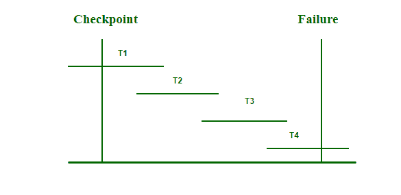

# 数据库管理系统中的检查点

> 原文:[https://www.geeksforgeeks.org/checkpoints-in-dbms/](https://www.geeksforgeeks.org/checkpoints-in-dbms/)

**我们为什么需要检查站？**
每当在实时环境中创建事务日志时，都会占用大量存储空间。此外，跟踪每次更新及其维护可能会增加系统的物理空间。最终，随着大小的不断增长，事务日志文件可能无法处理。这可以通过检查点来解决。用于移除所有先前事务日志并将它们存储在永久存储中的方法称为**检查点**。

**什么是检查点？**
检查点用于声明一个点，在该点之前，数据库管理系统处于一致状态，并且所有事务都已提交。在事务执行期间，会跟踪此类检查点。执行后，将创建事务日志文件。

到达保存点/检查点后，通过将其更新保存到数据库来销毁日志文件。然后创建一个新的日志，其中包含即将执行的事务操作，并且它将被更新，直到下一个检查点，并且该过程继续。

**如何使用数据库中的检查点？**
**步骤:**

1.  将 begin_checkpoint 记录写入日志。
2.  在稳定存储中收集检查点数据。
3.  将 end_checkpoint 记录写入日志。

执行并发事务时系统崩溃和恢复的行为如下所示–

了解多个事务中的检查点

*   恢复系统从最后一个检查点向后读取日志，即从 T4 到 T1。
*   它将跟踪两个列表——撤销和重做。
*   每当有一个带有指令<tn start="">和<tn commit="">或者只有<tn commit="">的日志时，它会将该事务放入重做列表中。T2 和 T3 包含<tn start="">和<tn commit="">，而 T1 只有<tn commit="">。这里，T1、T2 和 T3 在重做列表中。</tn></tn></tn></tn></tn></tn>
*   每当发现没有提交或中止指令的日志记录时，该事务被置于撤销列表<here t4="" has="" start="">中，但没有<tn commit="">，因为它是正在进行的事务。T4 将被列入撤销名单。</tn></here>

重做列表中的所有事务都与其以前的日志一起删除，然后在保存日志之前重做。撤消列表中的所有事务都被撤消，它们的日志也被删除。

**检查点的相关性:**
检查点是一个在 [ACID](https://www.geeksforgeeks.org/acid-properties-in-dbms/) 中为符合[的关系数据库管理系统](https://www.geeksforgeeks.org/rdbms-architecture/)添加 C 值的功能。如果数据库中出现意外关闭，检查点将用于恢复。检查点以一定的时间间隔工作，并将日志中的所有脏页(修改过的页)从中继写入数据文件，即从缓冲区写入物理磁盘。它也被称为脏页硬化。它是一个专用进程，由 SQL Server 以特定的时间间隔自动运行。数据库和事务日志之间的同步点有一个检查点。

**使用检查点的优势:**

*   它加快了数据恢复过程。
*   大多数 dbms 产品会自动检查自己。
*   日志文件中的检查点记录用于防止不必要的重做操作。
*   由于脏页会在后台不断刷新，因此开销非常低，而且可以频繁进行。

**实时应用检查点:**

*   每当在可能修改了数据库的实时环境中测试应用程序时，都会使用检查点对其进行验证。
*   检查点用于在数据库中应用任何更新之前创建备份和恢复。
*   恢复系统用于将数据库恢复到检查点状态。