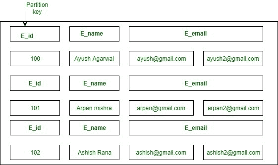
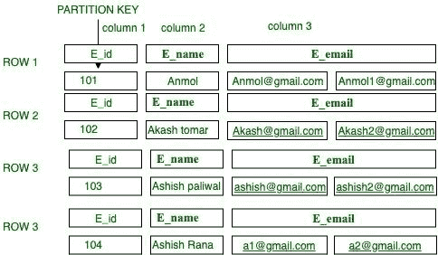
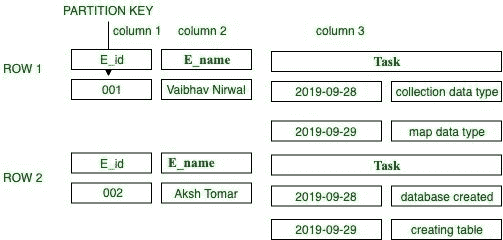

# Apache Cassandra 中的采集数据类型

> 原文:[https://www . geesforgeks . org/collection-data-type-in-Apache-Cassandra/](https://www.geeksforgeeks.org/collection-data-type-in-apache-cassandra/)

**Cassandra 中的采集数据类型**
在本文中，我们将描述采集数据类型概述以及 [Cassandra 查询语言(CQL)](https://www.geeksforgeeks.org/additional-functions-in-cql-cassandra-query-language/) 对每种采集数据类型的查询，并附说明。Cassandra 中有 3 种类型的收集数据类型。

```
1. SET
2. LIST
3. MAP 
```

让我们一个一个讨论。

**1。集合:**
集合是一个集合数据，我们可以在其中存储一组元素，这样一个用户可以有多个电子邮件地址，然后为了存储这种类型的数据，我们使用了集合数据类型，它在查询时返回排序的元素。它是唯一值的类型化集合。

**语法:**

```
Create table keyspace-Name.Table-Name(
  field 1 data_type 1,
  /*SET keyword is used to define collection data type.*/
  field 1 set<data_type>,  
  field 1 data_type 1,
  key_constraint if any
 ); 
```

**步骤 1:** 要创建键空间，请使用以下 CQL 查询。

```
CREATE KEYSPACE keyspace1
    WITH replication = {'class': 'SimpleStrategy', 
                        'replication_factor' : 1};  
```

**CQL 查询使用键空间 1**T2 查询使用键空间 1；

```
CREATE TABLE Employee
 ( 
  E_id int,
  E_name text,

  /* set syntax to define E_email as list collection data type. */
  E_email SET<text>,  
  PRIMARY KEY(E_id)
 ); 
```

**步骤 2:** 使用集合数据类型进行插入的语法。
**语法:**

```
INSERT INTO table_name(field 1, field 2, field 3..) 
            VALUES('field1_value', {'field2_value1', 'field2_value2', ..}, 
                                   { 'field3_value1', 'field3_value2', ..}....); 
```

使用 SET 插入的 CQL 查询:

```
INSERT INTO Employee (E_id, E_name, E_email) 
            VALUES(100, 'Ayush Agarwal', {'ayush@gmail.com’, ’ayush2@gmail.com’});
INSERT INTO Employee (E_id, E_name, E_email) 
            VALUES(101, 'Arpan mishra', {'arpan@gmail.com’, ’arpan2@gmail.com’});
INSERT INTO Employee (E_id, E_name, E_email) 
            VALUES(102, 'Ashish Rana', {'ashish@gmail.com’, ’ashish2@gmail.com’}); 
```

**步骤-3:** CQL 查询检索表数据。

```
select * from Employee;
```

**输出:**


**图–**卡珊德拉-表 _ 集

**2。列表:**
在列表中，一个值可以存储多次。列表集合数据类型中的规则之一是不能更改元素的顺序。在列表中，一旦存储了值，元素就会获得一个特定的索引，然后可以通过这些特定的索引检索值。在列表中，元素不需要是唯一的，它可以被复制。

**步骤 1:** 创建表时使用了以下 CQL 查询。

```
CREATE TABLE keyspace1.Employee
 ( 
  E_id int,
  E_name text,

  /* list syntax to define E_email as list collection data type. */
  E_email list<text>,  
  PRIMARY KEY(E_id)
 ); 
```

**步骤 2:** 使用列表集合数据类型进行插入的语法。

**语法:**

```
INSERT INTO table_name(field 1, field 2, field 3..) 
            VALUES(' field1_value', ['field2_value1', 'field2_value2', ..], 
                                    [ 'field3_value1', 'field3_value2', ..]....); 
```

使用列表插入的 CQL 查询:

```
INSERT INTO Employee (E_id, E_name, E_email) 
            VALUES(101, 'Anmol', ['Anmol@gmail.com’, ’anmol1@gmail.com’]);
INSERT INTO Employee (E_id, E_name, E_email) 
            VALUES(102, 'Aakash tomar', ['Akash@gmail.com’, ’Akash2@gmail.com’]);
INSERT INTO Employee (E_id, E_name, E_email) 
            VALUES(103, 'Ashish paliwal', ['ashish@gmail.com’, ’ashish2@gmail.com’]);
INSERT INTO Employee (E_id, E_name, E_email) 
            VALUES(104, 'Ashish Rana', ['a1@gmail.com’, ’a2@gmail.com’]); 
```

**步骤-3:** CQL 查询检索表数据。

```
select * from Employee;
```

**输出:**


**图–**LIST 表为以上 CQL 查询

**3。映射:**
在映射中，键-值对的类型化集合，使得值对具有各自的键名。地图收集数据类型按唯一键排序。

**步骤 1:** 创建表时使用了以下 CQL 查询。

```
CREATE TABLE keyspace1.Activity
 ( 
  E_id int,
  E_name text,
  task map<timestamp, text>,
  PRIMARY KEY(E_id)
 ); 
```

**步骤-2:** 使用地图收集数据类型进行插入的语法。

**语法:**

```
INSERT INTO table_name(field 1, field 2, field 3..) 
            VALUES({'key1':'value1', 'key2':'value2'..........}); 
```

使用映射插入的 CQL 查询:

```
INSERT INTO Employee (E_id, E_name, Task) 
            VALUES(001, 'Vaibhav Nirwal', {'2019-09-28':'collection data type', 
                                                '2019-09-29':'map data type'});
INSERT INTO Employee (E_id, E_name, Task) 
            VALUES(002, 'Aksh Tomar', {'2019-09-28':'database created', 
                                       '2019-09-29':'creating table'}); 
```

**步骤-3:** CQL 查询检索表数据。

```
select * from Activity;
```

**输出:**


**图–**地图表为以上 CQL 查询