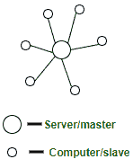
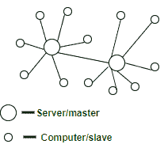
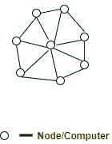

# 对比–集中式、分散式和分布式系统

> 原文:[https://www . geesforgeks . org/comparison-集中式-分散式-分布式系统/](https://www.geeksforgeeks.org/comparison-centralized-decentralized-and-distributed-systems/)

在本文中，我们将尝试理解和比较集中式、分散式和分布式系统的不同方面。

### 1.集中式系统:

我们从集中式系统开始，因为它们最直观、最容易理解和定义。

集中式系统是使用客户机/服务器体系结构的系统，其中一个或多个客户机节点直接连接到中央服务器。这是许多组织中最常用的系统类型，其中客户端向公司服务器发送请求并接收响应。

**图–**集中式系统可视化

**示例–**
维基百科。考虑一个巨大的服务器，我们向它发送请求，服务器用我们请求的文章进行响应。假设我们在维基百科的搜索栏中输入了搜索词“垃圾食品”。该搜索词作为请求发送到维基百科服务器(大部分位于美国弗吉尼亚州)，然后该服务器根据相关性回复文章。在这种情况下，我们是客户端节点，维基百科服务器是中央服务器。

**集中系统特点–**

*   **全局时钟的存在:**由于整个系统由一个中心节点(一个服务器/一个主节点)和许多客户端节点(一台计算机/一个从节点)组成，所有客户端节点都与全局时钟(中心节点的时钟)同步。
*   **单个中央单元:**服务/协调系统中所有其他节点的单个中央单元。
*   **组件的相关故障:**中心节点故障导致整个系统故障。这很有意义，因为当服务器关闭时，没有其他实体在那里发送/接收响应/请求。

**缩放–**
只能在中央服务器上垂直缩放。水平缩放将与单个中央实体系统的单个中央单元特征相矛盾。

**集中系统的组件–**
集中系统的组件有:

*   节点(计算机、移动等。).
*   服务器。
*   通信链路(电缆、无线网络等)。).

**集中式系统架构–**
客户端-服务器架构。服务于系统中其他节点的中心节点是服务器节点，所有其他节点是客户端节点。

**集中系统的局限性–**

*   超过一定限制后无法纵向扩展–超过限制后，即使增加服务器节点的硬件和软件功能，性能也不会明显提高，从而导致成本/收益比< 1. 

*   当流量达到峰值时，就会出现瓶颈，因为服务器只能有有限数量的开放端口来侦听来自客户端节点的连接。因此，当高流量发生时，如购物销售，服务器基本上可能遭受[拒绝服务](https://www.geeksforgeeks.org/deniel-service-prevention/)攻击或分布式拒绝服务攻击。

**集中系统优势–**

*   易于物理保护。根据服务器和客户端节点的位置，很容易保护和服务它们
*   流畅优雅的个人体验–客户有自己使用的专用系统(例如，个人电脑)，公司有类似的系统，可以根据客户需求进行修改
*   专用资源(内存、中央处理器内核等)
*   在一定限度内，小型系统的成本效率更高–由于中央系统需要较少的资金来建立，因此在必须构建小型系统时，它们具有优势
*   可以快速更新–只需更新一台机器。
*   从系统中轻松分离节点。只需从服务器上移除客户端节点的连接，瞧！节点已分离。

**集中式系统的缺点–**

*   高度依赖网络连接–如果节点失去连接，系统可能会失败，因为只有一个中心节点。
*   系统没有正常退化–整个系统突然出现故障
*   数据备份的可能性更小。如果服务器节点出现故障并且没有备份，您会立即丢失数据
*   服务器维护困难–只有一个服务器节点，由于可用性原因，关闭服务器进行维护效率低下且不专业。因此，更新必须在运行中进行(热更新)，这很困难，系统可能会崩溃。

**集中系统的应用–**

*   应用程序开发–非常容易设置中央服务器和发送客户端请求。现在的现代技术确实有默认的测试服务器，可以通过几个命令启动。比如快递服务器，Django 服务器。
*   数据分析–当所有数据都在一个地方并可供分析时，数据分析很容易
*   个人计算

**用例–**

*   集中式数据库—将所有数据放在一台服务器上使用。
*   单人游戏，如需要速度，GTA 副城-一个系统中的整个游戏(通常是个人电脑)
*   通过部署测试服务器进行应用程序开发，易于调试、部署和模拟
*   个人电脑

**组织使用–**
国家信息中心(印度)，IBM

### 2.分散系统:

这些其他类型的系统越来越受欢迎，主要是因为比特币的大规模炒作。现在许多组织都在努力寻找这种系统的应用。

在分散系统中，每个节点都做出自己的决定。系统的最终行为是各个节点决策的集合。请注意，没有接收和响应请求的单一实体。

**图–**分散式系统可视化

**示例–**
比特币。我们以比特币为例，因为它是去中心化系统最流行的用例。没有一个实体/组织拥有比特币网络。网络是所有节点的总和，这些节点相互交谈以保持每个账户持有人拥有的比特币数量。

**分散系统的特征–**

*   **缺少全局时钟:**每个节点都是相互独立的，因此它们运行和遵循不同的时钟。
*   **多个中央单元(计算机/节点/服务器):**多个中央单元，可以监听来自其他节点的连接
*   **组件的相关故障:**一个中心节点故障导致系统的一部分故障；不是整个系统

**缩放–**
垂直缩放是可能的。每个节点都可以向自身添加资源(硬件、软件)来提高性能，从而提高整个系统的性能。

**组件–**
分散系统的组件有:

*   节点(计算机、移动等。)
*   通信链路(电缆、无线网络等)。)

**分散系统架构–**

*   对等架构–所有节点都是彼此的对等体。任何一个节点都不能凌驾于其他节点之上
*   主从架构–一个节点可以通过投票成为主节点，并帮助协调系统的一部分，但这并不意味着该节点比它正在协调的另一个节点具有优势

**分散系统的局限性–**

*   可能会导致企业层面的协调问题——当每个节点都是自己行为的所有者时，就很难完成集体任务
*   不适合小型系统–由于低成本/收益比，不利于小型分散系统的构建和运营
*   无法管理系统上的节点–没有上级节点监督下级节点的行为

**分散系统的优势–**

*   出现性能瓶颈的最小问题——所有节点上的整个负载都得到平衡；导致最小到没有瓶颈的情况
*   高可用性–一些节点(计算机、移动设备、服务器)始终可用/在线工作，从而实现高可用性
*   更多的自主权和对资源的控制–由于每个节点都控制自己的行为，因此它拥有更好的自主权，从而对资源有更多的控制

**分散系统的缺点–**

*   难以完成全球性的大任务——没有指挥其他人执行特定任务的指挥链
*   没有监管监督
*   很难知道哪个节点出现故障–必须对每个节点进行可用性检查，并且必须对工作进行分区，通过检查节点生成的预期输出来找出哪个节点出现故障
*   很难知道哪个节点响应了——当一个请求由一个分散的系统服务时，该请求实际上由系统中的一个节点服务，但实际上很难找出哪个节点确实服务了该请求。

**分散系统的应用–**

*   专用网络–对等节点相互连接形成专用网络。
*   密码货币–节点加入成为系统的一部分，在该系统中，数字货币的交换没有任何谁将什么发送给谁的痕迹和位置。然而，在比特币中，我们可以看到公开的地址和转移的比特币数量，但是这些公开的地址是可变的，因此很难追踪。

**用例–**

*   区块链
*   分散的数据库–整个数据库被分割成多个部分，并分布到不同的节点进行存储和使用。例如，名称从“A”到“K”的记录在一个节点中，从“L”到“N”在第二个节点中，从“O”到“Z”在第三个节点中
*   加密货币

**使用–**
比特币的组织，Tor 网络

### 3.分布式系统:

这是我们要讨论的最后一种系统。让我们开始吧！

在分散系统中，每个节点都做出自己的决定。系统的最终行为是各个节点决策的集合。请注意，没有接收和响应请求的单一实体。

**图–**分布式系统可视化

**示例–**
谷歌搜索系统。每一个请求都由数百台计算机处理，它们爬上网络并返回相关结果。对用户来说，谷歌看起来是一个系统，但实际上是多台计算机一起工作来完成一项任务(将结果返回给搜索查询)。

**分布式系统的特点–**:

*   **组件的并发性:**节点应用共识协议来就相同的值/事务/命令/日志达成一致。
*   **缺少全局时钟:**所有节点都维护自己的时钟。
*   **组件独立失效:**在分布式系统中，节点独立失效，不会对整个系统产生重大影响。如果一个节点出现故障，没有故障节点的整个系统将继续工作。

**缩放–**
水平和垂直缩放是可能的。

**分布式系统的组件–**
分布式系统的组件有:

*   节点(计算机、移动等。)
*   通信链路(电缆、无线网络等)。)

**分布式系统架构–**

*   点对点–所有节点都是彼此的对等体，并朝着共同的目标努力
*   客户端-服务器–一些节点成为服务器节点，充当协调器、仲裁器等角色。
*   n 层架构–应用程序的不同部分分布在系统的不同节点上，这些节点协同工作，充当用户/客户端的应用程序

**分布式系统的局限性–**

*   难以为系统设计和调试算法。这些算法是困难的，因为没有一个共同的时钟；因此命令/日志不会发生时间排序。节点可能有不同的延迟，在设计此类算法时必须牢记这一点。复杂性随着节点数量的增加而增加。更多信息请访问[这个](http://www.cs.bham.ac.uk/~bxb/courses/02_03_DS/Lecture09_Handouts.pdf)链接
*   没有一个公共时钟会导致事件/事务的时间顺序出现困难
*   节点很难获得系统的全局视图，因此很难根据系统中其他节点的状态做出明智的决策

**分布式系统的优势–**

*   比集中式系统的延迟更低–分布式系统的延迟更低，因为地理位置分散，因此获得响应的时间更短

**分布式系统的缺点–**

*   难以达成[共识](https://www.geeksforgeeks.org/raft-consensus-algorithm/)
*   按事件发生的绝对时间记录事件的传统方式在这里是不可能的

**分布式系统的应用–**

*   集群计算——一种将多台计算机耦合在一起工作以实现全球目标的技术。计算机集群就像是一台单独的计算机
*   网格计算——所有资源汇集在一起，在这种计算中共享，将系统变成一台强大的超级计算机；本质上。

**用例–**

*   基于 SOA 的系统
*   多人在线游戏

**组织使用–**
苹果、谷歌、脸书。