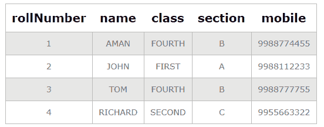

# SQL 中的组合键

> 原文:[https://www.geeksforgeeks.org/composite-key-in-sql/](https://www.geeksforgeeks.org/composite-key-in-sql/)

要知道什么是复合键，我们需要知道什么是主键，主键是在 SQL 表中具有唯一且非空值的列。

现在，复合键也是主键，但不同的是，它是由多列组合而成的，用于标识表中的特定行。

**复合键:**

复合键是由表中的两列或多列组合而成的，当列组合时，可以用来唯一标识表中的每一行。一行的唯一性得到保证，但当单独使用时，它不能保证唯一性，或者它也可以理解为由两个或多个属性组合而成的主键，用于唯一标识表中的每一行。

**注:**

*   一个组合键也可以由多个候选键组合而成。
*   复合键不能为空。

**示例:**

创建数据库:

```
CREATE School;
```

使用数据库:

```
USE School;
```

使用复合键创建表:

```
CREATE TABLE student
(rollNumber INT, 
name VARCHAR(30), 
class VARCHAR(30), 
section VARCHAR(1), 
mobile VARCHAR(10),
PRIMARY KEY (rollNumber, mobile));
```

***在本例中，我们将复合键设为两列的组合，即 rollNumber 和 mobile，因为学生表的所有行都可以由该复合键唯一标识。**T3】*

在表中插入记录:

```
INSERT INTO student (rollNumber, name, class, section, mobile) 
VALUES (1, "AMAN","FOURTH", "B", "9988774455");
INSERT INTO student (rollNumber, name, class, section, mobile) 
VALUES (2, "JOHN","FIRST", "A", "9988112233");
INSERT INTO student (rollNumber, name, class, section, mobile) 
VALUES (3, "TOM","FOURTH", "B", "9988777755");
INSERT INTO student (rollNumber, name, class, section, mobile) 
VALUES (4, "RICHARD","SECOND", "C", "9955663322");
```

查询记录:

```
SELECT * FROM student;
```

**输出:**

