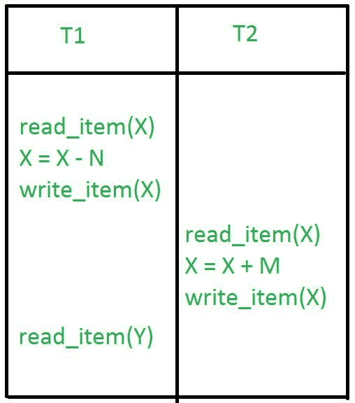
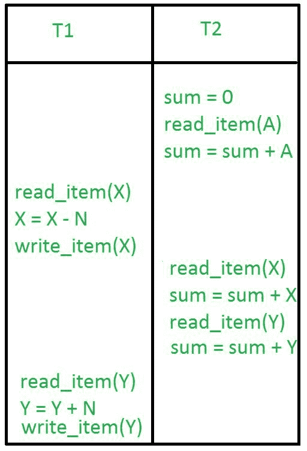
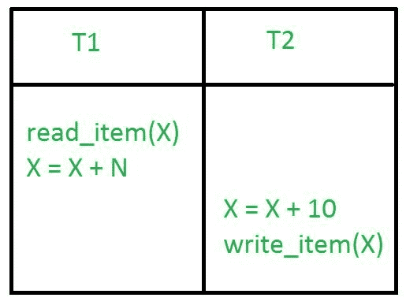
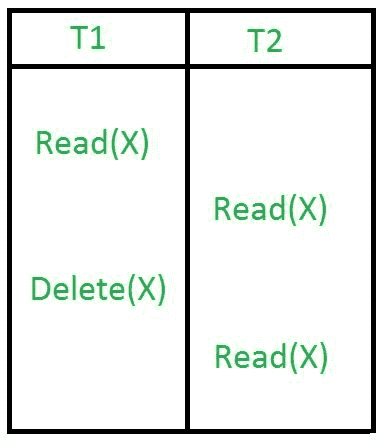

# DBMS 事务中的并发问题

> 原文:[https://www . geesforgeks . org/concurrency-in-DBMS-transactions/](https://www.geeksforgeeks.org/concurrency-problems-in-dbms-transactions/)

当[多个事务](https://www.geeksforgeeks.org/concurrency-control-in-dbms/)以不受控制或不受限制的方式并发执行时，可能会导致几个问题。这些问题通常被称为数据库环境中的并发问题。数据库中可能出现的五个并发问题是:

*   临时更新问题
*   摘要问题不正确
*   丢失更新问题
*   不可重复读取问题
*   幻影读取问题

这些解释如下。

### **临时更新问题:**

当一个事务更新一个项目并失败时，会出现临时更新或脏读问题。但是，在项目被更改或还原回其最后值之前，更新的项目被另一个事务使用。

#### **例:**

在上面的例子中，如果事务 1 由于某种原因失败，那么 X 将恢复到它以前的值。但是事务 2 已经读取了错误的 x 值。

### **汇总问题不正确:**

考虑这样一种情况，一个事务正在对一些记录应用聚合函数，而另一个事务正在更新这些记录。聚合函数可以在值被更新之前计算一些值，而在值被更新之后计算其他值。

#### **示例:**

在上面的示例中，事务 2 正在计算一些记录的总和，而事务 1 正在更新它们。因此，聚合函数可能会在更新之前计算一些值，而在更新之后计算另一些值。

### **更新丢失问题:**

在丢失更新问题中，事务对数据项所做的更新会丢失，因为它被另一个事务所做的更新所覆盖。

#### **例:**

在上面的示例中，事务 1 更改了 X 的值，但它被事务 2 在 X 上完成的更新覆盖。因此，事务 1 完成的更新丢失。

### **不可重复读取问题:**

当同一事务的两个或多个读取操作读取同一变量的不同值时，就会出现不可重复的问题。

#### **示例:**

在上面的例子中，一旦事务 2 读取变量 X，事务 1 中的写操作改变变量 X 的值。因此，当事务 2 执行另一个读操作时，它读取由事务 1 更新的 X 的新值。

### **幻影读取问题:**

当一个事务读取一个变量一次，但是当它试图再次读取同一个变量时，就会出现一个错误，说这个变量不存在。

#### **例:**

在上面的例子中，一旦事务 2 读取了变量 X，事务 1 就会在事务 1 不知情的情况下删除变量 X。因此，当事务 2 试图读取 X 时，它不能这样做。