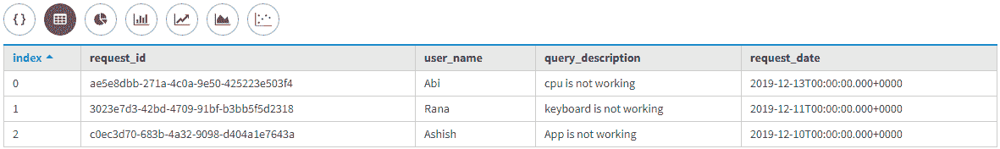
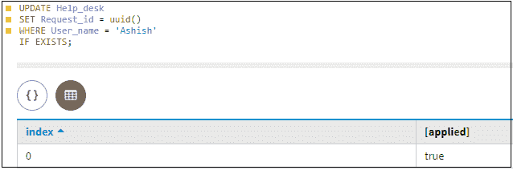
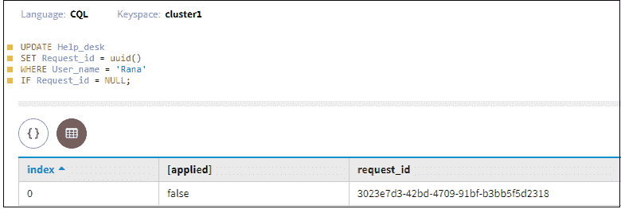
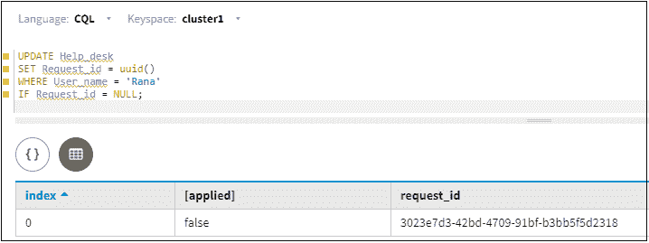
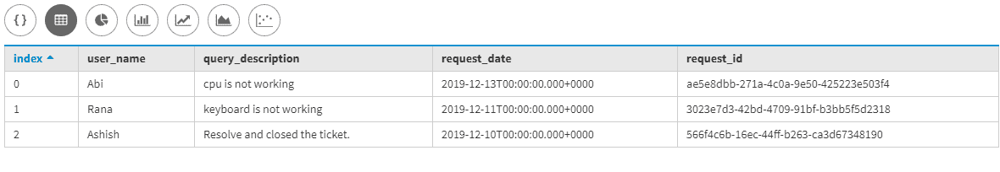

# 有条件更新列

> 原文:[https://www . geesforgeks . org/有条件更新-栏目/](https://www.geeksforgeeks.org/conditionally-updating-columns/)

在本文中，我们将讨论如何有条件地更新列，并讨论 IF、IF EXISTS 和 IF NOT EXISTS 条件命令如何有助于条件更新。

条件更新非常有帮助，因为查询将返回真或假的结果，并且在 IF、IF EXISTS 和 IF NOT EXISTS 之后的事务中，这种类型的命令属于 Cassandra 中的轻量级事务。那么，我们来看看。

如果查询匹配一行，那么 IF EXISTS 命令将成功执行，如果该行匹配，则返回结果 TRUE，否则返回 FALSE。让我们用一个例子来理解。

```
CREATE TABLE Help_desk
(
 User_name  text,
 Request_id  uuid,
 Query_description text,
 Request_date date,
 Primary key(User_name)
); 
```

现在，将一些数据插入帮助台。

```
INSERT INTO Help_desk (Request_id, User_name, Query_description, Request_date ) 
VALUES (uuid(), 'Ashish', ' App is not working', '2019-12-10');

INSERT INTO Help_desk (Request_id, User_name, Query_description, Request_date ) 
VALUES (uuid(), 'Rana', ' keyboard is not working', '2019-12-11');

INSERT INTO Help_desk (Request_id, User_name, Query_description, Request_date ) 
VALUES (uuid(), 'Abi', ' cpu is not working', '2019-12-13'); 
```

让我们看看结果。

```
select * 
from Help_desk; 
```

**输出:**



现在，我们要更新帮助台表。
我们来看看。

```
UPDATE Help_desk
SET Query_description = 'Resolve and closed the ticket.' 
WHERE User_name = 'Ashish'  
IF EXISTS; 
```

在上面的 CQL 查询中，如果该行存在，它将返回 true。
让我们看看结果。

**输出:**


在上面的 CQL 查询中，如果不存在行，它将返回 true。
让我们看看结果。

```
 [applied]
-----------
   False 
```

```
UPDATE Help_desk
SET Request_id = uuid()
WHERE User_name = 'Ashish'
IF NOT EXISTS; 
```



使用 IF 条件对匹配行中的一个或多个其他(非主键)列值应用测试。

现在，我们将对匹配行中的其他列值使用 IF 条件。例如，仅当请求标识匹配时才设置新的 UUID。

```
UPDATE Help_desk
SET Request_id = uuid()  
WHERE User_name = 'Rana'
IF Request_id = NULL; 
```

让我们看看结果。

**输出:**



在这里，我们将检查一个空值的 IF 条件测试，例如:

```
UPDATE Help_desk 
SET Request_id = uuid()  
WHERE User_name = 'Rana'
IF Request_id = NULL; 
```

让我们看看结果。

**输出:**



现在，这里我们将看到所有更改后的最终表输出。

让我们看看结果。

```
select * 
from Help_desk; 
```

**输出:**



**注:**

*   在上面的场景中，如果 A 记录匹配，并且 Request_id 列没有插入值，我们只是提几点。
*   这是第二个观察，如果一个记录匹配并且 Request_id 列有一个值(不为 null)，那么语句失败。
*   如果没有符合相应条件的记录，则会创建一条新记录。

**注意:**在 CQL 查询中，条件更新是轻量级事务的例子，它们会带来不可忽略的性能，这是有代价的，应该谨慎使用。