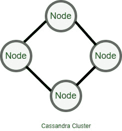

# 在卡珊德拉配置集群

> 原文:[https://www . geeksforgeeks . org/configuration-clusters-in-Cassandra/](https://www.geeksforgeeks.org/configuring-clusters-in-cassandra/)

先决条件–[监控 Cassandra 中的集群](https://www.geeksforgeeks.org/monitoring-cluster-in-cassandra/)
在本文中，我们将讨论如何在 cassandra.yaml 文件中配置集群设置。此外，我们将介绍 cassandra.yaml 文件的一些基本部分，在这些部分中，我们可以根据需要更改默认设置。

**集群:**
在卡珊德拉中，集群是一个节点的集合。在集群中，所有节点都可以通过 gossip 协议进行通信，并且集群中的所有节点都具有类似的能力。集群中的节点包含键空间、表、模式信息等。



**集群配置:**

*   在 Cassandra 中，cassandra.yaml 是主要的配置文件，我们可以根据需要在其中更改默认设置，在 cassandra.yaml 文件中进行任何更改后，您必须记住重新启动节点才能生效。
*   cassandra.yaml 文件的安装位置是

    ```
    <install_location>/resources/cassandra/conf.
    ```

**集群配置的常见属性:**
下表包含集群名称、listen_address、种子、本地传输地址等常见配置。

<center>

| 名字 | 配置设置 |
| 群集名称 | 默认值:“测试集群” |
| 监听地址 | 默认值:localhost |
| 本地 _ 传输 _ 地址 | 默认值:localhost |
| 种子 | 默认值:“127.0.0.1” |

</center>

**集群 _ 名称:**
在此配置中，可以在 cassandra.yaml 文件中更改集群的名称。要更改配置设置，请遵循以下步骤–

*   打开 **cassandra.yaml** 文件。
*   使用命令 **ctrl+f** 在文件中搜索。
*   搜索**集群名**。
*   您将在文件 **cluster_name 中看到以下属性:“测试集群”。**是集群节点的默认设置。
*   您可以根据需要更改集群名称，然后按 **ctrl+s** 保存文件。

**listen_address :**
是集群中其他节点查找该节点时使用的 IP 地址。要更改配置设置，请遵循以下步骤–

*   打开 **cassandra.yaml** 文件。
*   使用命令 **ctrl+f** 在文件中搜索。
*   搜索 **listen_address** 。
*   您将在文件 **listen_address: localhost** 中看到以下属性。这是群集节点的默认设置。
*   您可以根据需要更改 IP listen_address，然后按 **ctrl+s** 保存文件。

**native _ transport _ address:**
它是客户端用来连接节点或集群的 IP 地址。要更改配置设置，请遵循以下步骤–

*   打开 **cassandra.yaml** 文件。
*   使用命令 **ctrl+f** 在文件中搜索。
*   搜索**原生 _ 运输**。
*   您将在文件**native _ transport _ address:localhost**中看到以下属性。这是群集节点的默认设置。
*   您可以根据需要更改 IP native_transport，然后按 **ctrl+s** 保存文件。

**种子地址或种子地址:**
当新节点加入集群时使用。通常，群集中的所有节点都有相同的种子列表。要更改配置设置，请遵循以下步骤–

*   打开 **cassandra.yaml** 文件。
*   使用命令 **ctrl+f** 在文件中搜索。
*   搜索**种子**。
*   您将在文件**种子中看到以下属性:“127 . 0 . 0 . 1”**。这是群集节点的默认设置。
*   您可以根据自己的要求更改种子 IP 地址，然后按 **ctrl+s** 保存文件。

**输出–**

```
seed_provider :
# Addresses of hosts that are deemed contact points.
# Cassandra nodes use this list of hosts to find each other and learn
# the topology of the ring. You must change this if you are running
# multiple nodes!

class_name : org.apache.cassandra.locator.SimpleSeedProvider

parameters :
# seeds is actually a comma-delimited list of addresses.
# Example - "<ip1>, <ip2>, <ip3>"

seeds : "127.0.0.1"
```

**集群配置示例:**

<center>

| 环境 | 节点 1 | 附注 2 | 节点 3 |
| IP 地址(外部) | 192.168.10.71 | 192.168.10.72 | 192.168.10.73 |
| 群集名称 | DC1 | DC1 | DC1 |
| 监听地址 | 192.168.10.71 | 192.168.10.72 | 192.168.10.73 |
| 本地 _ 传输 _ 地址 | 192.168.10.71 | 192.168.10.72 | 192.168.10.73 |
| 种子 | “192.168.10.71” | “192.168.10.72” | “192.168.10.73” |

</center>