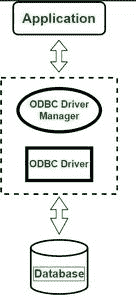

# ODBC 的连接

> 原文:[https://www.geeksforgeeks.org/connectivity-of-odbc/](https://www.geeksforgeeks.org/connectivity-of-odbc/)

[开放数据库连接或 ODBC](https://www.geeksforgeeks.org/odbc-full-form/) 是用于访问数据库的开放标准应用编程接口(API)。它可以用同一个源代码通过一个应用程序管理多个数据库管理系统。

数据库应用程序调用 ODBC 接口中的函数，这些函数在称为驱动程序的特定于数据库的模块中实现。驱动程序用于将应用程序与特定于数据库的调用隔离开来。

*   ODBC 为数据(也称为元数据)提供了广泛的数据支持。
*   ODBC 提供多种服务来获取关于类型和函数数据。
*   ODBC 使用 SQL 语法，每当用户将语句传输到 ODBC 驱动程序时，它就类似于并将其转换为基本数据库接受的适当的 SQL 语句。
*   ODBC 驱动程序可以开发各种应用程序，这些应用程序可以与不同的数据库进行通信，并且可以将应用程序从一个数据库切换到另一个数据库。
*   基于 ODBC 的数据架构，应用程序连接到 ODBC 驱动程序和驱动程序管理器，然后进一步链接到数据库，这对于从数据库中访问信息很有用。
*   ODBC 驱动程序处理 ODBC 活动调用，向特定数据源发送 SQL 请求，并在系统中返回结果。ODBC 驱动程序还可以修改系统应用程序，以适应相应数据库支持的语法。
*   驱动程序管理器为每个应用程序加载驱动程序。

ODBC 连接的优缺点:

**优点:**

*   它很好地集成到许多不同的 RAD 工具中。
*   它很容易进入各种开发站点的各种“数据绑定”对象，如 Power builder、Delphi、Visual Basic 和 Java 等。
*   它还简化并加快了应用程序开发。
*   借助于 ODBC 提供的模板，一次组织许多不同的项目也很有帮助。
*   它还允许完全集成，这意味着单个系统可以轻松访问不同的数据管理系统，或者我们也可以说，ODBC 允许单个系统根据用户需求或可用的 DBMS 类型来管理不同类型的 DBMS。
*   借助内置功能，我们可以创建自定义应用程序。

cons:t1]

*   ODBC 驱动程序对用户不友好
*   ODBC 驱动程序没有标准化。这就是为什么客户端维护自己的驱动程序，命名表，这给大型网站的管理带来了问题
*   低速
*   由于 ODBC 规范只指定了应用程序协议，因此它基本上继承了使用它的框架的特性。因此，我们可以说可靠性取决于正在使用的底层框架的请求/响应协议的实现。