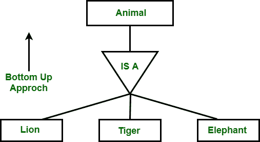

# 泛化的约束

> 原文:[https://www . geesforgeks . org/constraints-on-generation/](https://www.geeksforgeeks.org/constraints-on-generalization/)

为了更准确地对企业建模，有一些约束适用于特定的[概括](https://www.geeksforgeeks.org/generalization-specialization-and-aggregation-in-er-model/)上的数据库。

一般化

概括有以下三种限制:

1.  首先确定哪个实体可以是低级实体集的成员。
2.  第二个涉及实体是否属于多个较低级别的实体集。
3.  第三个指定较高级别实体集中的实体是否必须属于泛化中的至少一个较低级别的实体集。

### 1.首先确定哪个实体可以是低级实体集的成员:

这种成员资格可以是以下之一:

*   **条件定义–**
    在这个较低级别的实体集中，成员资格的评估是基于实体是否满足显式条件。例如，让我们假设，更高级别的实体集学生具有属性学生类型。学生的所有实体都是通过学生属性的定义来评价的。实体通过满足条件即学生类型=“研究生”来接受，然后只允许它们属于较低级的实体集即研究生。通过满足条件的学生类型=“本科”，则他们被包括在本科学生中。事实上，所有较低级别的实体都是基于相同的属性进行评估的，因此也称为属性定义的。

*   **用户自定义–**
    在这个较低层次的实体集不受一个名为隶属度的条件约束；数据库的用户将实体分配给给定的实体集。例如，考虑这样一种情况，在雇佣 3 个月后，大学的员工被分配到四个工作团队中的一个。为此，我们将团队表示为高级员工实体集的四个低级实体集。根据明确的定义条件，给定的员工不会被分配到特定的团队实体。负责此决策的用户根据个人情况进行团队分配。通过向实体集添加实体，实现了赋值。

### 2.第二个涉及实体是否属于多个较低级别的实体集:

以下是较低级别的实体集之一:

*   **不相交–**
    这个约束的要求是一个实体不应该属于一个以上的下级实体集。例如，学生实体的实体只满足学生类型属性的一个条件，即一个实体可以是研究生或本科生，但不能同时是两者。
*   **重叠–**
    在这一类归纳中，在单个归纳中，同一实体可能属于多个较低级别的实体集。例如，在员工工作团队中，假设某些员工参与多个工作团队。因此，它为给定的员工提供了他可能出现在多个团队实体集(员工的低级实体集)中的机会。因此，概括是重叠的。

### 3.第三个指定 pr(而不是更高级别实体集中的实体)是否必须属于一般化中的至少一个更低级别的实体集:

此约束可能是以下之一:

*   **完全泛化或特殊化–**
    根据这个约束，每个更高级别的实体必须属于一个更低级别的实体集。
*   **部分泛化或特殊化–**
    根据这个约束，一些较高级别的实体可能不属于任何较低级别的实体集。