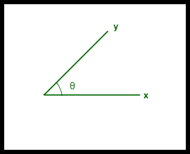

# 余弦相似度

> 原文:[https://www.geeksforgeeks.org/cosine-similarity/](https://www.geeksforgeeks.org/cosine-similarity/)

前提–[数据挖掘中的距离度量](https://www.geeksforgeeks.org/measures-of-distance-in-data-mining/)

在[数据挖掘](https://www.geeksforgeeks.org/data-mining/)中，相似性度量是指数据集中用维度表示数据对象特征的距离。如果这个距离比较小，相似度会比较高，但是当距离比较大的时候，相似度会比较低。

一些流行的相似性度量是–

1.  欧几里得距离。
2.  曼哈顿距离。
3.  雅克卡相似性。
4.  闵可夫斯基距离。
5.  余弦相似度。

**余弦相似度**是一种度量，有助于确定数据对象的相似程度，而与它们的大小无关。我们可以使用余弦相似度来度量 Python 中两个句子之间的[相似度。在余弦相似性中，数据集中的数据对象被视为向量。求两个向量之间余弦相似度的公式是–](https://www.geeksforgeeks.org/python-measure-similarity-between-two-sentences-using-cosine-similarity/)

```
Cos(x, y) = x . y / ||x|| * ||y||
```

哪里，

*   **x . y** =向量‘x’和‘y’的乘积(点)。
*   **||x||** 和 **||y||** =两个向量‘x’和‘y’的长度。
*   **||x|| * ||y||** =两个向量‘x’和‘y’的叉积。

**示例:**
考虑一个示例，使用余弦相似度计算两个向量–**‘x’**和**‘y’**之间的相似度。

“x”向量有值， **x = { 3，2，0，5 }**
“y”向量有值， **y = { 1，0，0，0 }**

计算余弦相似度的公式为: **Cos(x，y) = x . y / ||x|| * ||y||**

```
x . y = 3*1 + 2*0 + 0*0 + 5*0 = 3

||x|| = √ (3)^2 + (2)^2 + (0)^2 + (5)^2 = 6.16

||y|| = √ (1)^2 + (0)^2 + (0)^2 + (0)^2 = 1

∴ Cos(x, y) = 3 / (6.16 * 1) = 0.49 
```

两个向量“x”和“y”之间的差异由–

```
∴ Dis(x, y) = 1 - Cos(x, y) = 1 - 0.49 = 0.51
```

*   两个向量之间的余弦相似度用“θ”来衡量。
*   如果θ= 0,“x”和“y”向量重叠，从而证明它们相似。
*   如果θ= 90 °,则“x”和“y”向量不同。



两个向量之间的余弦相似性

**优势:**

*   余弦相似性是有益的，因为即使两个相似的数据对象由于大小而相距欧几里德距离很远，它们之间仍然可以有更小的角度。角度越小，相似度越高。
*   当绘制在多维空间上时，余弦相似性捕捉数据对象的方向(角度)，而不是幅度。