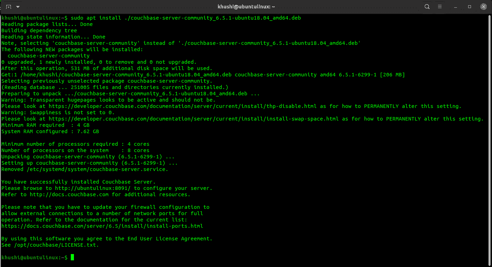
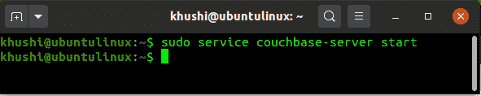
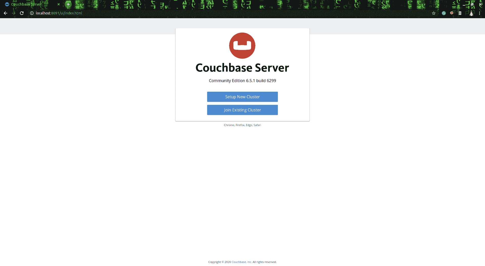
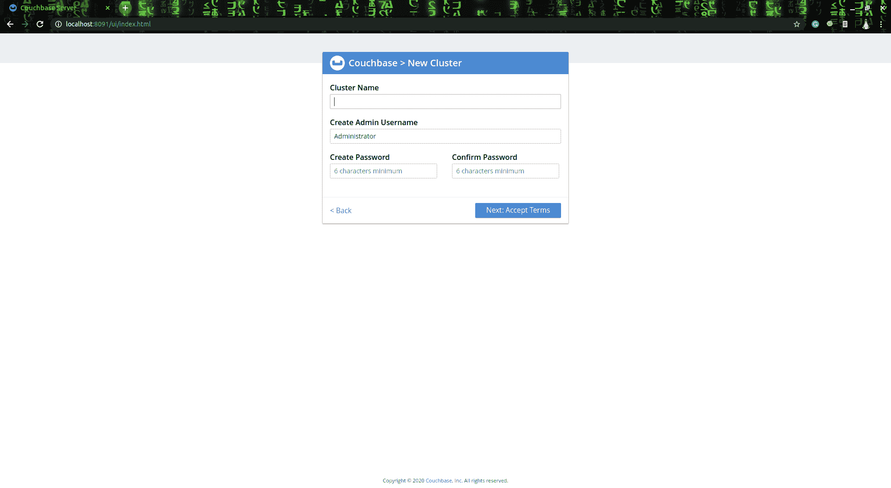
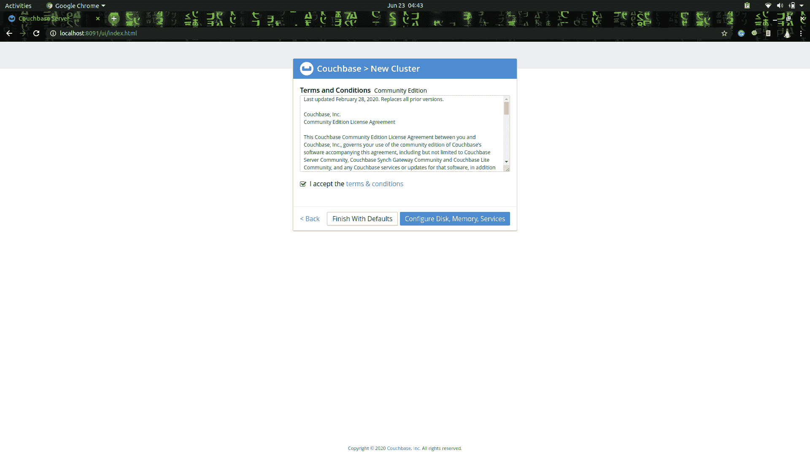
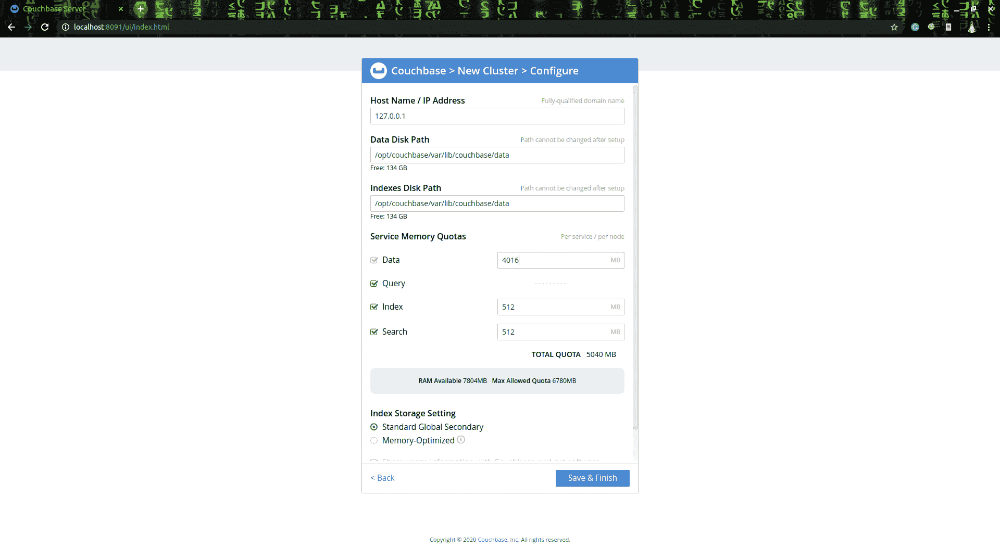
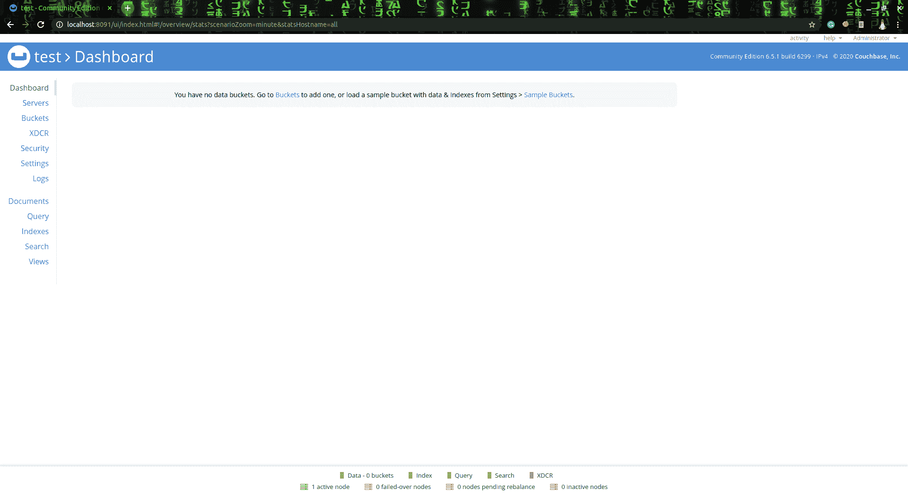

# couch base 安装

> 哎哎哎:# t0]https://www . geeksforgeeks . org/couch base-installation/

**Couchbase 服务器**是 [NoSQL](https://www.geeksforgeeks.org/introduction-to-nosql/) 数据库软件包，用于交互应用。这是一个开源的 NoSQL 数据库，它为我们提供了一种存储和恢复数据的机制，该机制是以关系数据库中使用的表格关系以外的方式建模的。它有多个数据访问路径来查询和管理我们的 JSON 文档。它提供最终一致性和即时一致性方法，以确保分布式系统中的一致性。

**安装:**
要安装 couchbase，我们首先需要下载 couchbase 服务器设置文件，之后，我们必须通过包管理器安装该文件，然后我们最终必须启动 couchbase 服务器，以便在 localhost 上运行它。

**安装程序如下:**

1.  **从[这里](https://www.couchbase.com/downloads)下载 couchbase** 数据库。
2.  Move to the location where the file is downloaded and use the following command to **install the downloaded file**.

    ```
    sudo apt install ./couchbase-server-community_6.5.1-ubuntu18.04_amd64.deb
    ```

    
    **注意:-** 用下载的版本替换命令中的版本。

3.  After the successful installation, **run the couchbase service** using the following command.

    ```
    sudo service couchbase-server start
    ```

    

4.  现在访问 [http://localhost:8091/](http://localhost:8091/) 如果给出如下结果，那么您的**安装成功**。
    

**创建自己的集群:**

1.  点击**设置新集群**按钮，创建自己的集群。
    T3】
2.  在此输入您的集群详细信息。
    
3.  正确阅读 couchbase 的条款和条件，如果发现合适，接受它们。
    
4.  输入集群所需的配置。
    
5.  如果一切顺利，您将拥有如下所示的仪表板。
    