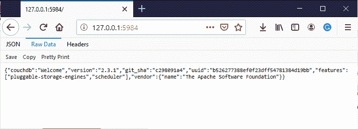
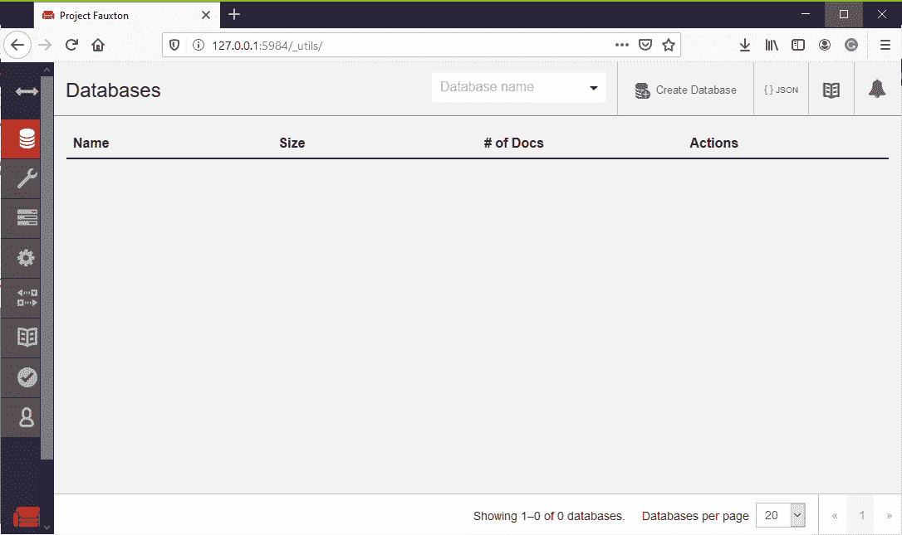

# couch db

> 原文:[https://www.geeksforgeeks.org/couchdb/](https://www.geeksforgeeks.org/couchdb/)

CouchDB 是一个**开源[NoSQL](https://www.geeksforgeeks.org/introduction-to-nosql/)T3】数据库。它主要关注易用性。它是由**阿帕奇软件**基金会开发的。**

**Apache CouchDB** 是最新类型的数据库之一。CouchDB 是 2005 年发布的多主应用程序，2008 年成为 Apache 项目。它是用**二郎编程语言**编写的。它基本上是一个面向文档的数据库，每个文档中的字段都存储为键值映射。字段可以是简单的键/值对、列表或映射。

CouchDB 使用 HTTP 协议进行 API。它使用 javascript 作为查询语言来转换文档，使用 JSON 来存储数据。

**为什么是 CouchDB？**
CouchDB 非常强大，可以用来查询你的数据。它还有一个无模式的文档模型，这使得它对普通应用程序更加友好，并且易于使用。

*   我们存储的数据采用灵活的基于文档的结构，这消除了在应用程序开发之前或期间对数据结构的担忧。
*   它为用户提供了强大的数据映射，为信息过滤、组合和查询提供了途径。
*   CouchDB 有一个基于 HTTP 的 REST API，有助于轻松与数据库进行通信。
*   像 GET、PUT、DELETE 这样的方法非常容易理解、使用和开发。

**CouchDB 数据模型:**

*   在 CouchDB 中，每个数据库都是独立文档的集合，构成了它的最外层数据结构/容器。
*   每个文档都维护自己的数据和独立的模式。
*   要合并数据库断开连接时出现的差异，文档元数据包含修订信息。
*   为了避免在写入过程中锁定数据库字段，它实现了多版本并发控制。

**<u>安装 CouchDB :</u>**

1.  从官方[网站](https://couchdb.apache.org/)下载 CouchDB 软件。
2.  安装下载的软件。
3.  Now visit the link [http://127.0.0.1:5984/](http://127.0.0.1:5984/).

    

4.  To interact with CouchDB web interface go to the link [http://127.0.0.1:5984/_utils/](http://127.0.0.1:5984/_utils/).

    

现在，您已经成功安装了 CouchDB。