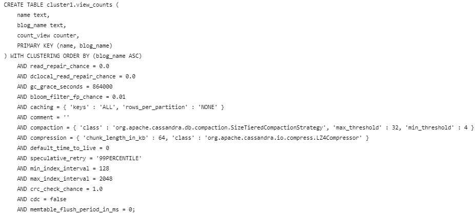
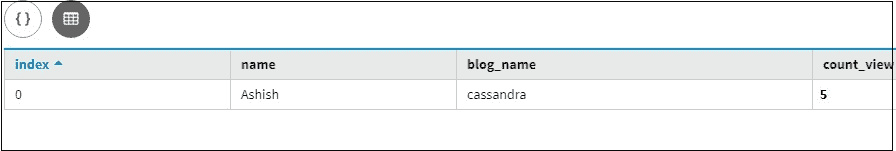
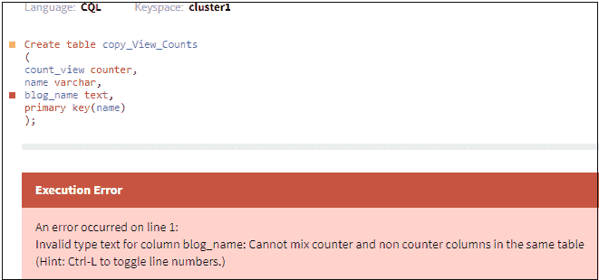

# 卡珊德拉中的计数器类型

> 原文:[https://www.geeksforgeeks.org/counter-type-in-cassandra/](https://www.geeksforgeeks.org/counter-type-in-cassandra/)

在本文中，我们将讨论如何在 [Cassandra](https://www.geeksforgeeks.org/introduction-to-apache-cassandra/) 中创建计数器类型列，以及在将计数器列用作表中的数据类型时有什么限制，我们将看到如何通过使用更新查询来更新计数器列。让我们一个一个来讨论。

计数器是一个特殊的列，用于存储一个数字，该数字随时间的变化而递增。例如，您可以使用计数器列来计算页面被查看的次数。因此，我们可以仅在专用表中定义一个计数器，并使用该计数器数据类型。

**计数栏限制:**

*   计数器列无法索引、删除或重新添加计数器列。
*   表中的所有非计数器列都必须定义为主键的一部分。
*   要在计数器列中加载数据或增加或减少计数器的值，请使用 update 命令。

现在，我们将创建一个带有计数器列的表。让我们来看看。

```
Create table View_Counts 
 (
  count_view counter,
  name varchar,
  blog_name text,
  primary key(name, blog_name)
 ); 
```

让我们看看表模式。

```
describe table View_Counts; 
```

**输出:**



现在，我们将借助 Update 子句为计数器列插入值。
我们来看看。

```
update View_counts set count_view = count_view+1 
where name = 'Ashish'and blog_name =  'cassandra';  
```

让我们看看结果。

```
select * 
from View_Counts; 
```

**输出:**


现在，我们将在 update 子句的帮助下更新计数器列的值。
我们来看看。

```
update View_counts set count_view = count_view + 4 
where name = 'Ashish'and blog_name =  'cassandra'; 
```

让我们看看结果。

```
select * 
from View_Counts; 
```

**输出:**



我们还可以在 Update 子句的帮助下减少计数器列的值。让我们来看看。

```
update View_counts set count_view = count_view - 4 
where name = 'Ashish'and blog_name =  'cassandra'; 
```

让我们看看结果。

```
select * 
from View_Counts; 
```

**输出:**


卡珊德拉拒绝在命令中使用时间星或使用 TTL 来更新计数器列。因此，让我们创建一个视图计数表。因此，我们创建了 count_view，这是一个 counter 类型的计数器值。这非常重要，我们有一个名字和 blog_name，我们可以看到主键是有一个名字和 blog_name。

如果我们试图创建一个类似的表，比如说–copy _ View _ Counts，主键将是唯一的名称，我们会得到一个错误。因为如果计数器列和非计数器列不是主键，则不能在同一个表中混合使用它们。让我们来看看。

让我们用一个例子来理解。

```
Create table copy_View_Counts
 (
  count_view counter,
  name varchar,
  blog_name text,
  primary key(name)
 ); 
```

这里，所有非计数器列都必须是主键的一部分。但是，唯一的名称是主列的唯一部分，这就是它给出错误的原因。让我们来看看。

让我们看看结果。

```
select * 
from View_Counts; 
```

**输出:**

