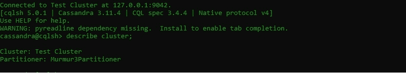

# 在卡珊德拉创建数据库

> 原文:[https://www.geeksforgeeks.org/create-database-in-cassandra/](https://www.geeksforgeeks.org/create-database-in-cassandra/)

在本文中，我们将讨论如何在 Cassandra 中创建数据库。因此，为了更好地理解，在 Cassandra 中创建数据库之前，您可以阅读《[Cassandra 简介》](https://www.geeksforgeeks.org/apache-cassandra-nosql-database/)一文。

**第一步:登录 cqlsh**
可以使用 Cassandra 默认凭据登录 cqlsh。现在，在创建数据库之前，您首先需要登录到 cqlsh。登录 cqlsh 后可以查看集群信息，我们来看看。

```
cqlsh 127.0.0.1 -u cassandra -p cassandra 
```



**步骤-2:创建数据库**
在 Cassandra 中创建键空间与在 SQL 中创建数据库相同。创建如下键空间的 CQL 查询。

```
Syntax: 

CREATE  KEYSPACE [IF NOT EXISTS] keyspace_name                
   WITH REPLICATION = {replication_map}
   [AND DURABLE_WRITES =  true|false] ; 
```

下面是一个示例，展示了如何创建一个名为 App_data 的键空间:

您必须阅读卡珊德拉中的[复制策略，以便更好地理解。](https://www.geeksforgeeks.org/replication-strategy-in-cassandra/)

```
Replication Strategy : NetworkTopologyStrategy
cqlsh> CREATE KEYSPACE IF NOT EXISTS App_data
       WITH REPLICATION = { 'class' : 'NetworkTopologyStrategy',
       'datacenter1' : 3, 'datacenter2': 2 }; 
```

现在，在这里您必须检查如果没有错误，是否创建了数据库，然后您可以运行描述键空间命令来确定数据库确实创建了键空间。

要检查已经创建的所有键空间，可以运行下面给出的 CQL 查询。

```
cqlsh> describe keyspaces; 
```

要检查 App_data 键空间是否已创建，您可以运行下面给出的 CQL 查询。

```
cqlsh> describe App_data; 
```

**输出:**

```
cassandra@cqlsh> describe keyspaces;

university   system    backup_copy     system_traces  system_schema
system_auth  app_data  system_distributed  operation 
```

在 Cassandra 中，IF NOT EXISTS 部分是可选的，但是使用这样的语句总是很好的做法，因为如果键空间循环已经存在，它有助于避免错误。

**步骤 3:描述键空间**
在 Cassandra 中，键空间是一个定义复制的容器。现在，您可以在数据库显示的键空间列表中看到新的键空间 App_data。

现在，要检查关于 App_data 键空间的详细信息，您可以执行 description App _ data 命令。

```
describe App_data; 
```

**输出:**

```
cassandra@cqlsh> describe App_data;

CREATE KEYSPACE app_data WITH 
replication = {'class': 'NetworkTopologyStrategy', 
               'datacenter1': '3', 'datacenter2': '2'}  
AND durable_writes = true; 
```