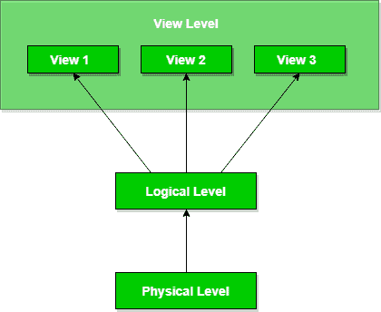

# 数据抽象和数据独立性

> 原文:[https://www . geeksforgeeks . org/数据抽象和数据独立性/](https://www.geeksforgeeks.org/data-abstraction-and-data-independence/)

数据库系统包括复杂的数据结构。为了使系统在数据检索方面高效，并在用户可用性方面降低复杂性，开发人员使用抽象，即对用户隐藏不相关的细节。这种方法简化了数据库设计。

主要有 **3** 级数据抽象:

**物理**:这是最底层的数据抽象。它告诉我们数据实际上是如何存储在内存中的。像顺序或随机访问这样的访问方法和像 B+树这样的文件组织方法，用于相同的散列。可用性、内存大小和记录的次数是我们在设计数据库时需要知道的因素。
假设我们需要存储一个员工的详细信息。存储块和用于这些目的的内存量对用户是隐藏的。

**逻辑**:这一级包括以表格形式实际存储在数据库中的信息。它还以相对简单的结构存储数据实体之间的关系。在这个级别上，用户在视图级别上可用的信息是未知的。
我们可以存储员工的各种属性和关系，例如与经理的关系也可以存储。

**查看**:这是最高层次的抽象。用户只能查看实际数据库的一部分。该级别的存在是为了方便单个用户访问数据库。用户以行和列的形式查看数据。表和关系用于存储数据。同一数据库可能存在多个视图。用户只需查看数据并与数据库交互，存储和实施细节对他们来说是隐藏的。

数据抽象的主要目的是实现数据独立性，以节省数据库修改或变更时所需的时间和成本。
我们有两个层次的数据独立性，它们来自这些抽象层次:

**物理级数据独立性**:是指为了优化的目的，能够在不改变概念或逻辑模式的情况下修改物理模式的特性，例如，数据库的概念结构不会受到数据库系统服务器存储大小的任何变化的影响。从顺序访问文件改为随机访问文件就是这样一个例子。这些对物理结构的变更或修改可能包括:

*   利用新的存储设备。
*   修改用于存储的数据结构。
*   更改索引或使用替代文件组织技术等。

**逻辑级数据独立性:**是指能够在不影响外部模式或应用程序的情况下修改逻辑模式的特性。数据的概念视图的任何更改都不会影响数据的用户视图。这些变化可能包括插入或删除属性、改变表结构实体或与逻辑模式的关系等。

本文由 **Avneet Kaur** 供稿。如果你发现任何不正确的地方，或者你想分享更多关于上面讨论的话题的信息，请写评论。