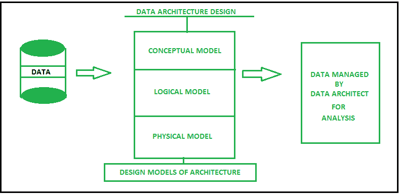

# 数据架构设计和数据管理

> 原文:[https://www . geesforgeks . org/data-architecture-design-and-data-management/](https://www.geeksforgeeks.org/data-architecture-design-and-data-management/)

在计算机和互联网的最初时代，使用的数据不像今天这样多，当时的数据可以由所有用户和企业在一台计算机上轻松存储和管理，因为数据从未超过 19 exabytes 的程度，但现在在这个时代，数据每天增加约 250 万。

大部分数据来自脸书、Instagram、Twitter 等社交媒体网站，其他来源可以是电子商务、电商交易、医院、学校、银行数据等。传统的数据存储技术无法管理这些数据。因此，大数据应运而生，用于处理大而不纯的数据。

[大数据](https://www.geeksforgeeks.org/what-is-big-data/)是企业利用一些[工具](https://www.geeksforgeeks.org/popular-tools-for-data-analytics/)和技术，从社交媒体、全球定位系统、传感器等各种来源收集大数据集并进行系统分析和提取有用模式的领域。在分析和确定数据之前，数据架构必须由架构师设计。

**数据架构设计和数据管理:**
数据架构设计是一套标准，由某些策略、规则、模型和标准组成，这些标准管理、收集什么类型的数据、从哪里收集数据、收集数据的排列、存储数据、利用数据并保护数据到系统和数据仓库中以供进一步分析。

数据是企业架构的重要支柱之一，通过它可以成功地执行业务战略。

**数据架构设计**对于创建数据系统之间发生交互的愿景很重要，例如，如果数据架构师想要实现数据集成，那么它将需要两个系统之间的交互，并且通过使用数据架构，可以实现过程中数据交互的愿景模型。

数据架构还描述了应用于管理数据的数据结构类型，并提供了一种简单的数据预处理方法。数据架构由三个基本模型组成，然后组合在一起:

*   **概念模型–**
    是使用[实体关系(ER)模型](https://www.geeksforgeeks.org/introduction-of-er-model/)进行实体及其属性关系的商业模型。
*   **逻辑模型–**
    这是一个以逻辑形式表示问题的模型，例如数据的行和列、类、xml 标签和其他 DBMS 技术。
*   **物理模型–**
    物理模型掌握着数据库设计，比如哪种类型的数据库技术适合架构。

数据架构师负责数据架构的所有设计、创建、管理和部署，并定义如何存储和检索数据，其他决策由内部机构做出。

**影响数据架构的因素:**
能够对数据架构产生影响的因素很少是业务策略、业务需求、使用的技术、经济和数据处理需求。

*   **业务需求–**
    这些包括业务扩展、系统访问性能、数据管理、事务管理、通过将原始数据转换为图像文件和记录来利用原始数据，然后存储在数据仓库中等因素。数据仓库是存储业务交易的主要方面。
*   **业务策略–**
    策略是用于描述数据处理方式的规则。这些政策由内部组织机构和其他政府机构制定。
*   **正在使用的技术–**
    这包括使用之前完成的数据架构设计的示例，以及使用现有的许可软件购买、数据库技术。
*   **商业经济学–**
    商业成长与亏损、利率、贷款、市场状况、整体成本等经济因素也会对设计架构产生影响。
*   **数据处理需求–**
    这些包括数据挖掘、大型连续事务、数据库管理和其他数据预处理需求等因素。

**数据管理:**

*   数据管理是管理任务的过程，如提取数据、存储数据、传输数据、处理数据，然后以低成本消耗保护数据。
*   数据管理的主要目的是以最佳方式管理和保护人员和组织的数据，以便他们可以轻松地创建、访问、删除和更新数据。
*   因为数据管理是每一个企业成长过程中必不可少的过程，没有数据管理，就无法为业务发展制定政策和决策。数据管理得越好，业务生产力就越高。
*   像大数据这样的大量数据传统上很难管理，因此必须利用最佳的数据管理技术和工具，如 Hadoop、Scala、Tableau、AWS 等。这可以进一步用于大数据分析，以实现模式的改进。
*   数据管理可以通过必要的员工培训和数据库管理员、数据分析师和数据架构师的维护来实现。