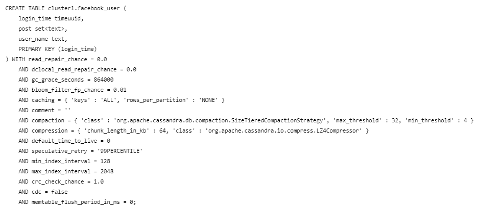
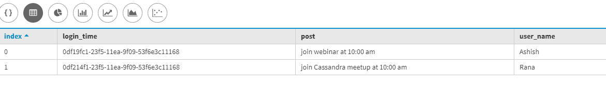

# 卡珊德拉的数据备份和恢复

> 原文:[https://www . geesforgeks . org/data-backup-and-restore-in-Cassandra/](https://www.geeksforgeeks.org/data-backup-and-restoration-in-cassandra/)

在本文中，我们将讨论如何备份和恢复我们的数据，并讨论我们可以在 [Cassandra](https://www.geeksforgeeks.org/introduction-to-apache-cassandra/) 中恢复数据的多种方式。我们可以通过使用快照、sstableloader 实用程序和 nodetool 刷新来恢复数据。

我们一个一个来讨论。

首先，我们将创建用于备份数据的密钥空间。让我们通过一个示例练习来讨论这个问题。

**创建键空间:**

```
create keyspace backup_copy 
with replication = { 'class' : 'SimpleStrategy', 
                     'replication_factor': 2 }; 
```

现在，我们使用 backup_copy 键空间。

```
use backup_copy ;  
```

现在，我们将创建用于备份目的的表。在下面给定的 CQL 查询中，facebook_user 是一个表名，其中 login_time、user_name 和 post 是字段。
我们来看看。

```
create table facebook_user
 (
  login_time timeuuid primary key, 
  user_name text, 
  post set<text>
 ); 
```

让我们看看表模式。

```
describe table facebook_user; 
```

**输出:**



现在，我们将插入一些数据用于备份和恢复。让我们来看看。

```
Insert into facebook_user(login_time, user_name, post) 
values(now(), 'Ashish', {'join webinar at 10:00 am'});

Insert into facebook_user(login_time, user_name, post) 
values(now(), 'Rana', {'join Cassandra meetup at 10:00 am'}); 
```

现在，让我们使用 select 命令验证记录是否已成功保存。让我们来看看。

```
select * 
from facebook_user; 
```

**输出:**



**要拍摄快照，我们需要使用 nodetool 实用程序:**

```
nodetool -h localhost -p 7199 snapshot facebook_user 
```

这里，7199 是一个港口编号。

请求为 facebook_user 创建快照。

```
Snapshot directory: 1205514051242
```

输出显示，在本地节点上运行 nodetool 快照已经在$ CASSANDRA _ DATA _ DIR/backup _ copy/Facebook _ user 文件夹下创建了快照 1205514051242。这里$CASSANDRA_DATA_DIR 是在 Cassandra.yaml 文件中为 data _ file _ directories 属性定义的值

要先恢复数据，我们需要删除一些可以恢复的数据。让我们来看看。

```
truncate facebook_user; 
```

**使用 sstableloader 实用程序恢复数据:**
首先，我们需要复制所有数据。快照目录中的数据库文件放入一个文件夹中，该文件夹应该与数据库模式同步，这意味着键空间/表名。在我们这里的例子中，它应该是 backup_copy 下的用户文件夹 Facebook _ user(/home/Asish/backup _ copy/Facebook _ user)。

现在，让我们执行 sstableloader。

```
$CASSANDRA_HOME/bin/sstableloader -d localhost /home/Ashish/backup_copy/facebook_user 
```

现在，这就是它的执行方式。让我们来看看。

```
Established connection to initial hosts
Opening sstables and calculating sections to stream
Streaming relevant part of /home/Ashish/backup_copy/facebook_user/facebook_user-jb-1-Data.db to
[/127.0.0.1, /127.0.0.2, /127.0.0.3]
progress: [/127.0.0.2 1/1 (100%)] [/127.0.0.3 1/1 (100%)] [total: 100% - 0MB/s (avg: 0MB/s)] 
```

一旦完成，我们可以通过运行 select 命令来验证数据是否已经恢复。
一旦上面的 CQL 查询完成，我们可以使用下面给出的 CQL 查询来验证数据是否已经恢复。

```
select * 
from backup_copy.facebook_user; 
```

**输出:**


**使用 nodetool 刷新:**
这是我们可以使用 nodetool 刷新实用程序恢复数据的方法之一，它不同于 sstableloader 方法。在这种情况下，我们需要手动复制。Cassandra 数据目录中的 db 文件。

要运行 nodetool 刷新命令，请使用下面给出的 CQL 查询。让我们来看看。

```
$CASSANDRA_HOME/bin/nodetool refresh backup_copy facebook_user 
```

**使用 clearsnapshot:**

```
$CASSANDRA_HOME/bin/nodetool -h localhost -p 7199 clearsnapshot 
```