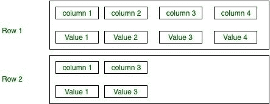
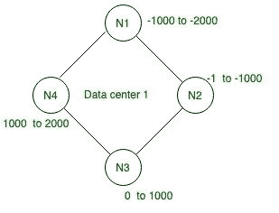
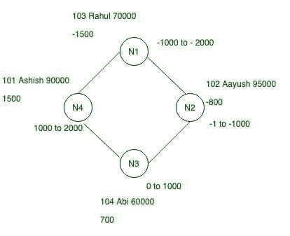
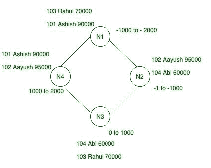

# 卡珊德拉的数据分发

> 原文:[https://www . geesforgeks . org/data-distribution-in-Cassandra/](https://www.geeksforgeeks.org/data-distribution-in-cassandra/)

在本文中，我们将讨论 [Cassandra](https://www.geeksforgeeks.org/introduction-to-apache-cassandra/) 中的数据分布，以及数据如何在集群中分布。那么，我们来看看。

在 Cassandra 中，数据分发和复制是一起进行的。在 Cassandra 中，分发和复制依赖于三件事，如分区密钥、键值和令牌范围。

**卡珊德拉表:**
该表有两行，其中一行包含四列及其值。第二行包含两列(第 1 列和第 3 列)及其值。在这个表中，第 1 列有主键。

**Figure –** Cassandra Table

现在，让我们举一个用户数据如何在集群上分布的例子。

| E_id | 电子名称 | E_sal |
| --- | --- | --- |
| One hundred and one | Ashish | Ninety thousand |
| One hundred and two | 哦，天啊 | Ninety-five thousand |
| One hundred and three | Rahul | Seventy thousand |
| One hundred and four | Abi | Sixty thousand |

在给定的环形架构下，给定的四个节点具有令牌范围，并且每一行都有自己的令牌 id，因此，在分割器的帮助下，我们将生成令牌值并分配它们，并相应地在集群上分发。

**Figure –** Data Center with Random token range

**令牌:**令牌是哈希值，mur3 哈希算法用于 Cassandra 中的哈希，分区器使用它来确定在环中的每个节点上将行存储在哪里。

例如:让我们为上表中给定数据的每一行取随机哈希值。

| 分区键 | Murmur3 哈希值 |
| --- | --- |
| Ashish | One thousand five hundred |
| 哦，天啊 | -800 |
| Rahul | -1500 |
| Abi | Seven hundred |

让我们看一看，以便更好地理解。

**Figure –** Example of Data Distribution in Cassandra

**复制因子:**在 Cassandra 中，复制因子非常重要，它表示整个集群中的副本总数。
我们取 RF = 2，简单的说就是每行有两个副本。卡珊德拉没有主副本或主副本。

**Figure –** Example of data distribution when RF = 2
