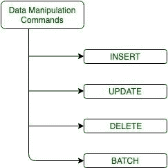

# 卡珊德拉中的数据操作

> 原文:[https://www . geesforgeks . org/data-operation-in-Cassandra/](https://www.geeksforgeeks.org/data-manipulation-in-cassandra/)

在本文中，我们将在 [Cassandra](https://www.geeksforgeeks.org/introduction-to-apache-cassandra/) 中描述以下 DML 命令，这些命令帮助我们插入、更新、删除、查询数据等。在 CQL 有以下数据操作命令。我们一个一个来讨论。

```
1. Insert 
2. Update 
3. Delete
4. Batch 
```

让我们举个例子:

**表名:**员工信息

```
CREATE TABLE Employee_info
 (
  E_id int,
  E_name text,
  E_city text,
  PRIMARY KEY(E_id)
 ); 
```

**DML 命令:**



<center>**Figure –** Data Manipulation Commands</center>

**1。INSERT:**
在列族中，有很多行包含用户可以预先指定的列。但是有一种情况，当用户想要在创建一个表之后添加更多的列，那么我们可以使用数据操作命令。“插入”关键字用于插入数据。

**插入数据有 2 种格式。**

*   **Format-1:**

    **语法:**

    ```
    INSERT INTO table_name (field _name1, field_name2, field_name3…)
                VALUES ('field_value1', 'field_value2', 'field_value3'…)
                USING  update_parameter[optional] ; 
    ```

    例如:

    ```
    INSERT INTO Employee_info(E_id, E_name, E_city) 
                VALUES (107, ‘Ashish’, ‘Delhi’);
    INSERT INTO Employee_info(E_id, E_name, E_city) 
           VALUES (110, ‘Rana’, ‘Noida’); 
    ```

    要查询数据或读取数据，请使用以下“选择”查询。

    ```
    Select * 
    from Employee_info; 
    ```

    **输出:**

    <center>

    | E_id | 电子名称 | E_city |
    | --- | --- | --- |
    | One hundred and seven | Ashish | 德里 |
    | One hundred and ten | 中国林蛙 | 无聊死了 |

    </center>

*   **Format-2:** By using JSON we can also insert data.

    **语法:**

    ```
    INSERT INTO table_name JSON '{"field_name1":"field_value1", 
                                       "field_name2":"field_value2", 
                                       "field_name3":"field_value3", ...}' 
    ```

    例如:

    ```
    INSERT INTO Employee_info JSON ’(“E_id” :”107”, 
                                          “E_name” : “Ashish”, 
                                           “E_city” : “Delhi”)’ ; 
    ```

    **输出:**使用 JSON 将数据插入表中。

    <center>

    | E_id | 电子名称 | E_city |
    | --- | --- | --- |
    | One hundred and seven | Ashish | 德里 |

    </center>

**2。更新:**
要用新数据更新现有数据，我们可以使用卡珊德拉中的“更新”数据操作命令。

**语法:**

```
UPDATE table_name USING  update _parameter
       SET field_name1 = field_value1,
           field_name2 = field_value2,
           field_name3> = field_value3,
                    .....
WHERE field_name = field_value; 
```

例如:

```
UPDATE student USING TTL 500
SET E_name= ‘Ashish Rana’,
E_city= ‘Mumbai’,
WHERE E_id=107; 
```

**输出:**

<center>

| E_id | 电子名称 | E_city |
| --- | --- | --- |
| One hundred and seven | Ashish Rana | 孟买 |
| One hundred and ten | 中国林蛙 | 无聊死了 |

</center>

**注意:**
UPDATE 和 INSERT 语句支持以下参数。

```
1. TIMESTAMP
2. TTL (Time To Live) 
```

DELETE 和 BATCH 语句支持以下参数。

```
1. TIMESTAMP 
```

**3。删除:**
当用户想要根据某些条件删除一些现有数据时，我们可以在卡珊德拉中执行“删除”数据操作命令。

**语法:**

```
DELETE table_name  
    USING  update _parameter
     ... 
    WHERE condition; 
```

例如:

*   **Example-1:**

    ```
    DELETE FROM Employee_info 
                USING TIMESTAMP 1450002143
     WHERE E_id = 107; 
    ```

    **输出:**

    <center>

    | E_id | 电子名称 | E_city |
    | --- | --- | --- |
    | One hundred and ten | 中国林蛙 | 无聊死了 |

    </center>

*   **Example-2:**

    ```
    DELETE E_city 
    FROM Employee_info
    WHERE E_id IN (107, 110); 
    ```

    **输出:**

    <center>

    | E_id | 电子名称 |
    | --- | --- |
    | One hundred and seven | Ashish Rana |
    | One hundred and ten | 中国林蛙 |

    </center>

**4。批处理:**
通过批处理语句进行分组，执行多个 INSERT、UPDATE 和 DELETE 语句。

**语法:**

```
batch_statement ::=  BEGIN [ UNLOGGED | COUNTER ] BATCH
                         [ USING update_parameter ( AND update_parameter )* ]
                           modification_statement ( ';' modification_statement )*
                            APPLY BATCH
modification_statement ::=  insert_statement | update_statement | delete_statement 
```

[来源](http://cassandra.apache.org/doc/4.0/cql/dml.html)。

例如:

```
BEGIN BATCH
   INSERT INTO users (E_id, E_name, E_city) 
          VALUES (908, 'Rahul Rana', 'Meerut');
   INSERT INTO users (E_id, E_name, E_city) 
          VALUES (909, 'Gaurav Rana', 'Meerut');   
   UPDATE Employee_info SET E_city = 'Noida' WHERE E_id = '908';
   DELETE E_name 
          FROM Employee_info 
          WHERE E_id = 909;
APPLY BATCH; 
```

**输出:**

<center>

| E_id | 电子名称 | E_city |
| --- | --- | --- |
| Nine hundred and eight | Rahul Rana | 无聊死了 |
| Nine hundred and nine | 空 | 密拉特 |

</center>