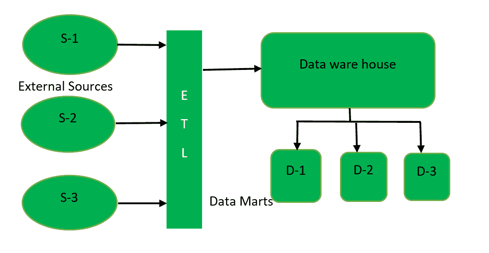
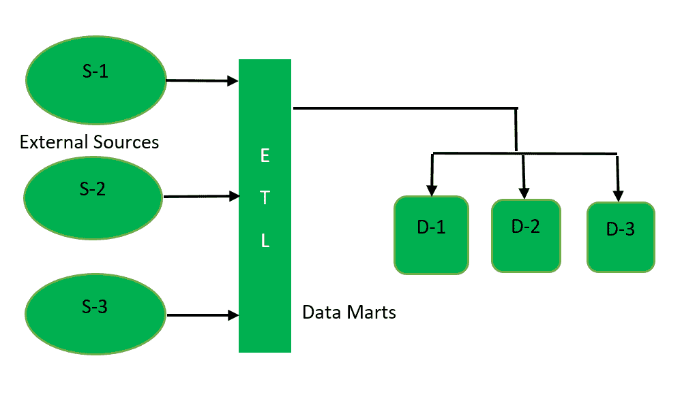

# 数据集市(HDFS 的存储组件)

> 原文:[https://www . geesforgeks . org/data-marts-storage-component-of-HDFS/](https://www.geeksforgeeks.org/data-marts-storage-component-of-hdfs/)

[数据仓库](https://www.geeksforgeeks.org/data-warehouse-architecture/)和数据集市，都是 HDFS 的存储组件。**数据集市**就是这样一个存储组件，它与组织的特定部门有关。它是存储在数据仓库中的数据的子集。数据集市只关注组织的特定功能，并且只由一个机构维护，例如财务、营销。数据集市规模小，而且灵活。

**数据集市的类型:**
数据集市有三种类型:

**1。相关数据集市–**

从属数据集市是通过从中央存储库数据仓库提取数据而创建的。首先通过从外部来源提取数据(通过 ETL 工具)来创建数据仓库，然后从数据仓库创建数据集市。相关数据集市是在数据仓库架构的自顶向下方法中创建的。这种数据集市模式被大组织所使用。

**2。独立数据集市–**

独立数据集市是直接从外部来源而不是数据仓库创建的。首先通过从外部来源提取数据来创建数据集市，然后从数据集市中的数据创建数据仓库。独立数据集市采用自下而上的数据仓库架构设计。这种数据集市模型被小型组织使用，并且相对来说具有成本效益。

**3。混合数据集市–**

这种类型的数据集市是通过从操作源或数据仓库中提取数据而创建的。1 路径反映直接从外部源访问数据，2 路径反映数据集市的相关数据模型。

**数据集市需求:**

1.  数据集市只关注组织中特定部门的功能。
2.  它由一个组织的单一权力机构维护。
3.  因为它存储与组织特定部分相关的数据，所以从它那里检索数据非常快。
4.  与数据仓库相比，数据集市的设计和维护非常容易。
5.  由于它存储少量数据，因此减少了用户的响应时间。
6.  它体积小，因此从它那里访问数据非常快。
7.  大多数组织都使用这个存储单元来保证其部门的平稳运行。

**数据集市优势:**

1.  与数据仓库的实现相比，数据集市的实现需要更少的时间，因为数据集市是为组织的特定部门设计的。
2.  组织可以根据成本和业务选择数据集市的模式。
3.  数据可以很容易地从数据集市访问。
4.  它包含经常访问的查询，因此能够分析业务趋势。

**数据集市的劣势:**

1.  由于它只存储与特定功能相关的数据，因此不会像数据仓库那样存储与组织的每个部门相关的大量数据。
2.  创建太多的数据集市有时会变得很麻烦。