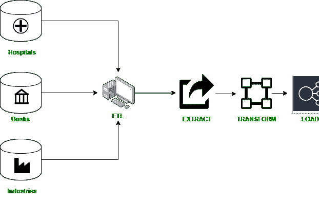

# 数据挖掘:数据仓库流程

> 原文:[https://www . geesforgeks . org/data-mining-data-warehouse-process/](https://www.geeksforgeeks.org/data-mining-data-warehouse-process/)

[数据仓库](https://www.geeksforgeeks.org/data-warehouse-architecture/)是从多个来源收集的信息，并保存在位于同一站点的模式下。它是借助包括以下过程在内的多种技术制成的:

**1。数据清理:**
数据清理是借助剔除或增强不正确、不完整、不相关、重复或格式不规则的信息，为分析准备统计数据的方式。如果你想研究统计数据，这个事实通常不再必要或有益，因为它能够中断技术或提供错误的结果。

**2。数据集成:**
数据集成是将来自不同资产的数据集成到统一视图中的过程。集成方式从启动开始，包括细化、ETL 映射和转换等步骤。数据集成最终允许分析工具创建强大而廉价的企业智能。

在典型的数据集成过程中，客户端向主服务器发送信息请求。主服务器准备来自内部和外部资产的重要记录。从来源中提取事实，然后将它们集成到一个信息集中。然后再次返回给客户端使用。

**3。数据转换:**
数据转换是将信息从一种布局或形状转换为另一种布局或结构的方式。数据转换对于包括数据集成和信息管理在内的功能至关重要。数据转换有不同的功能:您可以根据项目的需要替换记录类型，通过丢弃无效或重复的数据来丰富或聚合记录。

通常，该技术包括两个阶段。

在**第一步**中，你应该:

*   执行识别资产和数据类型的信息搜索。
*   确定发生的结构和信息变化。
*   映射数据以发现字符字段是如何映射、编辑、插入、过滤和存储的。

在**第二步**中，您必须:

*   从原始来源提取数据。供应的大小可以从一个连接的工具到一个可靠的有用资源，以及一个数据库或流资源，包括来自使用您的网络应用程序的客户端的遥测或日志文件。
*   将数据发送到目标站点。
*   目标可能是管理结构化和非结构化记录的数据库或数据仓库。

**4。加载数据:**
数据加载是将数据从报表、文件夹或应用程序复制和加载到数据库或类似实用程序的方式。这通常是通过从源中复制数字数据，并将记录粘贴或加载到数据仓库或处理工具中来完成的。

数据加载用于数据提取和加载方法。通常，此类信息的加载格式与源的原始位置不同。

**5。数据刷新:**
在这个过程中，仓库中存储的数据会定期刷新，以保持其完整性。

数据仓库是多维数据结构的模型，称为“数据立方体”，其中每个维度代表数据模式中的一个属性或不同的属性集，每个单元格用于存储值。数据从各种来源收集，如医院、银行、组织等，并经历一个称为 ETL(提取、转换、加载)的过程。

1.  **提取:**该过程从各种来源的数据库中读取数据。
2.  **Transform:** 它将存储在数据库中的数据转换成数据立方体，以便可以加载到仓库中。
3.  **加载:**是将转换后的数据写入数据仓库的过程。

这个过程可以在下图中看到:

**数据仓库的特点:**
请参考–[数据仓库的特点](https://www.geeksforgeeks.org/characteristics-and-functions-of-data-warehouse/)。