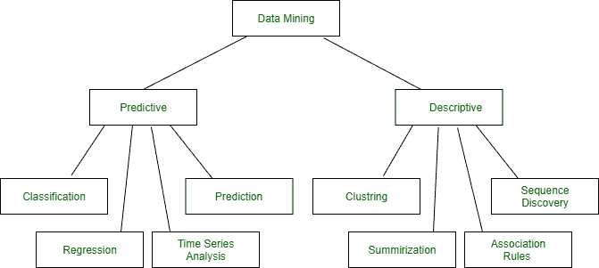

# 数据挖掘模型

> 原文:[https://www.geeksforgeeks.org/data-mining-models/](https://www.geeksforgeeks.org/data-mining-models/)

**先决条件–**[**数据挖掘**](https://www.geeksforgeeks.org/data-mining-process/)

数据挖掘的目的是识别现有数据中有效的、可能有利的和可理解的联系和模式。数据库技术变得更加发达，大量数据需要存储在数据库中，隐藏在这些数据集中的丰富知识被业务人员收集起来，作为制定业务重要决策的可用工具。然后，数据挖掘吸引了更多的注意力，因为它有义务从原始数据中提取有价值的信息，企业可以利用这些信息通过有利可图的决策过程来扩大自己的优势。

[数据挖掘](https://www.geeksforgeeks.org/data-mining/)用于刻画数据库中的智能；它是使用数学、统计、人工智能和机器学习技术从数据库中提取和识别有用信息和后续知识的过程。数据挖掘整合了许多不同的算法来完成不同的任务。所有这些算法都将模型吸收到数据中。算法检查数据并调整最接近被检查数据特征的数据。数据挖掘算法可以描述为由三部分组成。

**模型–**模型的目标是在数据中拟合模型。
**偏好–**必须使用一些识别测试来使一个模型适合另一个模型。
**搜索–**所有算法都是处理查找数据所必需的。

[**数据挖掘模型类型**](https://www.geeksforgeeks.org/difference-between-descriptive-and-predictive-data-mining/)**–**

1.  预测模型
2.  描述性模型

数据挖掘模型

**预测模型:**
预测模型使用从各种数据中发现的已知结果来构成关于数据值的预测。可以基于不同历史数据的使用进行预测建模。预测模型数据挖掘任务包括回归、时间序列分析、分类、预测。

预测模型被称为**统计回归**。这是一种监控学习技术，它结合了少数属性值对相似项目中其他属性值的依赖性的解释，以及可以预测最近案例中这些属性值的模型的增长。

*   **分类–**
    是将对象分配到几个预定义类别之一的行为。或者，我们可以将分类定义为目标函数的学习函数，该函数将每个属性设置为预定义的类标签。
*   **回归–**
    用于适当的数据。这是一种验证函数数据值的技术。回归有两种类型–
    1。**线性回归**与搜索最佳直线相关联，以拟合两个属性，从而可以应用一个属性来预测另一个属性。
    2。**多元线性回归**涉及两个或两个以上属性，数据拟合到多维空间。
*   **时间序列分析–**
    它是一组基于时间的数据。时间序列分析作为一个独立变量来估计因变量的时间。
*   **预测–**
    它预测一些缺失或未知的值。

**描述模型:**
描述模型区分数据中的关系或模式。与预测模型不同，描述性模型是探索被检查数据属性的一种方式，而不是预测新属性，聚类、总结、关联规则和序列发现是描述性模型数据挖掘任务。

描述性分析专注于将数据汇总并转换为重要信息，以进行监控和报告。

*   **聚类**–
    它是将一组抽象对象转换成相同对象类别的技术。
*   **汇总**–
    它以更深入、更容易理解的形式保存一组数据。
*   **关联规则–**
    他们发现一大组数据对象之间令人兴奋的一致性或因果关系。
*   **序列–**
    数据中有趣模式的发现与对其有趣程度的客观或主观测量有关。