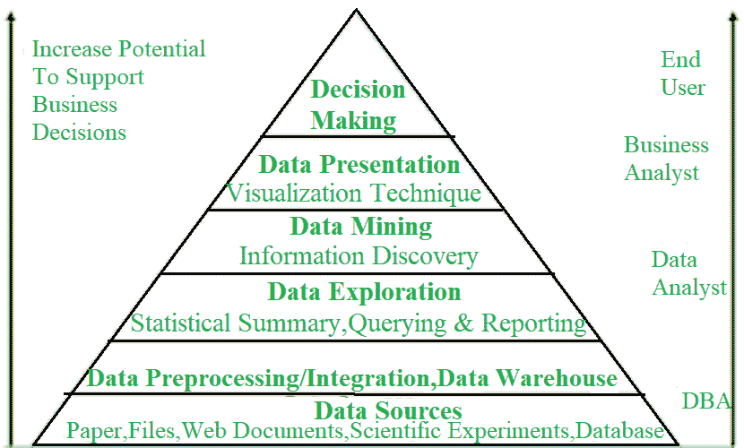
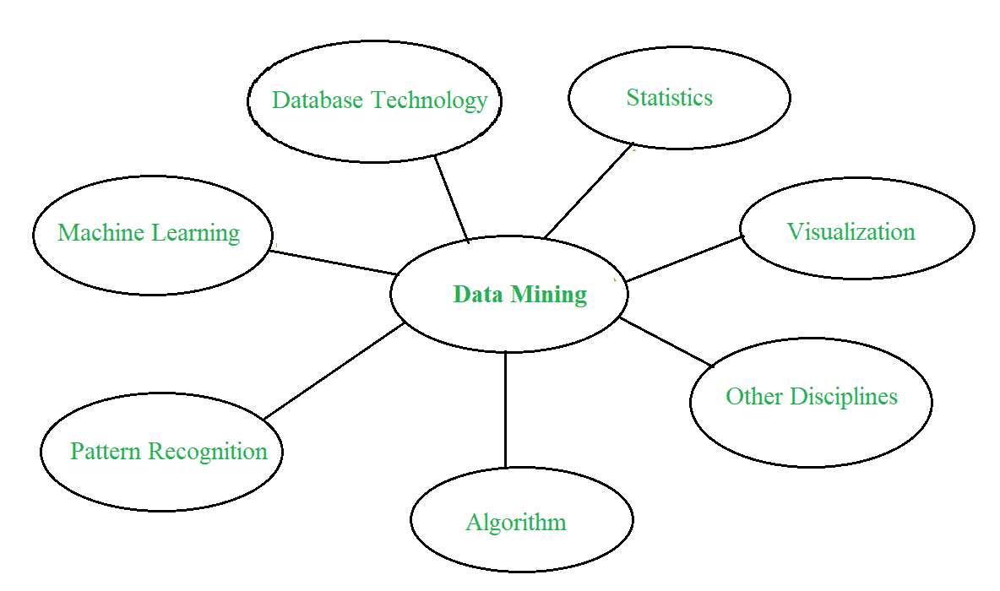
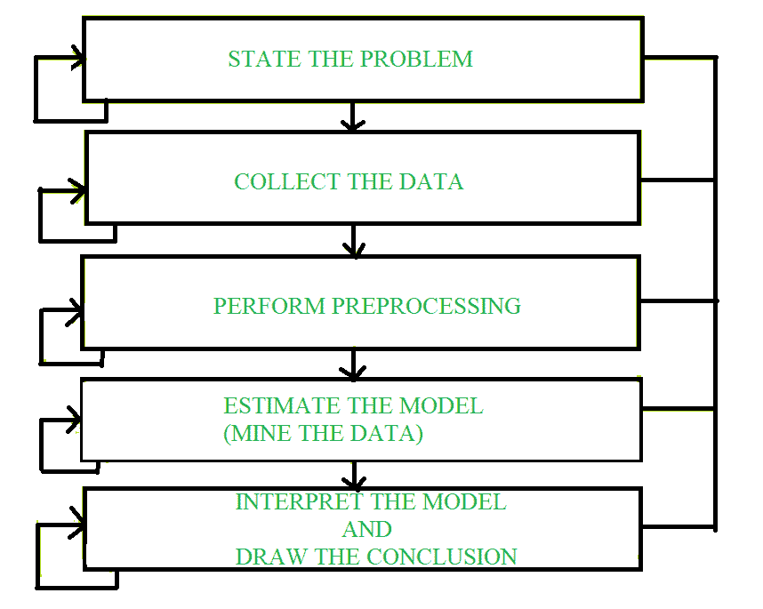

# 数据挖掘流程

> 原文:[https://www.geeksforgeeks.org/data-mining-process/](https://www.geeksforgeeks.org/data-mining-process/)

[数据挖掘](https://www.geeksforgeeks.org/data-mining/)是指从大量数据中提取或挖掘知识。这个术语实际上是用词不当。因此，数据挖掘应该被更恰当地称为知识挖掘，它强调从大量数据中进行挖掘。它是在大型数据集中发现模式的计算过程，涉及人工智能、机器学习、统计和数据库系统的交叉方法。数据挖掘过程的总体目标是从数据集中提取信息，并将其转换为可理解的结构以供进一步使用。

它也被定义为从大量数据中提取有趣的(非琐碎的、隐含的、以前未知的和潜在有用的)模式或知识。数据挖掘是一个快速发展的领域，它涉及开发技术来帮助管理者和决策者智能地使用大量的存储库。

**数据挖掘的替代名称:**

```
1. Knowledge discovery (mining) in databases (KDD)
2. Knowledge extraction
3. Data/pattern analysis
4. Data archeology
5. Data dredging
6. Information harvesting
7. Business intelligence 
```

**数据挖掘和商业智能:**



**数据挖掘的关键属性:**

```
1. Automatic discovery of patterns
2. Prediction of likely outcomes
3. Creation of actionable information
4. Focus on large datasets and databases 
```

**数据挖掘:多学科融合–**



**数据挖掘过程:**
数据挖掘是从给定的数据集合中发现各种模型、摘要和派生值的过程。
适用于数据挖掘问题的一般实验过程包括以下步骤:

1.  **State problem and formulate hypothesis –**
    In this step, a modeler usually specifies a group of variables for unknown dependency and, if possible, a general sort of this dependency as an initial hypothesis. There could also be several hypotheses formulated for one problem at this stage. The primary step requires combined expertise of an application domain and a data-mining model. In practice, it always means an in-depth interaction between data-mining expert and application expert. In successful data-mining applications, this cooperation does not stop within initial phase. It continues during whole data-mining process.
2.  **收集数据–**
    这一步关心的是信息是如何生成和拾取的。一般来说，有两种截然不同的可能性。主要是当数据生成过程在专家(建模者)的控制之下。这种方法被理解为一种设计好的实验。第二种可能性是当专家不能影响数据生成过程时。这通常被称为观察方法。

在大多数数据挖掘应用中，都假设了一种观测环境，即随机数据生成。典型地，在收集数据之后，采样分布是完全未知的，或者在数据收集过程中被部分地和隐含地给出。然而，了解数据收集如何影响其理论分布是至关重要的，因为这样的先验知识通常对建模以及随后对结果的最终解释有用。此外，确保用于估计模型的信息以及随后用于测试和应用模型的数据来自等效的未知抽样分布也很重要。如果情况并非如此，估计模型就不能成功地用于结果的最终应用。

*   **[Data Preprocessing](https://www.geeksforgeeks.org/data-preprocessing-in-data-mining/) –**
    In the observational setting, data is usually “collected” from prevailing databases, data warehouses, and data marts.

    数据预处理通常至少包括两个常见任务:

    *   **(i) Outlier Detection (and removal) :**
        Outliers are unusual data values that are not according to most observations. Commonly, outliers result from measurement errors, coding, and recording errors, and, sometimes, are natural, abnormal values. Such non-representative samples can seriously affect model produced later.

        处理异常值有两种策略:作为预处理阶段的邻域，检测并最终移除异常值。开发对异常值不敏感的稳健建模方法。

    *   **(ii)缩放、编码和选择特征:**
        数据预处理包括几个步骤，如可变缩放和不同类型的编码。例如，范围为[0，1]的一个特征和范围为[100，1000]的另一个特征在所应用的技术中没有相等的权重。它们也会以不同的方式影响最终的数据挖掘结果。因此，建议对它们进行缩放，并将这两个特征转换为相等的权重，以便进一步分析。此外，特定于应用程序的编码方法通常通过为后续数据建模提供较少数量的信息特征来实现降维。

    这两类预处理任务只是数据挖掘过程中大量预处理活动的示例。数据预处理步骤不应被视为完全独立于其他数据挖掘阶段。在数据挖掘过程的每一次迭代中，所有的活动可以一起为后续迭代定义新的和改进的数据集。一般来说，诚实的预处理方法通过将先验知识结合到某种特定于应用的缩放和编码中，为数据挖掘技术提供了最佳表示。

    *   **Estimate model –**
    The selection and implementation of acceptable data-mining technique is that main task during this phase. This process is not straightforward. Usually, in practice, implementation is predicated on several models, and selecting simplest one is a further task.

    *   **Interpret model and draw conclusions –**
    In most cases, data-mining models should help in deciding. Hence, such models got to be interpretable so as to be useful because humans are not likely to base their decisions on complex “black-box” models. Note that goals of accuracy of model and accuracy of its interpretation are somewhat contradictory. Usually, simple models are more interpretable, but they are also less accurate. Modern data-mining methods are expected to yield highly accurate results using high dimensional models. The matter of interpreting these models, also vital, is taken into account a separate task, with specific techniques to validate results.

    

    **数据挖掘系统分类:**

    ```
    1. Database Technology
    2. Statistics
    3. Machine Learning
    4. Information Science
    5. Visualization 
    ```

    **数据挖掘的主要问题:**

    1.  **Mining different kinds of knowledge in databases –**
        The need for different users is not same. Different users may be interested in different kinds of knowledge. Therefore it is necessary for data mining to cover a broad range of knowledge discovery tasks.
    2.  **Interactive mining of knowledge at multiple levels of abstraction –**
        The data mining process needs to be interactive because it allows users to focus on search for patterns, providing and refining data mining requests based on returned results.
    3.  **背景知识的结合–**
        为了指导发现过程并表达发现的模式，背景知识不仅可以用简洁的术语表达发现的模式，还可以在多个抽象层次上表达发现的模式。

    *   **Data mining query languages and ad-hoc data mining –**
    Data Mining Query language that allows user to describe ad-hoc mining tasks should be integrated with a data warehouse query language and optimized for efficient and flexible data mining.*   **Presentation and visualization of data mining results –**
    Once patterns are discovered it needs to be expressed in high-level languages, visual representations. These representations should be easily understandable by users.*   **Handling noisy or incomplete data –**
    The data cleaning methods are required that can handle noise, incomplete objects while mining data regularities. If data cleaning methods are not there then accuracy of discovered patterns will be poor.*   **Pattern evaluation –**
    It refers to interestingness of problem. The patterns discovered should be interesting because either they represent common knowledge or lack of novelty.*   **Efficiency and scalability of data mining algorithms –**
    In order to effectively extract information from huge amount of data in databases, data mining algorithm must be efficient and scalable.*   **Parallel, distributed, and incremental mining algorithms –**
    The factors such as huge size of databases, wide distribution of data, and complexity of data mining methods motivate development of parallel and distributed data mining algorithms. These algorithms divide data into partitions that are further processed parallel. Then results from partitions are merged. The incremental algorithms update databases without having mined data again from scratch.