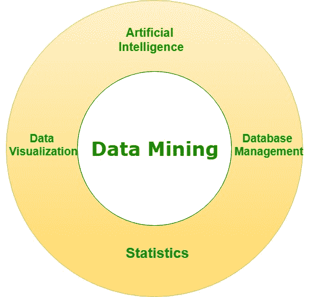
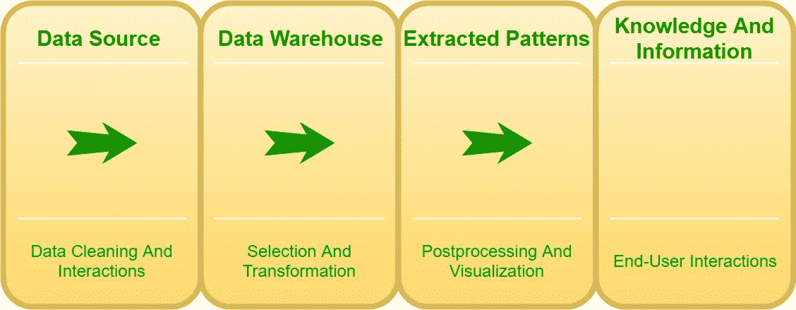

# 数据挖掘|第二集

> 原文:[https://www.geeksforgeeks.org/data-mining-set-2/](https://www.geeksforgeeks.org/data-mining-set-2/)

[数据挖掘](https://www.geeksforgeeks.org/data-mining/)可能是应用科学的术语。通常，它还被称为数据库中的数据发现(KDD)。数据处理是指在大量的知识中发现新的信息。希望从数据处理中获得的数据都是新的和有帮助的。

**工作:**
在几种情况下，信息是保留的；因此，它可能会在以后使用。数据与目标一起保存。举个例子，商店需要保存很多已经购买的东西。他们需要尝试并做到这一点，以掌握自己应该购买的数量，从而拥有足够的数量供以后出售。保存这些信息会产生大量的知识。信息有时被保存在过量的信息中。为什么保存信息的解释被称为主要用途。

后来，持续的信息也可能习惯于获得主要用途不需要的替代信息。商店可能需要掌握个人在购物后购买了哪些合理的东西。(例如，许多购买食物的人另外购买蘑菇。)那种{信息|信息|知识}在数据中，是有益的，然而，这并不是保存数据的原因。这些信息是新的，可能会有所帮助。这是恒定信息的第二种用途。从信息中发现新的甚至有用的信息被称为数据处理。

对于数据来说，有许多不同种类的数据处理来获取新的信息。通常，预测是有关的；预期结果存在不确定性。随后的研究依赖于这样的观察，即有一个没有经验的小苹果，在此期间我们可以在结构上改变我们的信息。数据处理的种类有很多:

[模式识别](https://www.geeksforgeeks.org/pattern-recognition-introduction/)(试图在报告内的行内，在规则种类内寻找相似性。微小- >没有经验。(小苹果的平方测度通常是绿色的)
使用一个定理网络(试图创建一个东西，它会说，然而，各种信息属性平方测度相互连接/影响。尺寸和颜色平方度量相关。因此，如果你认识到一件事关于方面，你会猜测颜色。)

使用[神经网络](https://www.geeksforgeeks.org/introduction-to-artificial-neutral-networks/)(试图创建一个难以掌握的大脑模型；然而，一台电脑会告诉我们，如果苹果没有经验，那么如果我们倾向于对电脑说苹果没有经验，那么下一个可能就是痛苦。因此这往往是某种记录器模型，我们倾向于不要精明它工作；然而，它起作用了。)
使用分类树(所有备选数据都试图提及与问题相关的一个备选问题，我们倾向于平方测量观察结果。这是一个有大小、颜色和光泽的副学士苹果，它的风格会是什么样的？)

数据挖掘需要信息准备，这可能会暴露出可能损害机密性和隐私义务的信息或模式。实现这一点的标准方法是通过信息聚合。信息聚合包括以一种非常便于分析的方式组合信息(可能来自许多来源)(但这可能会额外建立个人的、个人级别的演绎或其他显而易见的信息的识别)。这本质上可能不是数据处理，而是分析之前准备数据的结果，也是为了分析的需要。

一旦信息一旦被编辑，对个人隐私的威胁就开始发挥作用，导致信息体力劳动者或任何联合国机构能够访问最近编辑的信息集，以准备确定特定的人，特别是一旦信息以前是匿名的。

数据也可能被更改；因此，成为匿名，所以人们可能不会被及时知道。然而，即使是“去身份化”/“匿名化”的信息集，无疑也会包含足够的信息来识别人，就像记者们意识到许多人支持一组搜索历史时发生的那样，而美国在线在不知不觉中就免费了。