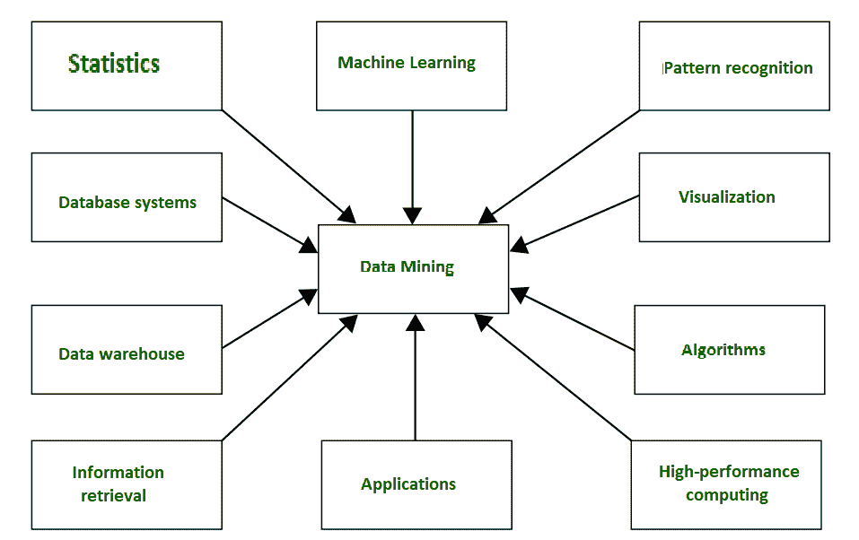
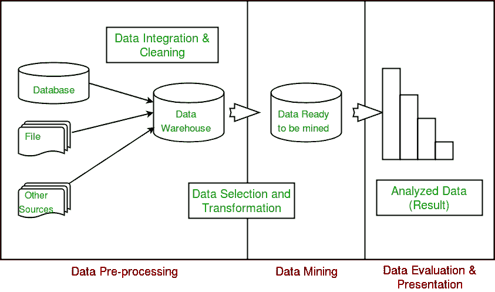

# 数据挖掘

> 原文:[https://www.geeksforgeeks.org/data-mining/](https://www.geeksforgeeks.org/data-mining/)

一般来说，**采矿**是从地球上提取一些有价值物质的过程，例如采煤、钻石开采等。在计算机科学的背景下，**数据挖掘**可以称为**从数据、知识提取、数据/模式分析、数据考古和数据挖掘**中进行知识挖掘。它基本上是从大量数据或[数据仓库中提取有用信息的过程。](https://www.geeksforgeeks.org/data-warehousing/)可以看出这个名词本身有点混乱。就煤炭或钻石开采而言，开采过程的结果是煤炭或钻石。但是在数据挖掘的情况下，提取过程的结果不是数据！！相反，数据挖掘结果是我们在提取过程结束时获得的模式和知识。从这个意义上说，我们可以把数据挖掘看作是知识发现或知识提取过程中的一个步骤。

格雷戈里·皮亚特斯基-夏皮罗在 1989 年创造了术语**“数据库中的知识发现”**。然而，**“数据挖掘”**一词在商界和新闻界变得更加流行。目前，数据挖掘和知识发现可以互换使用。

如今，数据挖掘几乎应用于所有存储和处理大量数据的地方。例如，银行通常使用“数据挖掘”来发现他们的潜在客户，这些客户可能对信用卡、个人贷款或保险也感兴趣。由于银行拥有客户的交易细节和详细资料，他们会分析所有这些数据，并试图找出有助于他们预测某些客户可能对个人贷款感兴趣的模式。

**数据挖掘的主要目的**

数据挖掘

基本上，数据挖掘已经与来自其他领域的许多其他技术集成在一起，例如**统计、机器学习、模式识别、数据库和数据仓库系统、信息检索、可视化、**等。收集更多关于数据的信息，帮助预测隐藏的模式、未来趋势和行为，并让企业做出决策。

从技术上讲，数据挖掘是从不同的角度、维度、角度分析数据，并将其分类/汇总成有意义的信息的计算过程。

数据挖掘可以应用于任何类型的数据，例如**数据仓库、事务数据库、关系数据库、多媒体数据库、空间数据库、时间序列数据库、万维网。**
**数据挖掘整体流程**
数据挖掘的整个流程由三个主要阶段组成:

1.  数据预处理–进行数据清理、集成、选择和转换
2.  数据提取–精确数据挖掘的出现
3.  Data Evaluation and Presentation – Analyzing and presenting results 

在未来的文章中，我们将涵盖每个阶段的细节。

**数据挖掘的应用**

1.  财务分析
2.  生物检验
3.  科学分析
4.  入侵检测
5.  欺诈检测
6.  研究分析

**数据挖掘的真实例子**

**菜篮子分析**:这是一种对顾客在超市购物进行仔细研究的技术。这个概念基本上是用来识别顾客一起购买的物品。比方说，如果一个人买面包，他/她也买黄油的可能性有多大。这种分析有助于促进公司的报价和交易。在数据挖掘的帮助下也是如此。

**蛋白质折叠:**是一种仔细研究生物细胞并预测生物细胞内蛋白质相互作用和功能的技术。这项研究的应用包括确定阿尔茨海默氏症、帕金森氏症和由蛋白质错误折叠引起的癌症的**病因和可能的治疗方法。**

**欺诈检测:**如今，在这个手机的土地上，我们可以使用数据挖掘来分析手机活动，以比较可疑的手机活动。这可以帮助我们检测克隆手机上的通话。类似地，使用信用卡，将购物与历史购物进行比较可以发现被盗卡的活动。

数据挖掘也有许多成功的应用，如商业智能、网络搜索、生物信息学、健康信息学、金融、数字图书馆和数字政府。

本文由**贾芳·柯利**供稿。如果你喜欢 GeeksforGeeks 并想投稿，你也可以使用[write.geeksforgeeks.org](https://write.geeksforgeeks.org)写一篇文章或者把你的文章邮寄到 review-team@geeksforgeeks.org。看到你的文章出现在极客博客主页上，帮助其他极客。

如果你发现任何不正确的地方，或者你想分享更多关于上面讨论的话题的信息，请写评论。