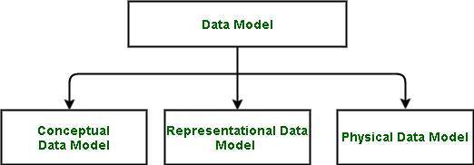

# 数据库管理系统中的数据模型

> 原文:[https://www.geeksforgeeks.org/data-models-in-dbms/](https://www.geeksforgeeks.org/data-models-in-dbms/)

数据库管理系统(DBMS)中的**数据模型**，是为总结数据库描述而开发的工具的概念。

它分为三种类型:

**1。概念数据模型:**
概念数据模型，在很高的层次上描述数据库，对于理解数据库的需求或需求很有用。在需求收集过程中，也就是在数据库设计者开始制作一个特定的数据库之前，使用的就是这个模型。其中一个流行的模型是[实体/关系模型(ER 模型)](https://www.geeksforgeeks.org/introduction-of-er-model/)。E/R 模型专门研究数据库设计者使用的实体、关系甚至属性。根据这个概念，甚至可以与非计算机科学(非技术)用户和利益相关者进行讨论，并且可以理解他们的需求。

**2。代表性数据模型:**
这种类型的数据模型仅用于表示数据库的逻辑部分，不表示数据库的物理结构。代表性数据模型允许我们主要关注数据库的设计部分。一个流行的代表性模型是[关系模型](https://www.geeksforgeeks.org/relational-model-in-dbms/)。

**3。物理数据模型:**
最终，数据库中的所有数据都以物理方式存储在辅助存储设备上，如磁盘和磁带。它以文件、记录和某些其他数据结构的形式存储。它包含文件格式、数据库结构、外部数据结构及其相互关系的所有信息。