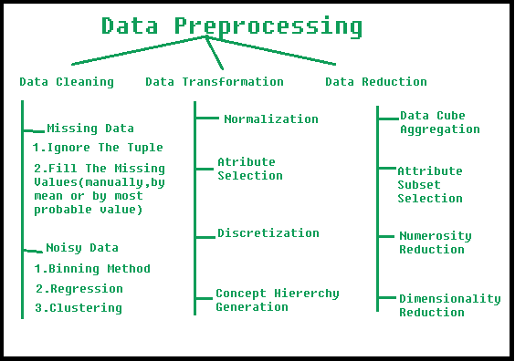

# 数据挖掘中的数据预处理

> 原文:[https://www . geeksforgeeks . org/数据挖掘中的数据预处理/](https://www.geeksforgeeks.org/data-preprocessing-in-data-mining/)

**数据挖掘中的预处理:**
数据预处理是一种数据挖掘技术，用于将原始数据转换为有用且高效的格式。

**数据预处理涉及的步骤:**

**1。数据清理:**
数据可以有很多不相关、缺失的部分。为了处理这一部分，需要进行数据清理。它涉及丢失数据、噪声数据等的处理。

*   **(一)。缺少数据:**
    当数据中缺少一些数据时，就会出现这种情况。可以用各种方式处理。
    其中一些是:
    1.  **忽略元组:**
        这种方法只适用于我们拥有的数据集非常大并且一个元组中缺少多个值的情况。

    2.  **填充缺失值:**
        有多种方法可以完成此任务。您可以选择通过属性平均值或最可能值手动填充缺失值。

*   **(b)。**
    嘈杂数据是机器无法解读的无意义数据。它可能是由于错误的数据收集、数据输入错误等而产生的。可以通过以下方式处理:
    1.  **宁滨方法:**
        该方法对排序后的数据进行平滑处理。整个数据被分成大小相等的段，然后执行各种方法来完成任务。每个分段都是单独处理的。可以用平均值或边界值来替换一个段中的所有数据，以完成任务。

    2.  **回归:**
        这里的数据可以通过拟合一个回归函数来平滑。所使用的回归可以是线性的(具有一个自变量)或多重的(具有多个自变量)。

    3.  **聚类:**
        这种方法将相似的数据分组到一个聚类中。异常值可能未被检测到，或者会落在聚类之外。

**2。数据转换:**
采取这一步骤是为了将数据转换为适合挖掘过程的适当形式。这包括以下方式:

1.  **归一化:**
    是为了在指定范围内缩放数据值(-1.0 到 1.0 或 0.0 到 1.0)

2.  **属性选择:**
    在这个策略中，从给定的属性集合中构造新的属性来帮助挖掘过程。

3.  **离散化:**
    这样做是为了用区间级别或概念级别替换数值属性的原始值。

4.  **Concept Hierarchy Generation:** 
    Here attributes are converted from lower level to higher level in hierarchy. For Example-The attribute “city” can be converted to “country”. 

**3。数据缩减:**
因为数据挖掘是一种用于处理大量数据的技术。在处理大量数据的同时，在这种情况下分析变得更加困难。为了摆脱这种情况，我们采用了数据约简技术。旨在提高存储效率，降低数据存储和分析成本。

数据缩减的各个步骤是:

1.  **数据立方体聚合:**
    对数据进行聚合操作，构建数据立方体。

2.  **属性子集选择:**
    高度相关的属性要用，剩下的全部可以丢弃。为了执行属性选择，可以使用属性的重要性级别和 p 值，p 值大于重要性级别的属性可以被丢弃。

3.  **数值缩减:**
    这使得能够存储数据模型而不是整个数据，例如:回归模型。

4.  **降维:**
    这通过编码机制减少了数据的大小。它可以是有损的，也可以是无损的。如果从压缩数据重建后，可以恢复原始数据，这种缩减称为无损缩减，否则称为有损缩减。两种有效的降维方法是:小波变换和主成分分析。