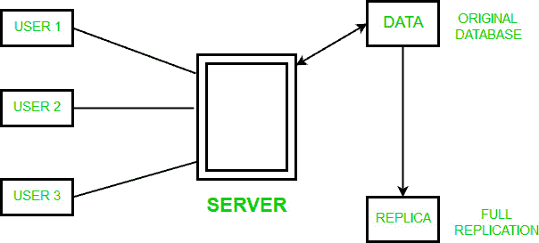
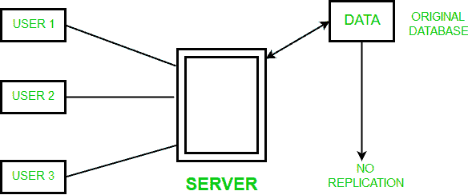
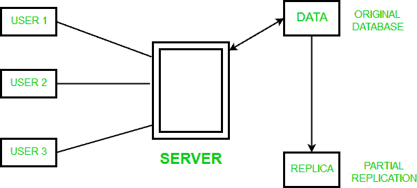

# 数据库管理系统中的数据复制

> 原文:[https://www.geeksforgeeks.org/data-replication-in-dbms/](https://www.geeksforgeeks.org/data-replication-in-dbms/)

**数据复制**是将数据存储在多个站点或节点的过程。这对于**提高数据**的可用性非常有用。它只是将数据库中的数据从一台服务器复制到另一台服务器，这样所有用户都可以共享相同的数据，而不会出现任何不一致。其结果是一个**分布式数据库**，用户可以在其中访问与其任务相关的数据，而不会干扰他人的工作。

数据复制包含持续的事务复制，因此**复制处于一致更新状态**并与源同步。然而，在数据复制中，数据在不同的位置可用，但是特定的关系必须只驻留在一个位置。

可以进行完全复制，将整个数据库存储在每个站点。也可以是部分复制，其中复制数据库的一些常用片段，而不复制其他片段。

**数据复制的类型–**

1.  **事务复制–**在事务复制中，用户接收数据库的完整初始副本，然后在数据更改时接收更新。数据从发布服务器实时复制到接收数据库(订阅服务器)，复制顺序与发布服务器相同，因此在这种类型的复制中，**事务一致性得到保证。**事务复制通常用于服务器到服务器的环境。它不是简单地复制数据更改，而是一致而准确地复制每个更改。
2.  **快照复制–**快照复制在特定时刻准确地分发数据，不监视数据的更新。生成整个快照并将其发送给用户。**快照复制一般用于数据更改不频繁的情况**。它比事务处理慢一点，因为每次尝试它都会将多条记录从一端移动到另一端。快照复制是在发布服务器和订阅服务器之间执行初始同步的好方法。
3.  **合并复制–**来自两个或多个数据库的数据被合并到一个数据库中。合并复制是最复杂的复制类型，因为它允许发布服务器和订阅服务器独立地对数据库进行更改。合并复制通常用于服务器到客户端的环境。它允许将更改从一个发布者发送到多个订阅者。

**复制方案–**

**1。完全复制–**最极端的情况是在分布式系统的每个站点复制整个数据库。这将提高系统的可用性，因为只要至少有一个站点启动，系统就可以继续运行。

**完全复制的优势–**

*   数据的高可用性。
*   提高了检索全局查询的性能，因为结果可以从任何本地站点本地获得。
*   更快地执行查询。

**完全复制的缺点–**

*   在完全复制中很难实现并发。
*   缓慢的更新过程，因为单次更新必须在不同的数据库中执行，以保持副本的一致性。

    **2。无复制–**另一种复制情况涉及无复制，即每个片段仅存储在一个站点。

    

    **无复制的优势–**

    *   数据很容易恢复。
    *   没有复制也能实现并发。

    **无复制的缺点–**

    *   由于多个用户正在访问同一个服务器，这可能会降低查询的执行速度。
    *   由于没有复制，数据不容易获得。

    **3。部分复制–**在这种类型的复制中，数据库的某些片段可能会被复制，而其他片段可能不会。片段的拷贝数量可以从一个到分布式系统中站点的总数。片段复制的描述有时被称为复制模式。

    

    **部分复制的优势–**

    *   片段的拷贝数取决于数据的重要性。

    **数据复制的优势–**数据复制通常用于:

    *   为所有数据库节点提供一致的数据拷贝。
    *   增加数据的可用性。
    *   通过数据复制提高了数据的可靠性。
    *   数据复制支持多个用户并提供高性能。
    *   为了消除任何数据冗余，数据库被合并，从属数据库用过时或不完整的数据更新。
    *   由于创建了副本，因此有可能在事务执行的地方找到数据本身，从而减少数据移动。
    *   执行更快的查询。

    **数据复制的缺点–**

    *   由于在不同站点存储相同数据的副本会消耗更多空间，因此需要更多存储空间。
    *   当所有不同站点的副本都需要更新时，数据复制就变得昂贵了。
    *   维护所有不同站点的数据一致性涉及复杂的措施。