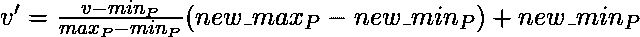
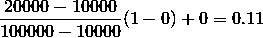
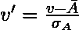
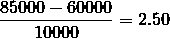
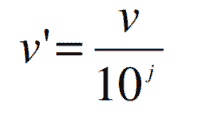

# 数据挖掘中的数据转换

> 原文:[https://www . geesforgeks . org/data-transformation-in-data-mining/](https://www.geeksforgeeks.org/data-transformation-in-data-mining/)

数据以最适合挖掘数据的方式进行转换。数据转换包括以下步骤:

**1。平滑:**
这是一个使用一些算法从数据集中去除噪声的过程。它允许突出显示数据集中存在的重要特征。它有助于预测模式。当收集数据时，可以对其进行操作以消除或减少任何差异或任何其他噪声形式。

数据平滑背后的概念是，它将能够识别简单的变化，以帮助预测不同的趋势和模式。这对需要查看大量数据的分析师或交易者来说是一种帮助，这些数据通常很难消化，以找到他们在其他情况下看不到的模式。

**2。聚合:**
数据收集或聚合是以汇总格式存储和呈现数据的方法。数据可以从多个数据源获得，以将这些数据源集成到数据分析描述中。这是至关重要的一步，因为数据分析见解的准确性高度依赖于所用数据的数量和质量。收集高质量和足够大数量的准确数据是产生相关结果的必要条件。

数据的收集对于从产品的融资或商业策略、定价、运营和营销策略的决策都是有用的。

例如**【销售】，可以汇总数据计算每月&年度总金额。**

****3。离散化:**
是将连续数据转化为一组小区间的过程。现实世界中的大多数数据挖掘活动都需要连续的属性。然而，许多现有的数据挖掘框架无法处理这些属性。**

**此外，即使数据挖掘任务可以管理连续属性，它也可以通过用离散值替换恒定质量属性来显著提高效率。**

**举**例**，(1-10，11-20)(年龄:-青年，中年，老年)。**

****4。属性构建:**
创建新属性的地方&应用于从给定的属性集合中辅助挖掘过程。这简化了原始数据&使得挖掘更加高效。**

****5。泛化:**
它利用概念层次将低层数据属性转换为高层数据属性。例如，最初以数字形式(22，25)表示的年龄被转换为分类值(年轻，年老)。**

**对于**示例**，分类属性，如房屋地址，可以推广到更高级别的定义，如城镇或国家。**

****6。规范化:**数据规范化包括将所有数据变量转换到给定的范围内。
用于标准化的技术有:**

*   ****Min-Max Normalization:**

    *   这将线性转换原始数据。
    *   假设:最小 A 是属性的最小值，最大 A 是属性的最大值

    我们有公式:
    

    *   其中 v 是要在新范围内绘制的值。
    *   v '是将旧值归一化后得到的新值。

    求解**例** :
    假设一个属性利润(P)的最小值和最大值为 Rs。10，000 卢比。100, 000.我们想画出[0，1]范围内的利润。使用最小-最大归一化 Rs 的值。2 万对于属性利润可以标绘到:
    

    因此，我们得到 v’的值为 0.11** 
*   ****Z-Score Normalization:**

    *   在 z 分数归一化(或零均值归一化)中，属性(A)的值基于 A 的平均值及其标准偏差进行归一化
    *   属性 A 的值 v 通过计算归一化为 v’

    

    对于**示例** :
    让属性 P 的平均值= 60，000，标准差= 10，000。使用 z 分数归一化，可以将 P 的值 85000 转换为:
    

    因此我们得到 v’的值是 2.5** 
*   ****十进制比例:****

    *   **它通过改变小数点的位置来规范化属性值**
    *   **小数点移动的点数可以由属性 a 的绝对最大值决定。**
    *   **A value, v, of attribute A is normalized to v’ by computing

        ** 
    *   **其中 j 是最小的整数，这样 Max(|v'|) < 1。**

    **例如**:****

    *   ****假设:属性 P 的值从-99 到 99 不等。****
    *   ****P 的最大绝对值是 99。****
    *   ****为了规范化这些值，我们将这些数除以 100(即 j = 2)或(最大数目的整数数)，这样得出的值为 0.98、0.97 等等。****