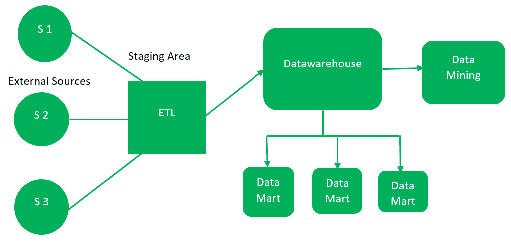
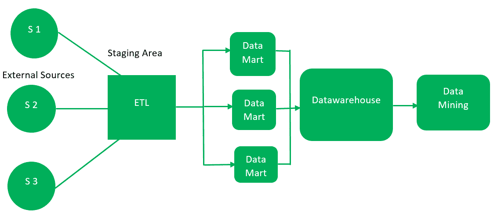

# 数据仓库架构

> 原文:[https://www.geeksforgeeks.org/data-warehouse-architecture/](https://www.geeksforgeeks.org/data-warehouse-architecture/)

一个**数据仓库**是在统一模式下组织的不同数据源的异构集合。构建数据仓库有两种方法:自顶向下法和自底向上法，解释如下。

**1。自上而下的方法:**

基本组成部分讨论如下:

1.  **外部来源–**
    外部来源是收集数据的来源，与数据类型无关。数据可以是结构化的、半结构化的，也可以是非结构化的。

2.  **阶段区域–**
    由于从外部来源提取的数据不遵循特定的格式，因此需要验证这些数据以加载到数据仓库中。为此，建议使用 **ETL** 工具。
    *   **E(提取):**数据从外部数据源提取。

    *   **T(转换):**数据转换为标准格式。

    *   **L(Load):** 将数据转换为标准格式后加载到数据仓库中。

3.  **数据仓库–**
    对数据进行清理后，作为中央存储库存储在数据仓库中。它实际上存储了元数据，而实际数据被存储在数据集市中。**注意**数据仓库以这种自上而下的方式以最纯粹的形式存储数据。

4.  **数据集市–**
    数据集市也是存储组件的一部分。它存储由单一机构处理的组织特定职能的信息。根据不同的功能，一个组织中可以有相同数量的数据集市。我们也可以说，数据集市包含存储在数据仓库中的数据子集。

5.  **Data Mining –** 
    The practice of analysing the big data present in datawarehouse is data mining. It is used to find the hidden patterns that are present in the database or in datawarehouse with the help of algorithm of data mining. 

    这种方法由 **Inmon** 定义为–数据仓库作为整个组织的中央存储库，在创建了完整的数据仓库之后，数据集市便由此创建。

**自上而下方法的优势–**

1.  因为数据集市是从数据仓库创建的，所以提供了数据集市的一致的维度视图。

2.  此外，这种模式被认为是商业变革的最强模式。这就是为什么大型组织更喜欢遵循这种方法。

3.  从数据仓库创建数据集市很容易。

**自上而下方法的缺点–**

1.  设计和维护的成本、时间非常高。

**2。自下而上的方法:**

1.  首先，从外部来源提取数据(与自上而下的方法相同)。

2.  然后，数据通过暂存区(如上所述)并加载到数据集市而不是数据仓库中。首先创建数据集市，并提供报告功能。它只针对一个业务领域。

3.  这些数据集市然后被集成到数据仓库中。

这种方法由**金球**给出，因为数据集市是首先创建的，并为分析提供了一个精简的视图，而数据仓库是在创建了完整的数据集市之后创建的。

**自下而上方法的优势–**

1.  由于数据集市是首先创建的，所以报告会很快生成。

2.  我们可以在这里容纳更多数量的数据集市，这样就可以扩展数据仓库。

3.  此外，设计该模型的成本和时间相对较低。

**自下而上方法的缺点–**

1.  这个模型不如自顶向下的方法强大，因为数据集市的维度视图不像上面的方法那样一致。