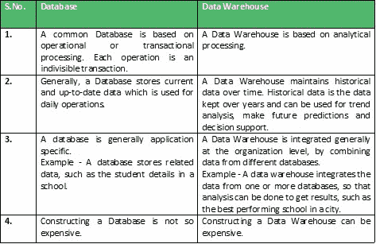

# 数据仓库

> 原文:[https://www.geeksforgeeks.org/data-warehousing/](https://www.geeksforgeeks.org/data-warehousing/)

**后台**
一个数据库管理系统(DBMS)以表格的形式存储数据，使用 ER 模型，目标是 [ACID 属性](https://www.geeksforgeeks.org/acid-properties-in-dbms/)。例如，大学的数据库管理系统有学生、教师等的表格。

一个**数据仓库**与 DBMS 是分开的，它存储着海量的数据，这些数据通常是从文件、DBMS 等多个异构来源收集的。目标是产生有助于决策的统计结果。例如，一所大学可能希望快速看到不同的结果，例如在过去 10 年中，计算机科学学生的安置在工资、人数等方面有所改善。

**数据仓库的需求**
一个普通的数据库可以存储数兆字节到数千兆字节的数据，也可以存储特定用途的数据。为了存储 TB 大小的数据，存储转移到了数据仓库。除此之外，事务性数据库不能提供分析。为了有效地执行分析，组织保留一个中央数据仓库，通过组织、理解和使用其历史数据来进行战略决策和分析趋势，从而密切研究其业务。

**数据仓库 vs DBMS**

**数据仓库的应用示例**
数据仓库可以应用于我们拥有大量数据并且希望看到有助于决策的统计结果的任何地方。

*   **社交媒体网站:**脸书、推特、领英等社交网站。是基于对大数据集的分析。这些站点收集与成员、组、位置等相关的数据。，并将其存储在一个中央存储库中。由于数据量很大，因此需要数据仓库来实现。
*   **银行业务:**目前大部分银行都是用仓库来查看账户/持卡人的消费模式。他们利用这一点向他们提供特别优惠、交易等。
*   **Government:** Government 使用数据仓库来存储和分析用于检测偷税的税款。

在电子商务、电信、运输服务、营销和分销、医疗保健和零售等不同领域，可以有更多的应用。

**参考:**
[http://www 3 . cs . stonybrook . edu/~ CSE 634/presentations/data warehousing-part-1 . pdf](http://www3.cs.stonybrook.edu/~cse634/presentations/DataWarehousing-part-1.pdf)

本文由**贾芳·柯利**供稿。如果你喜欢 GeeksforGeeks 并想投稿，你也可以使用[write.geeksforgeeks.org](https://write.geeksforgeeks.org)写一篇文章或者把你的文章邮寄到 review-team@geeksforgeeks.org。看到你的文章出现在极客博客主页上，帮助其他极客。

如果你发现任何不正确的地方，或者你想分享更多关于上面讨论的话题的信息，请写评论。