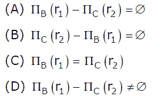

# 数据库管理系统|第 2 集

> 原文:[https://www . geesforgeks . org/database-management-system-set-2/](https://www.geeksforgeeks.org/database-management-system-set-2/)

GATE 2012 考试中提出了以下问题。

**1)关于一个 SQL 查询，下列哪些陈述是正确的？**
**P:**SQL 查询可以包含 HAVING 子句，即使它没有 GROUP BY 子句
**Q:**SQL 查询只有在它有 GROUP BY 子句
**R:**GROUP BY 子句中使用的所有属性必须出现在 SELECT 子句中
**S:** 并非 GROUP BY 子句中使用的所有属性都需要出现在 SELECT 子句中
(A) P 和 R 【T15

答案(C)
根据标准的 SQL，答案应该是选项(C)，这是 GATE 机构给出的答案键。

如果我们谈论不同的 SQL 实现，比如 MySQL，那么选项(B)也是对的。但是有问题的是，他们似乎在谈论标准的 SQL，而不是实现。例如下面是一个

p 在大多数实现中都是正确的。HAVING 子句也可以与聚合函数一起使用。如果我们使用没有 GROUP BY 子句的 HAVING 子句，则 HAVING 条件适用于满足搜索条件的所有行。换句话说，满足搜索条件的所有行组成一个组。详见[本](http://publib.boulder.ibm.com/infocenter/idshelp/v10/index.jsp?topic=/com.ibm.sqlt.doc/sqltmst101.htm)。

s 是正确的。要验证 S，请尝试在 SQL 中执行以下查询。

```
CREATE TABLE temp 
  ( 
     id   INT, 
     name VARCHAR(100) 
  ); 

INSERT INTO temp VALUES (1, "abc"); 
INSERT INTO temp VALUES (2, "abc"); 
INSERT INTO temp VALUES (3, "bcd"); 
INSERT INTO temp VALUES (4, "cde"); 

SELECT Count(*) 
FROM   temp 
GROUP  BY name; 
```

输出:

```
count(*)
--------
2
1
1
```

**替代方式–**

语句(P)“一个 SQL 查询可以包含一个 Having 子句，即使它没有 Group By 子句”是正确的，因为 Having 子句是在聚合阶段之后应用的，如果您想要筛选聚合结果并且 HAVING 不需要 GROUP BY 子句，则必须使用 HAVING 子句。没有 GROUP BY 子句的 HAVING 子句在标准 SQL 中是有效且(可以说)有用的语法。考虑这个例子，它是有效的标准 SQL:

```
 SELECT 'T' AS result
   FROM Book
 HAVING MIN(NumberOfPages) < MAX(NumberOfPages);
```

语句“并非 Group By 子句中使用的所有属性都需要出现在 Select 子句中”是正确的，但是如果我们使用 GROUP BY 子句，那么我们可以放入 SELECT 子句的内容会受到限制。

**2)给定基本的 ER 和关系模型，以下哪一项是不正确的？**
(A)一个实体的一个属性可以有多个值
(B)一个实体的一个属性可以是复合的
(C)在一个关系表的一行中，一个属性可以有多个值
(D)在一个关系表的一行中，一个属性可以正好有一个值或一个空值

答案(C)
术语“实体”属于 er 模型，“关系表”属于关系模型。
A 和 B 都是真的。ER 模型支持多值属性和复合属性，详见[本](http://wofford-ecs.org/dataandvisualization/ermodel/material.htm)。
(丙)为假，(丁)为真。在关系模型中，关系表中的一个条目可以只有一个值或一个空值。

**3)假设( <u>A</u> ，B)和( <u>C</u> ，D)是两个关系模式。设 r1 和 r2 为对应关系实例。b 是引用 r2 中 C 的外键。如果 r1 和 r2 中的数据满足引用完整性约束，下列哪一项总是正确的？**



答案(A)
B 是 r1 中的外键，指的是 r2 中的 C。r1 和 r2 满足参照完整性约束。所以 r1 的 B 列中存在的每个值也必须存在于 r2 的 C 列中。

**4)以下哪一项是正确的？**
(A)2NF 中的每一个关系也在 BCNF
(B)如果 R 的每一个非素属性在功能上完全依赖于 R 的每一个键
(C)BCNF 的每一个关系也在 3NF 中
(D)BCNF 和 3NF 中都不能有关系

答案(C)
[BCNF](http://en.wikipedia.org/wiki/Boyce%E2%80%93Codd_normal_form) 是更强的版本 [3NF](http://en.wikipedia.org/wiki/Third_normal_form) 。所以 BCNF 的每一个关系也是 3NF。

**请参见**[**GATE Corner**](http://geeksquiz.com/gate-corner-2/)**查看往年所有论文/解答/说明、教学大纲、重要日期、笔记等。**

如果您发现任何答案/解释不正确，或者您想分享更多关于以上讨论主题的信息，请写评论