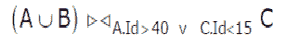

# 数据库管理系统|第 3 集

> 原文:[https://www . geesforgeks . org/database-management-system-set-3/](https://www.geeksforgeeks.org/database-management-system-set-3/)

GATE 2012 考试中提出了以下问题。

**1)考虑以下数据项 P 和 Q 初始化为零的事务:**

```
T1: read (P) ;
    read (Q) ;
    if P = 0 then Q : = Q + 1 ;
    write (Q) ;
T2: read (Q) ;
    read (P) ;
    if Q = 0 then P : = P + 1 ;
    write (P) ;

```

**为了并发执行，T1 和 T2 的任何非串行交错导致**
(A)可串行化调度
(B)不冲突可串行化的调度
(C)冲突可串行化调度
(D)不能绘制优先图的调度

回答(B)
如果:
1)两个或多个动作属于不同的事务，则称这两个或多个动作冲突。
2)至少有一个动作是写操作。
3)动作访问同一对象(读或写)。

如果满足以下条件，则称 S1 和 S2 的时间表是冲突等价的:
1)S1 和 S2 的时间表都涉及相同的事务集(包括每个事务中的操作顺序)。
2)S1 和 S2 每对冲突动作的顺序相同。

*当一个调度与一个或多个串行调度相冲突时，该调度被称为冲突可串行化的。*

来源:[时间表维基页面](http://en.wikipedia.org/wiki/Schedule_(computer_science))

在给定的场景中，有两种可能的串行时间表:
1) T1 之后是 T2
2) T2 之后是 T1。
在这两个串行调度中，作为第一步，其中一个事务读取其他事务写入的值。因此，T1 和 T2 的任何非串行交织都不会冲突序列化。

**2)考虑以下关系 A、B、c，下面关系代数表达式的结果包含多少元组？假设 A U B 的图式与 A 的图式相同**

[](https://media.geeksforgeeks.org/wp-content/cdn-uploads/DBMSGATE20124.png)

```
Table A
Id   Name    Age
----------------
12   Arun    60
15   Shreya  24
99   Rohit   11

Table B
Id   Name   Age
----------------
15   Shreya  24
25   Hari    40
98   Rohit   20
99   Rohit   11

Table C
Id   Phone  Area
-----------------
10   2200   02  
99   2100   01

```

(甲)7
(乙)4
(丙)5
(丁)9

答案(一)

```
Result of AUB will be following table

Id   Name    Age
----------------
12   Arun    60
15   Shreya  24
99   Rohit   11
25   Hari    40
98   Rohit   20

The result of given relational algebra expression will be

Id   Name    Age  Id   Phone Area
---------------------------------
12   Arun    60   10   2200   02 
15   Shreya  24   10   2200   02   
99   Rohit   11   10   2200   02 
25   Hari    40   10   2200   02 
98   Rohit   20   10   2200   02 
99   Rohit   11   99   2100   01
98   Rohit   20   99   2100   01

```

**3)考虑上面的表 A、B、c，下面的 SQL 查询结果包含多少元组？**

```
SELECT A.id 
FROM   A 
WHERE  A.age > ALL (SELECT B.age 
                    FROM   B 
                    WHERE  B. name = "arun") 

```

(甲)4
(乙)3
(丙)0
(丁)1

回答(B)
“ALL”的意思是 A。年龄应该大于子查询返回的所有值。表 b 中没有名为“arun”的条目。因此子查询将返回空值。如果子查询返回空值，则 A 的所有行的条件都为真(详情参见[本](http://publib.boulder.ibm.com/infocenter/iseries/v5r3/index.jsp?topic=%2Fsqlp%2Frbafyhowsub.htm))。所以表 A 的所有行都被选中。

**所有往年论文/解答/说明、教学大纲、重要日期、笔记等请见[门角](http://geeksquiz.com/gate-corner-2/)。**

如果您发现任何答案/解释不正确，或者您想分享关于上述主题的更多信息，请写评论。