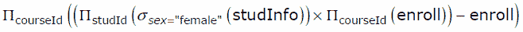
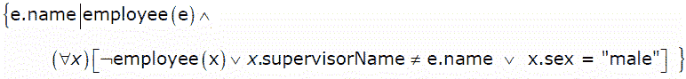
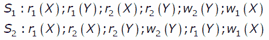

# 数据库管理系统|第 11 集

> 原文:[https://www . geesforgeks . org/database-management-systems-set-11/](https://www.geeksforgeeks.org/database-management-systems-set-11/)

GATE CS 2007 考试提出了以下问题。

**1)关于学生集合的信息由关系*studinifo(studId，姓名，性别)*给出。*注册(studId，courseId)* 关系给出了哪个学生注册(或选修)了该课程。假设每门课程至少有一名男生和一名女生选修。下面的关系代数表达式代表什么？**
[](https://media.geeksforgeeks.org/wp-content/cdn-uploads/GATE2009DBMS12.gif)

所有女生都参加的课程。
(B)招收适当数量女生的课程。
(三)只招收男生的课程。
(四)以上都不是

回答(B)
问题中给出的表达式按顺序执行以下步骤。
a)选择所有女生中的*学习*，选择所有课程中的所有*课程*。
b)然后查询进行上面的[笛卡尔乘积](http://en.wikipedia.org/wiki/Cartesian_product)从不同的表中选择两列。
c)最后从上述步骤(b)的结果中减去*注册*表。这将删除存在于*注册*表中的所有(*studed，coursed id*)对。如果所有的女生都注册了一门课程，那么这门课程将不会出现在减去的结果中。
所以完整的表达式返回了招收了适当一部分女生的课程。

```
studinfo table
studid   name    sex
------------------------
 1        a      Male
 2        c      Female 
 3        d      Female 

enroll table
studid  courseid
------------------
 1         1
 2         1
 3         1
 2         2 
 3         3
 3         2    

Result of step b
studid     courseid
---------------------
 2             1
 2             2
 2             3
 3             1
 3             2
 3             3  

Result of step c
studid    courseid
-------------------
 2           3

```

**2)考虑以姓名为关键的关系员工(姓名、性别、主管姓名)。主管姓名给出所考虑员工的主管姓名。下面的元组关系演算查询会产生什么？**
[](https://media.geeksforgeeks.org/wp-content/cdn-uploads/GATE2009DBMS22.gif) 
(一)有男主管的员工姓名。
(B)没有直接男性下属的员工姓名。
(三)无直接女性下属的员工姓名。
(四)有女主管的员工姓名。

答案(C)
查询选择所有直接下属为“男性”的员工。换句话说，它选择没有直接女性下属的员工姓名

**3)考虑表员工(empId、姓名、部门、薪资)和下面的两个查询 Q1、Q2。假设第 5 部门有多名员工，我们想找到工资比第 5 部门任何人都高的员工，对于任意的员工表，以下哪一种说法是正确的？**

```
Q1 : Select e.empId
     From employee e
     Where not exists
        (Select * From employee s where s.department = “5” and 
                                        s.salary >=e.salary)
Q2 : Select e.empId
     From employee e
     Where e.salary > Any
    (Select distinct salary From employee s Where s.department = “5”)

```

(一)Q1 是正确的查询
(二)Q2 是正确的查询
(三)Q1 和 Q2 给出了相同的答案。
(四)Q1 和 Q2 都不是正确的质疑

回答(B)
让员工(empId、姓名、部门、工资)有如下实例。

empId 名称部门工资
——————E1——A——1——10000
E2——B——5——5000
E3——C——5——7000
E4——D——2——2000
E5——E——3

现在实际结果应该包含 empId : e1、e3 和 e5(因为他们的工资比部门中的任何员工都高‘5’)

——————————————————–】现在 Q1:

注意:EXISTS(空集)给出假，NOT EXISTS(空集)给出真。

从不存在的员工 e

中选择 e.empId
(从员工 s 中选择*其中 s . department =“5”和
s .薪资> =e .薪资)

Q1 将只得到 empId e1。
————————————————
而 Q2:

从员工 e 中选择 e.empId
其中 e .薪资>任何
(从员工 s 中选择不同的薪资，其中 s . department =“5”)

Q2 将产生 empId e1、e3 和 e5。
——————————————————————————
因此 Q2 是正确的查询。

**4)下列哪一项陈述为假？**
(A)任何有两个属性的关系都在 BCNF
(B)每个键只有一个属性的关系都在 2NF
(C)一个质数属性可以过渡依赖于 3 NF 关系中的一个键。
(D)一个主属性可以过渡地依赖于 BCNF 关系中的一个键。

答案(四)

**5)考虑以下涉及两个交易的时间表。以下哪个陈述是正确的？**
[](https://media.geeksforgeeks.org/wp-content/cdn-uploads/GATE2009DBMS3.gif) 
(一)S1 和 S2 都是冲突可串行化的。
(B) S1 是冲突可串行化的，S2 不是冲突可串行化的。
(C) S1 不冲突可串行化，S2 冲突可串行化。
(D)S1 和 S2 都不是冲突可串行化的。

答案(C)
S1 不是冲突可串行化的，但 S2 是冲突可串行化的

```
Schedule S1
   T1            T2
---------------------
  r1(X)
  r1(Y)
                r2(X)
                r2(Y)
                w2(Y)
  w1(X)
The schedule is neither conflict equivalent to T1T2, nor T2T1.

Schedule S2
   T1            T2
---------------------
  r1(X)
                r2(X)
                r2(Y)
                w2(Y)
  r1(Y)
  w1(X)
The schedule is conflict equivalent to T2T1.

```

如果您发现任何答案/解释不正确，或者您想分享更多关于上述主题的信息，请写评论