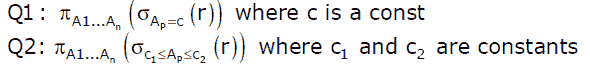

# 数据库管理系统|第 4 集

> 原文:[https://www . geesforgeks . org/database-management-systems-set-4/](https://www.geeksforgeeks.org/database-management-systems-set-4/)

GATE 2011 考试中提出了以下问题。

**1。考虑一个关系表，其中每个注册学生都有一条记录，并具有以下属性。**

**1。注册号:<每个注册学生的唯一注册号**
**2。UID:唯一身份号码，在全国范围内对每个公民都是唯一的**
**3。银行账号:银行的唯一账号。一个学生可以有多个账户或联名账户。该属性存储主账号**
**4。姓名:学生姓名**
**5。招待所 _ 房间:招待所房间号**

**以下哪个选项不正确？**
(A) BankAccount_Number 是候选键
(B) Registration_Number 可以是主键
(C) UID 是候选键如果所有学生都来自同一个国家
(D)如果 S 是一个超键使得 S ∪ UID 为 NULL 那么 S∪UID 也是一个超键

答案(一)

一个[候选关键字](http://en.wikipedia.org/wiki/Candidate_key)值必须唯一标识表中的相应行。银行帐户号码不是候选键。根据问题“一个学生可以有多个账户或联合账户。该属性存储主账号”。如果两个学生有一个联合帐户，并且该联合帐户是他们的主要帐户，则 BankAccount_Number 值不能唯一标识一行。

**2)考虑一个记录数足够多的关系表 r，它有属性 A1，A2，…，An 和 let 1 < = p < = n .下面给出了两个查询和。**



**数据库可以配置为在 Ap 上进行有序索引或在 Ap 上进行散列。以下哪个陈述是正确的？**
(A)两个查询的有序索引总是优于哈希
(B)两个查询的哈希总是优于有序索引
(C)哈希在 Q1 优于有序索引，但在 Q2 不优于有序索引
(D)哈希在 Q2 优于有序索引，但在 Q1 不优。

答案(三)

如果从表中为特定值访问记录，散列会做得更好。如果在一个值范围内访问记录，则有序索引的性能会更好。详见[本](http://www.cse.iitb.ac.in/~sudarsha/db-book/slide-dir/ch12.pdf)。

**3)贷款 _ 记录数据库表如下。**

```
Borrower    Bank_Manager   Loan_Amount
 Ramesh      Sunderajan     10000.00
 Suresh      Ramgopal       5000.00
 Mahesh      Sunderajan     7000.00
```

**下面的 SQL 查询输出是什么？**

```
SELECT Count(*) 
FROM  ( (SELECT Borrower, Bank_Manager 
       FROM   Loan_Records) AS S 
        NATURAL JOIN (SELECT Bank_Manager, 
                             Loan_Amount 
                      FROM   Loan_Records) AS T ); 
```

(甲)3
(乙)9
(丙)5
(丁)6

答案(三)

以下是临时表的内容

```
Borrower    Bank_Manager
--------------------------
 Ramesh      Sunderajan
 Suresh      Ramgopal
 Mahesh      Sunderajan
```

以下是临时表 T 的内容

```
Bank_Manager   Loan_Amount
---------------------------
Sunderajan      10000.00
Ramgopal        5000.00
Sunderajan      7000.00
```

下面将是上述两个表自然连接的结果。需要注意的关键是，自然连接发生在同名的列名上，在上面的例子中是 Bank_Manager。“Sunderajan”在 Bank_Manager 列中出现两次，因此它们将是四个条目，Bank_Manager 为“Sunderajan”。

```
Borrower  Bank_Manager   Load_Amount
------------------------------------
Ramesh    Sunderajan     10000.00
Ramesh    Sunderajan     7000.00
Suresh    Ramgopal       5000.00
Mahesh    Sunderajan     10000.00
Mahesh    Sunderajan     7000.00
```

**4)考虑一个包含两列 X 和 Y 的数据库表 T，每列都是整数类型。创建表后，在表中插入一条记录(X=1，Y=1)。**

**让 MX 和 My 表示在任意时间点表中所有记录中 X 和 Y 各自的最大值。使用 MX 和 MY，在表中插入新记录 128 次，X 和 Y 值分别为 MX+1、2*MY+1。可以注意到，每次插入后，MX 和 MY 的值都会改变。执行上述步骤后，以下 SQL 查询的输出将是什么？**

```
SELECT Y FROM T WHERE X=7;
```

(一)127
(二)255
(三)129
(四)257

答案(一)

```
 X    Y
-------
 1    1
 2    3
 3    7
 4    15
 5    31
 6    63
 7   127
 ......
 ......
```

**请参见**[**GATE Corner**](http://geeksquiz.com/gate-corner-2/)**查看往年所有论文/解答/说明、教学大纲、重要日期、笔记等。**

如果您发现任何答案/解释不正确，或者您想分享关于上述主题的更多信息，请写评论。