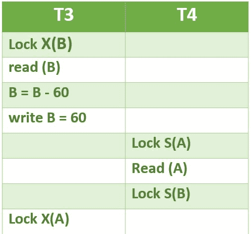
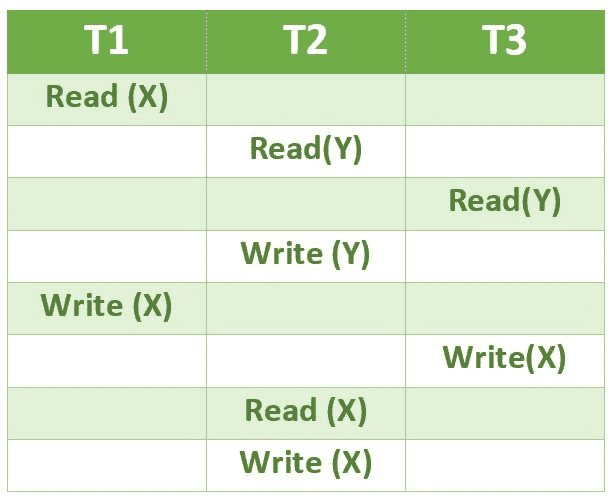

# 数据库管理系统|第 5 集

> 原文:[https://www . geesforgeks . org/database-management-systems-set-5/](https://www.geeksforgeeks.org/database-management-systems-set-5/)

GATE CS 2010 考试中提出了以下问题。

**1)列车预订数据库的关系模式如下。**
**乘客(pid，pname，年龄)**
**预订(pid，等级，tid)**

```
Table: Passenger
pid   pname   age
-----------------
 0    Sachin   65
 1    Rahul    66
 2    Sourav   67
 3    Anil     69

Table : Reservation
pid  class  tid
---------------
 0    AC   8200
 1    AC   8201
 2    SC   8201
 5    AC   8203
 1    SC   8204
 3    AC   8202
```

**下面的 SQL 查询为上面的表实例返回了哪些 PID？**

```
SELECT pid
FROM Reservation ,
WHERE class ‘AC’ AND
    EXISTS (SELECT *
       FROM Passenger
       WHERE age > 65 AND
       Passenger. pid = Reservation.pid)
```

(甲)1，0
(乙)1，2
(丙)1，3
1，5

答案(C)
当子查询使用来自外部查询的值时，该子查询被称为[相关子查询](http://en.wikipedia.org/wiki/Correlated_subquery)。对于外部查询处理的每一行，相关子查询都要计算一次。

外部查询从预订表中选择 4 个条目(pids 为 0、1、5、3)。在这些选定的条目中，子查询只返回 1 和 3 的非空值。

**2)以下哪种并发控制协议既能保证冲突的可串行化，又能避免死锁？**
**一、2 相闭锁**
**二。时间戳排序**
(A)我只有
(B)二只有
(C)我和二都有
(D)我和二都没有

答案(B)
[2 锁相(2PL)](http://en.wikipedia.org/wiki/Two-phase_locking) 是一种保证可串行化的并发控制方法。该协议利用由事务应用于数据的锁，该锁可以阻止(解释为停止的信号)其他事务在事务的生命周期内访问相同的数据。由于两个或多个事务的相互阻塞，2PL 可能会导致死锁。看到下面的情况，T3 和 T4 都不能进步。



[基于时间戳的并发控制](http://en.wikipedia.org/wiki/Timestamp-based_concurrency_control)算法是一种无锁并发控制方法。在基于时间戳的方法中，死锁不会发生，因为没有事务等待。

**3)考虑交易 T1、T2 和 T3 的以下时间表:**



**下面哪个时间表是上面的正确序列化？**
(A)T1→T3→T2
(B)T2→T1→T3
(C)T2→T3→T1
(D)T3→T1→T2

回答(A)
T1 可以在 T2 和 T3 之前完成，因为在上图中，T1 的 Write(X)与 T1 的 Write(X)之前发生的 T2 和 T3 中的操作之间没有冲突。
T3 应该可以在 T2 之前完成，因为 T3 的 Read(Y)和 T2 的 Read(Y)不冲突。同样，T3 的写(X)与 T2 的读(Y)和写(Y)操作并不冲突。
解决这个问题的另一种方法是创建一个依赖图，并对依赖图进行拓扑排序。经过拓扑排序，我们可以看到序列 T1，T3，T2。

**4)关系 R(A、B、C)和 S(B、D、E)具有以下哪个函数依赖关系:**
**B → A、**
**A → C**
**关系 R 包含 200 个元组，而关系 S 包含 100 个元组。**
**自然连接中可能的最大元组数是多少 R◎S(R 自然连接 S)**
(A)100
(B)200
(D)300
(D)2000

答案(A)
从给定的函数依赖集合中，可以观察到 B 是 R 的候选键，所以 B 的所有 200 个值在 R 中必须是唯一的，S 没有给定的函数依赖，为了得到输出中元组的最大数量，S 可以有两种可能性
1)S 中 B 的所有 100 个值都是相同的，R 中有一个条目与这个值匹配。在这种情况下，我们在输出中得到 100 个元组。
2)S 中的 B 的所有 100 个值都是不同的，这些值也存在于 R 中。同样在这种情况下，我们得到 100 个元组。

**请参见**[**GATE Corner**](http://geeksquiz.com/gate-corner-2/)**查看往年所有论文/解答/说明、教学大纲、重要日期、笔记等。**

如果您发现任何答案/解释不正确，或者您想分享关于上述主题的更多信息，请写评论。