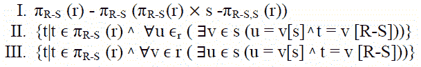

# 数据库管理系统|第 6 集

> 原文:[https://www . geesforgeks . org/database-management-systems-set-6/](https://www.geeksforgeeks.org/database-management-systems-set-6/)

GATE 2009 CS 考试提出了以下问题。

**1)考虑两个交易 T1 和 T2，以及 T1 和 T2 的四个时间表 S1、S2、S3、S4 如下所示:**
T1 = R1[X]W1[X]W1[Y]
T2 = R2[X]R2[Y]W2[Y]
S1 = R1[X]R2[X]R2[Y]R2[Y]W1[X]W1[Y]W2[Y]
S2 = R1[X]R2[X]R2[Y]W1[X]W2[Y]W1[Y]T6
(甲)S1 和 S2
(乙)S2 和 S3
(丙)仅 S3
(丁)仅 S4

回答(B)
可能有两个可能的串行时间表 T1 T2 和 T2 T1。T2 时间表 T1 有以下操作顺序
R1[X]W1[X]W1[Y]R2[X]R2[Y]W2[Y]
时间表 T2 时间表 T1 有以下操作顺序。
R2【X】R2【Y】W2【Y】R1【X】W1【X】W1【Y】
时间表 S2 冲突-相当于 T2 T1，S3 冲突-相当于 T1 T2。

**2)让 R 和 S 为关系模式，使得 R={a，b，c}和 S={c}。现在考虑**
**数据库上的以下查询:**



```
IV) SELECT R.a, R.b
       FROM R,S
            WHERE R.c=S.c
```

**以上哪些查询是等价的？**
(A)一、二
(B)一、三
(C)二、四
(D)三、四

答案(A)
I 和 II 分别描述了[关系代数](http://en.wikipedia.org/wiki/Relational_algebra)和[元组关系演算](http://en.wikipedia.org/wiki/Tuple_relational_calculus)中的除法运算符。详见本第 3 页[和本](http://users.abo.fi/soini/divisionEnglish.pdf)第 9、10 页。

**3)考虑以下关系模式:**

```
Suppliers(<u>sid:integer</u>, sname:string, city:string, street:string)
Parts(<u>pid:integer</u>, pname:string, color:string)
Catalog(<u>sid:integer, pid:integer</u>, cost:real)
```

**考虑以下对上述数据库的关系查询:**

```
SELECT S.sname
    FROM Suppliers S
        WHERE S.sid NOT IN (SELECT C.sid
                            FROM Catalog C
                            WHERE C.pid NOT IN (SELECT P.pid  
                                                FROM Parts P                                                                                                    
                                                WHERE P.color<> 'blue'))
```

**假设上述模式对应的关系不为空。以下哪一项是对上述查询的正确解释？**

(一)查找所有提供非蓝色零件的供应商的名称。
(B)查找所有未提供非蓝色零件的供应商的名称。
(C)查找所有只提供蓝色零件的供应商的名称。
(D)找到所有没有只提供蓝色零件的供应商的名字。

回答(A)
子查询“*从零件中选择零件号，其中零件号颜色< >【蓝色】*给出非蓝色零件号。较大的子查询“*从目录 C 中选择零件号，其中零件号不在(从零件号中选择零件号，其中零件号颜色为< >【蓝色】)*”给出了所有提供蓝色零件的供应商的零件号。完整的查询给出了提供非蓝色零件的所有供应商的名称

**4)假设在上面的供应商关系中，一个城市内的每个供应商和每个街道都有一个唯一的名称，并且(sname，city)形成一个候选关键字。除了主键和候选键所暗示的函数依赖关系之外，没有其他函数依赖关系。关于上述模式，以下哪一项是正确的？**
(A)图式在 BCNF
(B)图式在 3NF 但不在 BCNF
(C)图式在 2NF 但不在 3NF
(D)图式不在 2NF

答案(A)
一个关系在 [BCNF](http://en.wikipedia.org/wiki/Boyce%E2%80%93Codd_normal_form) 如果对于它的每一个依赖项 X？y，至少下列条件之一成立:

```
    X ? Y is a trivial functional dependency (Y ? X)
    X is a superkey for schema R 
```

既然(sname，city)形成了一个候选键，就没有非平凡的依赖 X？其中 X 不是超级键

**请参见**[**GATE Corner**](http://geeksquiz.com/gate-corner-2/)**查看往年所有论文/解答/说明、教学大纲、重要日期、笔记等。**

如果您发现任何答案/解释不正确，或者您想分享关于上述主题的更多信息，请写评论。