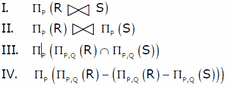
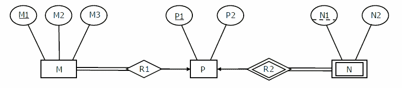

# 数据库管理系统|第 7 集

> 原文:[https://www . geesforgeks . org/database-management-systems-set-7/](https://www.geeksforgeeks.org/database-management-systems-set-7/)

GATE 2008 CS 考试提出了以下问题。

**1)让 R 和 S 是以下两个关系模式
R ( <u>P，Q</u> ，R1，R2，R3)
S ( <u>P，Q</u> ，S1，S2)
其中{P，Q}是两个模式的关键。以下哪些查询是等效的？**
[](https://media.geeksforgeeks.org/wp-content/cdn-uploads/GATE2008DBMS1.gif) 
(A)仅 I 和 II
(B)仅 I 和 III
(C)仅 I、II 和 III
(D)仅 I、III 和 IV

答案(D)
在 I 中，从 R 和 S 的自然连接中选择 Ps。
在 III 中，来自 R 和 S 中存在的(P，Q)对的交集的所有 Ps。
IV 也等同于 III，因为(R –( R–S))= R∪S。
II 不等同，因为它还可能包括 Q 在 R 和 S 中不相同的 Ps

**2)考虑下面的 er 图。
[](https://media.geeksforgeeks.org/wp-content/cdn-uploads/GATE2008DBMS_ERDIA.gif)** 

表示 M、N、P、R1、R2 所需的最小表格数为
(A)2
(B)3
(C)4
(D)5

答案(B)
详见[http://geeksquiz.com/gate-gate-cs-2008-question-82/](http://geeksquiz.com/gate-gate-cs-2008-question-82/)解释。

**3)以下哪一项是上述问题正确答案表之一的正确属性集？**
(A) {M1、M2、M3、P1}
(B) {M1、P1、N1、N2}
(C) {M1、P1、N1}
(D) {M1、P1}

答案(A)

**4)考虑以下图书馆数据库的关系方案:
图书(书名、作者、目录号、出版商、年份、价格)
收藏(书名、作者、目录号)**

**具有以下功能依赖关系:**

 **```
I. Title Author --> Catalog_no
II. Catalog_no --> Title Author Publisher Year
III. Publisher Title Year --> Price 
```** 

假设{作者，标题}是这两个方案的关键。以下哪个陈述是正确的？

(A) Both Book and Collection are in BCNF
(B) Both Book and Collection are in 3NF only
(C) Book is in 2NF and Collection is in 3NF
(D) Both Book and Collection are in 2NF only

答案(C)
表集合在 [BCNF](http://en.wikipedia.org/wiki/Boyce%E2%80%93Codd_normal_form) 因为只有一个功能依赖“标题作者–>目录 _ 号”{作者，标题}是集合的关键。图书不在 BCNF，因为目录号不是关键，存在功能依赖“目录号–>书名作者出版年份”。图书不在 [3NF](http://en.wikipedia.org/wiki/Third_normal_form) 中，因为非主要属性(出版商年份)暂时依赖于关键字[标题，作者]。Book 在 [2NF](http://en.wikipedia.org/wiki/Second_normal_form) 中，因为表的每个非质数属性要么依赖于关键字【标题、作者】，要么依赖于另一个非质数属性。

**所有往年论文/解答/说明、教学大纲、重要日期、笔记等请见[门角](http://geeksquiz.com/gate-corner-2/)。**

如果您发现任何答案/解释不正确，或者您想分享关于上述主题的更多信息，请写评论。