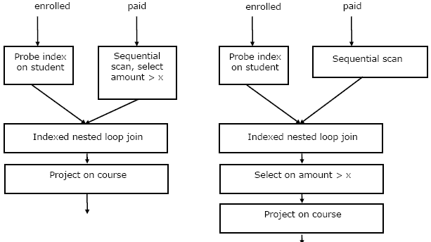

# 数据库管理系统|第 9 集

> 原文:[https://www . geesforgeks . org/database-management-systems-set-9/](https://www.geeksforgeeks.org/database-management-systems-set-9/)

GATE 2006 CS 考试中提出了以下问题。

**1)考虑以下在银行账户上的两个交易的日志序列，初始余额为 12000，将 2000 转移到抵押付款，然后应用 5%的利息。**

```
 1\. T1 start
  2\. T1 B old=12000 new=10000
  3\. T1 M old=0 new=2000
  4\. T1 commit
  5\. T2 start
  6\. T2 B old=10000 new=10500
  7\. T2 commit 
```

 **假设数据库系统在写日志记录 7 之前崩溃。当系统重新启动时，恢复过程中哪一项陈述是正确的？** 
(A)我们必须重做日志记录 6 以将 B 设置为 10500
(B)我们必须撤消日志记录 6 以将 B 设置为 10000，然后重做日志记录 2 和 3
(C)我们不需要重做日志记录 2 和 3，因为事务 T1 已经提交了
(D)我们可以以任意顺序应用重做和撤消操作，因为它们是幂等的。

答案(二)

**2)考虑以(学生、课程)为主键的注册关系(学生、课程)，以学生为主键的付费关系(学生、金额)。假设没有空值，没有外键或完整性约束。给出以下四个查询:**

```
Query1: select student from enrolled where student in (select student from paid)
Query2: select student from paid where student in (select student from enrolled)
Query3: select E.student from enrolled E, paid P where E.student = P.student
Query4: select student from paid where exists
        (select * from enrolled where enrolled.student = paid.student)

```

**以下哪一种说法是正确的？**
(A)所有查询为任何数据库返回相同的行集
(B)查询 2 和查询 4 为所有数据库返回相同的行集，但是存在查询 1 和查询 2 返回不同行集的数据库。
(三)有些数据库的查询 3 返回的行数比查询 2 少。
(D)存在查询 4 将在运行时遇到完整性冲突的数据库。

答案(B)
举个例子:

```
Table enrolled
student   course
----------------
 abc      c1   
 xyz      c1
 abc      c2
 pqr      c1

Table paid
student  amount
-----------------
 abc      20000
 xyz      10000
 rst      10000

Output of Query 1
 abc
 abc
 xyz

Output of Query 2
 abc
 xyz

Output of Query 3
 abc
 xyz

Output of Query 4
 abc
 xyz
```

查询 1 和查询 3 可能返回重复的学生值，因为“学生”不是注册关系中的关键字，但是查询 2 和查询 4 总是返回相同的行集。

所以，选项(B)是正确的。

**3)考虑以(学生、课程)为主键的注册关系(学生、课程)和以学生为主键的付费关系(学生、金额)。假设没有空值，没有外键或完整性约束。假设 6000、7000、8000、9000 和 10000 各由 20%的学生支付。考虑这些查询计划(左边的计划 1，右边的计划 2)来“列出所有付费超过 x 的学生参加的课程”。**

[](https://media.geeksforgeeks.org/wp-content/cdn-uploads/2006DBMS12.png) 
**一次磁盘寻道需要 4 毫秒，磁盘数据传输带宽为 300 MB/s，检查一个元组看看量是否大于 x 需要 10 微秒。以下哪个陈述是正确的？**
(A)计划 1 和计划 2 不会为所有数据库输出相同的行集。
(B)对于某些数据库，计划 1 的输出中可能不止一次列出一门课程
(C)对于 x = 5000，对于所有数据库，计划 1 的执行速度都快于计划 2。
(D)对于 x = 9000，对于所有数据库，计划 1 的执行速度都比计划 2 慢。

答案(C)
假设足够大的内存可用于所有需要的数据。两个计划都需要加载两个表课程并注册。所以两个计划的磁盘访问时间是相同的。
与计划 1 相比，计划 2 进行的比较较少。
1)连接操作将需要更多的比较，因为与计划 1 相比，第二个表在计划 2 中将有更多的行。
2)两个表的连接表将有更多的行，因此需要更多的比较来找到大于 x 的数量。

**4)给出了以下函数依赖关系:**

```
AB → CD, AF → D, DE → F, C → G , F → E, G → A 
```

 **以下哪个选项为假？** 
(A)CF+= { ACDEFG }
(B)BG+= { ABCDG }
(C)AF+= { ACDEFG }
(D)AB+= { ABCDFG }

回答(C)
房颤闭合或房颤+ = {ADEF}，房颤闭合不含 C 和 g
选项(D)看起来也是正确的。AB+ = {ABCDG}，AB 的闭包不含 f。

所有往年论文/解答/说明、教学大纲、重要日期、笔记等请见 [GATE Corner](http://geeksquiz.com/gate-corner-2/) 。

如果您发现任何答案/解释不正确，或者您想分享关于上述主题的更多信息，请写评论。