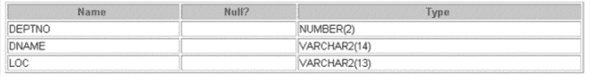
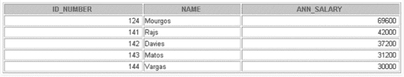

# 数据库管理系统中的数据库对象

> 原文:[https://www.geeksforgeeks.org/database-objects-in-dbms/](https://www.geeksforgeeks.org/database-objects-in-dbms/)

****数据库对象**** 是数据库中用于存储或引用数据的任何已定义对象。我们从**创建命令**得到的任何东西都被称为数据库对象。它可以用来保存和操作数据。数据库对象的一些例子有:视图、序列、索引等。

*   **表–**基本存储单位；组合行和列
*   **视图–**逻辑上表示一个或多个表中的数据子集
*   **序列–**生成主键值
*   **索引–**提高了一些查询的性能
*   **同义词–**对象的替代名称

不同的数据库对象:

1.  **Table –** This database object is used to create a table in database.

    **语法:**

    ```
    CREATE TABLE [schema.]table
                   (column datatype [DEFAULT expr][, ...]);
    ```

    **示例:**

    ```
    CREATE TABLE dept
               (deptno NUMBER(2),
                dname VARCHAR2(14),
                loc VARCHAR2(13));
    ```

    **输出:**

    ```
    DESCRIBE dept;
    ```

    

2.  **View –** This database object is used to create a view in database.A view is a logical table based on a table or another view. A view contains no data of its own but is like a window through which data from tables can be viewed or changed. The tables on which a view is based are called base tables. The view is stored as a SELECT statement in the data dictionary.

    **语法:**

    ```
    CREATE [OR REPLACE] [FORCE|NOFORCE] VIEW view
                           [(alias[, alias]...)]
                           AS subquery
                           [WITH CHECK OPTION [CONSTRAINT constraint]]
                           [WITH READ ONLY [CONSTRAINT constraint]];
    ```

    **示例:**

    ```
    CREATE VIEW salvu50
                   AS SELECT employee_id ID_NUMBER, last_name NAME,
                   salary*12 ANN_SALARY
                   FROM employees
                   WHERE department_id = 50;
    ```

    **输出:**

    ```
    SELECT *
    FROM salvu50;
    ```

    

3.  **Sequence –** This database object is used to create a sequence in database.A sequence is a user created database object that can be shared by multiple users to generate unique integers. A typical usage for sequences is to create a primary key value, which must be unique for each row.The sequence is generated and incremented (or decremented) by an internal Oracle routine.

    **语法:**

    ```
    CREATE SEQUENCE sequence
                        [INCREMENT BY n]
                        [START WITH n]
                        [{MAXVALUE n | NOMAXVALUE}]
                        [{MINVALUE n | NOMINVALUE}]
                        [{CYCLE | NOCYCLE}]
                        [{CACHE n | NOCACHE}];
    ```

    **示例:**

    ```
    CREATE SEQUENCE dept_deptid_seq
                            INCREMENT BY 10
                            START WITH 120
                            MAXVALUE 9999
                            NOCACHE
                            NOCYCLE;
    ```

    **检查序列是否由**创建

    ```
    SELECT sequence_name, min_value, max_value,
                           increment_by, last_number
                           FROM   user_sequences;
    ```

4.  **Index –** This database object is used to create a indexes in database.An Oracle server index is a schema object that can speed up the retrieval of rows by using a pointer.Indexes can be created explicitly or automatically. If you do not have an index on the column, then a full table scan occurs.

    索引提供了对表中行的直接快速访问。其目的是通过使用索引路径快速定位数据来减少磁盘输入/输出的必要性。该索引由 Oracle 服务器自动使用和维护。一旦创建了索引，用户就不需要任何直接的活动。索引在逻辑上和物理上都独立于它们所索引的表。这意味着它们可以随时创建或删除，对基表或其他索引没有影响。

    **语法:**

    ```
    CREATE INDEX index
                ON table (column[, column]...);
    ```

    **示例:**

    ```
    CREATE INDEX emp_last_name_idx
                    ON  employees(last_name);
    ```

5.  **Synonym –** This database object is used to create a indexes in database.It simplify access to objects by creating a synonym(another name for an object). With synonyms, you can Ease referring to a table owned by another user and shorten lengthy object names.To refer to a table owned by another user, you need to prefix the table name with the name of the user who created it followed by a period. Creating a synonym eliminates the need to qualify the object name with the schema and provides you with an alternative name for a table, view, sequence,procedure, or other objects. This method can be especially useful with lengthy object names, such as views.

    在语法中:
    PUBLIC:创建所有用户都可以访问的同义词
    同义词:是要创建的同义词的名称
    对象:标识为其创建同义词的对象

    **语法:**

    ```
    CREATE [PUBLIC] SYNONYM synonym FOR  object;
    ```

    **示例:**

    ```
    CREATE SYNONYM d_sum FOR dept_sum_vu;
    ```

**参考资料:**
[数据库对象–IBM](https://www.ibm.com/support/knowledgecenter/en/SSEPGG_9.5.0/com.ibm.db2.luw.admin.dbobj.doc/doc/c0023321.html)
[Oracle 9i 简介](https://www.amazon.com/Introduction-Oracle-9i-Student-Guide/dp/B007U55B2A/ref=sr_1_9/135-0559177-4020104?s=books&ie=UTF8&qid=1513328691&sr=1-9&refinements=p_27%3AOracle) : SQL 学生指南第 2 卷